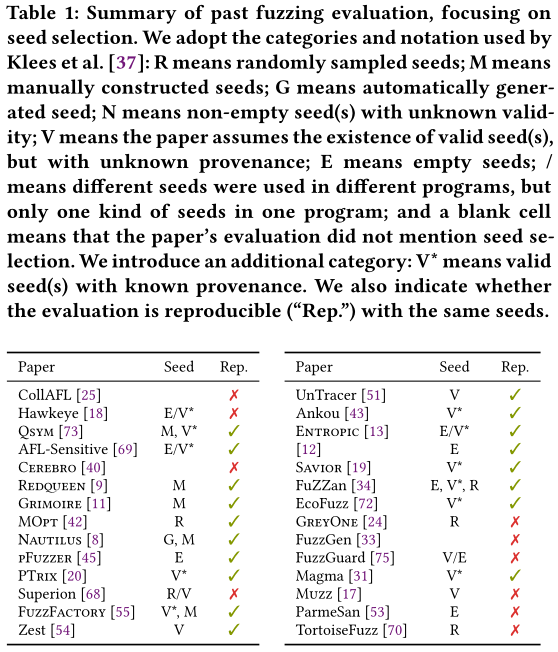

# Seed Selection for Successful Fuzzing

## 摘要

文章主要系统性的调研了6种种子选择方法（包括3种语料库最小化技术），结果表明：

* **模糊测试结果很受初始种子的影响**
* 最小化语料库要比单一种子、空、大种子集合（数以千计的文件）好。

因此，论文建议在评估/部署模糊测试程序时，首先考虑种子选择，并建议：

* 仔细考虑并明确记录种子选择
* 永远不要仅使用单个种子进行模糊测试

---

## 贡献

* 对fuzzer评估和部署中使用的种子选择实践和语料库最小化技术进行系统性调研。调研指出，种子选择实践差异很大，对于选择引导模糊测试过程的种子的最佳方式没有得到共识；
* 一个新的语料库最简化工具POTIMIN用于产生一个最优的最小语料库；
* 对各个种子选择实践的定量评估和比较。本次评估涵盖了三种语料库最小化工具（包括OPTIMIN），使用这些工具生成的语料库在bug挖掘能力方面要优于使用单个文件种子和空种子。

## 种子选择实践

### 实验评估

>klees et al. : “most papers treated the choice of seed casually, apparently assuming that any seed would work equally well, without providing particulars"

在他们调查的32篇论文中（2012-2018年），有10篇使用了非空种子，但不清楚这些种子是否为有效输入；9篇假设存在有效种子，但没有报告如何获得这些种子；五篇对种子进行了随机抽样；四篇使用人工构建的种子；两篇使用空种子。

>klees et al. : "it is clear that a fuzzer’s performance on the same program can be very different depending on what seed is used"
>
>"it is clear that a fuzzer’s performance on the same program can be very different depending on what seed is used"

检查了从2018年以来发表的另外28篇文论：

* 未报告种子收集：三项研究没有提到他们的种子选择程序。其中一个，FuzzGen，明确提到"标准化通用种子"是有效比较的关键，但没有提到使用的种子。

* 基准和fuzzer提供的种子：三项研究（Hawkeye、FuzzFactory和Entropic）评估了Google Fuzzer套件（FTS）中的fuzzer，该套件为24个目标程序中的14个提供了种子。在这些种子集中，有八个只包含了一个或两个种子。当没有提供种子时，尚不清楚这三项研究使用了哪一些种子。

  类似地，四篇论文（AFL-Sensitive、PTrix、Savior和EcoFuzz）使用了AFL提供的单一种子集。 

* 人工构建种子：两篇论文（Redqeen and Gri-moire）使用一种无信息的通用种子，由可打印ASCII集合中的不同字符组成，但作者没有说明：

  * 为什么选择这些特定的单个语料库
  * 这种选择对作者的真实结果有什么影响，特别是在模糊binutils时，其中大多数目标接受非ASCII二进制文件格式（如readelf，objdump）

* 随机种子：五篇论文（MOPT, Superion, FuZZan, GreyOne, and TortoiseFuzz）从随机选择种子，种子来源有：

  * 特定目标程序开发者提供的更大的种子库中随机选择种子
  * 互联网上爬取

  在这些研究中，有两项（Superion和GreyOne）特别提到使用afl的语料库最小化工具afl-cmin从随机种子中集中移除重复种子。

* 空种子：八篇文章使用空种子来引导模糊测试过程。有趣的是，Böhme et al.[13]和Böhme and Falk[12]明确删除了OSSFuzz提供的语料库，因为他们发现"初始种子语料库通常是饱和的，在启动不久后，特征发现就有效地停止了"

* 一个复现实验：REDQUEEN，复现了一个来自REDQUEUE的评估实验。Aschermann[9 REDQUEEN]等人对binutils的大量应用程序进行模糊测试，用一个"未知的、通用的种子"引导每一个实验。他们的readelf结果特别惊人：AFLFast和honggfuzz覆盖的代码很少。我们重复这个实验，但使用各种初始种子，包括：（i）原始的，未知的种子；（ii）单个有效的ELF文件；（iii）从ALLSTAR和Malpedia数据集中的ELF文件集合（使用afl-cmin使大小由104733降低至366个）。

  * 实验结果：

    

  * 结果说明：使用未提供信息的种子进行AFLFast引导时，对readelf代码的探索很少：不到1%。然而，对于使用有效的ELF文件引导的AFLFast来说，这一比例增加到了38%左右，这使得它与honggfuzz和AFL++（尽管AFL++的性能仍比它们高出约15%）相比更具竞争力。

    虽然afl-cmin语料库对AFLFast和Honggfuzz的影响微不足道，但在使用afl++进行模糊测试处理时，它会带来显著的改善，将覆盖率提高到约60%。

>至少，fuzzer评估必须报告用于引导模糊化过程的种子集。为了确保再现性，人工制品必须提供初始种子集（因为结果可能会因使用的种子而异）。理想情况下，fuzzer评估应该对不同的初始种子库进行实验，以了解不同的初始种子如何影响模糊结果。

### 部署

除了活跃的课题研究外，fuzzer还经常被部署去挖掘真实世界软件的漏洞。值得注意的是，从业者也认识到了种子选择的重要性。如Mozilla Firefox浏览器开发人员评论说：

>如果原始样本[即种子]质量良好，则基于变异的策略通常优于其他策略，因为原始样本具有模糊程序不必知道或实现的大量语义。然而，这里的成功取决于样品的质量。如果原始版本没有涵盖实现的某些部分，那么fuzzer还需要做更多的工作才能实现。 

与前述评估实践相反，工业模糊测试相较于小种子集和空种子，更优先使用大语料库种子集。但大语料库种子集存在大量的冗余，这些冗余是浪费的，**因为它会导致种子阻塞模糊测试队列，从而阻碍和延迟更有希望的种子的突变**。

>在工业上部署fuzzers时，必须将表现出冗余行为的种子从模糊队列中移除，因为它们会导致周期的浪费，进一步可能会使更有希望的种子饿死。

## 语料库最小化技术

与第3节讨论的种子选择实践正交，许多流行的fuzzers，如AFL、LibFuzzer、honggfuzz，提供了语料库最小化工具。语料库最小化假设存在一个大型的种子语料库，而语料库最小化工具将这个大型语料库简化为种子子集，然后用于引导模糊测试过程。在进行语料库最小化时，需要回答的主要问题是：

>给定一个特定目标程序的大量输入集合（收集的语料库），我们将如何从初始模糊测试语料库中选择一个输入子集？

Abdelnur等人首先将该问题形式化为最小集合覆盖（MSCP）问题的一个实例。MSCP：给定一个元素集合U和一个N个集合S=s1,s2,...sN，s1∪s2∪...∪sN=U，S的最小子集的并仍等于U。已知这个最小子集C⊆ S是最小集合覆盖。更重要的是，每一个si∈S与一个权重wi相关联。在这种情况下，加权MSCP（WMSCP）试图最小化C中元素的总cost。

[W]MSCP是一个NP完全问题，因此Abdelnur等人使用贪心算法来求解未加权的MSCP。U由原始集合语料库中种子集的代码覆盖信息组成。随后，代码覆盖率继续被用于描述模糊测试语料库中的种子，这是因为代码覆盖率与模糊测试过程中发现的错误之间存在强烈的正相关。因此，找到C相当于找到最小的种子集，以保持集合语料库中观察到的代码覆盖率。

自Abdelnur等人的工作以来，已经提出了许多语料库最小化技术。我们关注文件格式模糊测试，并总结与我们的评估相关的技术。 

### MINSET

Rebert等人通过将执行时间或文件大小作为权重计算C，他们设计六种语料库最小化技术，并对这些技术进行了模拟和实证评估，测试了一系列模糊测试活动（使用BFF黑盒fuzzer）。他们发现，未加权最小集（未加权贪心减少最小化）在最小化能力方面表现突出，并且Peach Set算法发现最多的漏洞。奇怪的是，他们还发现peachminset实际上并没有计算C，也没有一个经过验证的近似值。

### afl-cmin

afl-cmin工具实现了一个贪心最小化算法，重用afl的边覆盖概念，在最小化时对种子进行分类，记录边频率计数的近似值，而不仅仅是边是否已经被触发。此外，afl-cmin忽略对相同桶内的计数变化，对从一个桶到另外一个桶的转换标记为程序控制流的有趣变化。最小化时，afl-cmin选择语料库中覆盖给定边计数的最小种子，然后执行一个贪心加权的最小化过程。我们认为afl-cmin和Rebert's的minset作为最小化工具的最先进代表，并囊括在我们的评估中。

### OPTIMIN

前面描述的语料库最小化技术都使用启发式算法来近似求解C。这是因为底层问题[W]MSCP是NP完全问题。然而，在语料库最小化的过程中，我们发现通过将问题变为最大可满足性（MaxSAT）并使用一个现成的MaxSAT后端，可以在合理的时间内计算得到精确解。因此，我们实现了OPTIMIN，一个改进的语料库最小化工具。

OPTIMIN使用EvalMaxSAT求解器去提出并求解一个基于语料库最小化的MaxSAT问题。不像布尔可满足性问题，MaxSAT将约束分为硬约束和软约束，旨在满足所有硬约束，并最大化满足软约束的总数（或加权总数）。 在这里，OPTIMIN将边覆盖视为硬约束，而在解决方案中不包含特定种子的视为软约束。这种方法确保解决方案以最小的种子数覆盖所有的边，并且保证解决方案C精确（而不是近似）意义上的最优。该过程如图2所示：使用三个种子执行图2a中的程序，产生图2b中的轨迹。这些轨迹被转换成一组（加权）约束（图2c），由EvalMaxSAT求解。

## 评估

RQ1：语料库最小化工具在生成最小语料库方面有多有效？ 

RQ2：种子选择对模糊者的错误识别能力有什么影响？当使用（a）一个小种子集（例如，空或单种子集）或（b）一个大种子库（在应用语料库最小化工具后从更大的集合语料库中派生）引导时，Fuzzer是否表现更好？ 

RQ3：种子选择如何影响代码覆盖率？从执行更多检测数据点的语料库开始是否会导致更大的代码覆盖率，或者fuzzer的变异引擎是否自然地实现了相同的覆盖率（例如，从空种子开始）？ 

### 方法论

#### 目标选择

Magma、Google Fuzzer Test Suite和六款流行开源程序（涵盖14种不同的file格式）

#### 样本收集

对于每一种文件类型，使用Scrapy构建了一个网络爬虫，在互联网上爬行72小时，以创建收集语料库。删除重复MD5值和大于300KB的文件。

#### 实验设置

#### Fuzzer设置

* 对每一个目标/文件类型中每一个初始语料库进行一次模糊测试，每个模糊测试包括30个独立的18小时的实验。
* AFL（v2.52b），Magma和FTS包括AFL++（a. CmpLog插桩， b. 250kb覆盖位图）

#### 实验

评估以下6种种子选择方法：

* FULL（没有最小化）
* EMPTY
* PROV：基准提供的语料库，仅适用于Magma和FTS
* MSET：使用未加权Minset工具获得的语料库
* CMIN：使用AFL's afl-cmin工具最小化的语料库
* WOPT：以文件大小作为权重的最优最小化语料库
* WMOPT：考虑边频率的加权最优最小语料库（最小化file大小，最大化边的频率计数）

从三个方面比较每个种子选择方法的表现：

* Bug 数
* Bug 存在时间
* 边覆盖信息

### Minimization（RQ1）

* CMIN处理时间慢，原因有两点：1.afl-cmin是一个BASH脚本，而最优求解器用C++编写；2.语料库最小化时一次性的前期成本，其开销可以忽略不计

>与现有最先进的语料库最小化工具相比，OptiMin生成的语料库小得多，同时运行时成本也更低。 

### Bug Finding (RQ2)

>种子选择对fuzzer发现错误的能力有着显著的影响。AFL和AFL++在使用最小化语料库进行引导时都表现得更好，尽管精确的最小化工具无关紧要。虽然AFL和AFL++都能找到相似数量的错误，但AFL通常能更快地找到（并且错误发现时间的差异较小）。 

### Code Coverage (RQ3)

>种子选择对模糊程序扩展代码覆盖率的能力有显著影响。当使用空种子进行模糊处理时，更高级的模糊程序（如AFL++）能够覆盖更多代码。然而，随着更快的迭代速度变得更为关键，当用最小化的语料库引导模糊程序时，这种优势几乎消失了。精确的最小化工具仍然无关紧要。

### 讨论

#### 选择语料库最小化工具

我们评估了三种语料库最小化工具：Minset、afl-cmin和我们自己的OptiMin。我们的结果并没有揭示“最佳最小化工具”；虽然最小化的语料库大小在不同工具之间存在显著差异，但随机模糊可变性意味着这最终对模糊测试结果没有统计上的显著影响（关于错误过滤和代码覆盖率）。然而，由于迭代速度更快，最小化的语料库总是更好，虽然我们的结果表明，在给定的试验中，这不一定会产生更多的错误，但这仍然意味着fuzzer能够更快地丢弃不值得探索的输入。因此，我们建议采用OptiMin，因为它产生的语料库要小得多。

#### 何时使用空种子

虽然我们的结果表明，语料库最小化可以获得最佳结果，但有九种情况下（Magma、FTS和现实世界基准中各有三种），其中EMPTY的表现与最小化语料库相当或更好。这些情况对应于覆盖率最低的时候，表明这些是浅层漏洞。因此，在可能的情况下，我们建议使用空种子进行额外的活动，以快速找到浅层漏洞。然而，**在进行工业规模的模糊化活动时，绝对不能使用空种子**。 

#### 有损压缩的语料库最小化

之前的工作表明，在实践中，不同的覆盖度量可以影响模糊测试结果。类似地，语料库最小化还可以利用覆盖率指标，这些指标不仅基于代码覆盖率（或者，在AFL的情况下，近似的边覆盖率）。完全基于代码覆盖率的语料库最小化实际上是一种有损压缩[22]：如果程序状态不扩展代码覆盖率，则可能会被丢弃。事实上，我们在前面也看到了这一点，因为不同大小的覆盖位图，AFL/AFL++语料库的大小有所不同。我们将在未来的工作中探索语料库最小化如何推广到不同的覆盖度量。 

#### 推广到其他fuzzers

AFL++的结果可以推广到其他基于突变的灰盒fuzzers，它展示了种子选择实践如何影响模糊研究的一系列最新进展。我们将此留给未来的工作来解决。

## 我的看法

亮点：

1. 是一篇系统性阐述了模糊测试准备阶段种子筛选（使用语料库最小化工具后）对于后续模糊测试的影响，并且提出了OPTIMIN的语料库最小化技术。
2. 通过将不同语料库（空的、不做最小化的默认语料库、进行最小化的语料库）作为模糊测试的输入，通过实验，从最小化性能、漏洞发掘能力和覆盖率信息这三个角度进行比较，对如何选择语料库进行充分的阐述。

