# AFLTurbo: Speed up Path Discovery for Greybox Fuzzing

## 贡献

* 为了提高AFL的路径发现速度，我们提出了三种新方法：**可中断变异**、**基于局部的变异**和**热点感知模糊测试**
* 将这三种方法结合在一起，并基于AFL 2.52b实现了一个名为AFLTurbo的原型工具。开源项目：https://github.com/sleicasper/aflturbo
* 我们在8个程序和LAVA-M上评估了它的性能，实验结果表明AFLTurbo显著提高了AFL的路径发现和错误检测能力
* 在四个开源程序中发现了20个漏洞，其中18个被分配了新的CVE，2个以前已经报告过

## 背景和相关工作

### 基于覆盖的灰盒模糊测试

* CGF通过编译时插桩或动态二进制插桩来获取用于指导模糊测试过程的覆盖率信息
* CGF保持了模糊测试的速度，并减少了程序分析的开销

### AFL

---

**1. Bitmap**

* AFL使用轻量级编译时插桩在运行时报告边覆盖信息
* 边覆盖信息存储在664KB共享位图`trace_bits`中，`trace_bits`中每个字节存储每条边的命中计数

---

**2. 变异策略**

* 确定性变异和havoc
* 在确定性变异阶段，AFL使用确定性变异策略来对测试用例进行变异
* 在havoc阶段，AFL随机选择变异操作，在随机位置对测试用例进行变异

---

**3. 确定性变异**

* 比特翻转（bitflip 1/1, bitflip 2/1, bitflip 4/1）
* 字节翻转（bitflip 8/8, bitflip 16/8 and bitflip 32/8）
* 算术加减（arith 8/8, arith 16/8 and arith 32/8）
* 感兴趣值替换（interest 8/8, interest 16/8 and interest 32/8）

x/y表示对测试用例的长度为x比特、步长为y比特应用变异操作

---

**4. 种子调度**

* 种子调度控制循环期间从队列中选择种子的顺序，其中循环表示测试用例队列的单个迭代
* AFL有效考虑种子大小较小、执行时间较短的测试用例

---

**5. 核心算法**

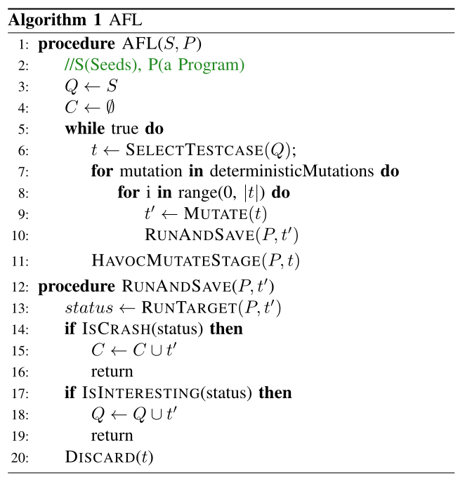

### 相关工作

**1. AFL性能优化**

* AFL原生的调度策略导致大多数测试用例执行相同的高频路径。

  AFLFast实现了几种创新的调度算法：

  * 能量调度：为覆盖低频路径的种子赋以更多的能量
  * 种子调度：对执行罕见路径的测试用例赋以更高的优先级

* AFL未能探索程序的大区域，为了帮助AFL实现更高的代码覆盖率，FairFuzz使用两种方法：
  * 识别罕见分支（被少数测试用例执行）
  * 为每个测试用例创建变异掩码，以避免对那些能够导致罕见分支执行的区域进行变异

* 为了减少CGF中代码覆盖率跟踪的开销，UnTracer引入了覆盖率跟踪：
  * 一个插桩了软件中断的兴趣预言机，用于快速识别未触发的基本块
  * 一个全插桩的跟踪器，用于统计代码覆盖率

* Xu等人设计了几个操作系统调用（轻量级的snapshot()来替换fork()，专门的文件系统服务处理小文件和共享内存日志用于同步），以减少forkserver和文件操作的开销

---

**2. 结构感知模糊测试**

* AFLSmart将Peach引入AFL中，充分利用Peach生成良好结构化测试用例的能力
* Superion在AFL中引入了一种语法感知修剪策略和几个变异策略

---

**3. Magic数感知模糊测试**

* Steelix使用静态分析和二进制插桩向AFL提供比较信息反馈
* laf-intel利用LLVM的pass将比较操作拆分成为更小的比较操作。因此，如果AFL变异的某个字节是magic数的一部分，laf-intel可以快速发现路径变化
* REDQUEEN通过检查函数调用和比较指令来解决magic数难题

---

**4. 混合模糊测试**

* Driller将模糊测试和符号执行结合在一起。当模糊器无法满足约束时，Drill将利用符号求解器来产生新的测试用例以通过检查。然而，符号执行会降低模糊测试的可扩展性
* QSYM设计了一个快速的符号执行引擎来提高混合模糊测试的可伸缩性

---

**5. 仅二进制文件模糊测试**

* AFL-dyninst利用静态二进制插桩将反馈代码注入到原始二进制文件
* WinAFL、afl-pin和afl-dynamorio在运行时利用动态二进制插桩来收集代码覆盖率信息
* AFL QUMU模式和Unicorefuzz都是用仿真来收集代码覆盖率信息

## 挑战

**C1：变异开销急剧的增长**

* AFL不考虑变异空间

* 在经过几轮模糊测试处理后，模糊器将在某些测试用例中耗费大量时间，从而阻碍了模糊器的有效运行

* 一个例子：

  * 图1展示了对readelf进行模糊测试时AFL的挂起状态（很长一段时间不能够找到新路径）
  * 找到这些测试用例并避免陷入不必要的攻击性突变是很重要的

  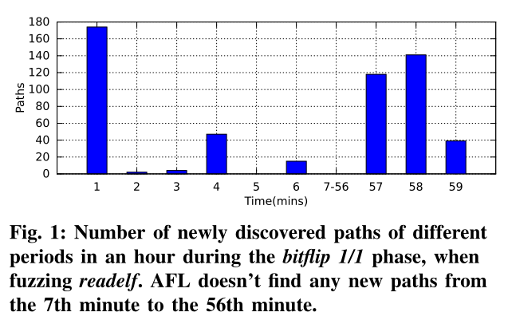

---

**C2：无效变异区域选择**

* 在对不同目标程序进行模糊测试时，可以找到控制新路径的元数据区域，元数据上的变异通常会极大地促进模糊测试过程
  * 在测试ELF格式解析器（readelf）时，在ELF头上执行变异可以快速找到许多新路径
  * 相反，改变代码部分可能是徒劳的

* **AFL对整个测试用例一视同仁**，这样无效且阻止模糊器更快找到更多的路径

* 图2所示的激励程序在第15行处包含了一个堆溢出漏洞（CVE-2019-19931）。假设AFL生成一个新的文本用例t，该用例首先通过第11行的检查，并且`dataLength`的值是合法的。然后，由于检测到新路径，测试用例t将会被保留下来。然而，当选择t进行变异时，AFL会从头到尾对其进行变异，这是非常低效的，因为只有`tag`和`dataLength`对控制流有影响。更重要的是，在dataLength相关字段优先变异有助于更早触发漏洞，而AFL不行。因此，AFL无法有效发小新路径，也无法及时暴露漏洞。

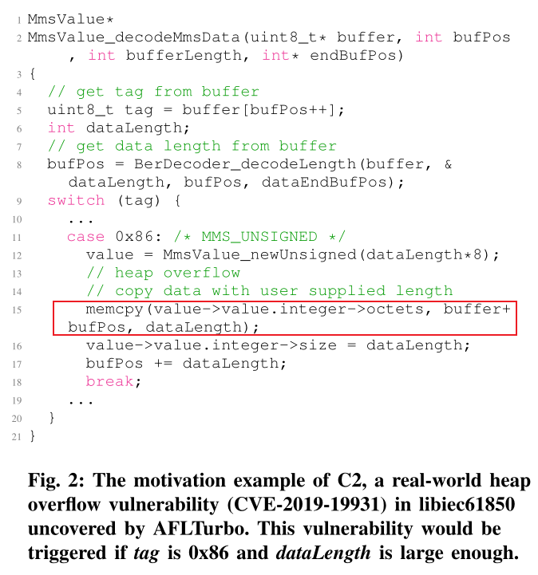

## AFLTurbo

### A. Overview

* 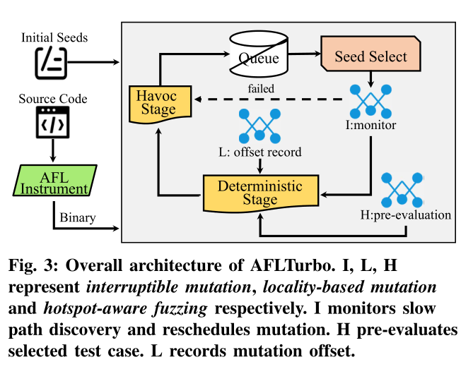

* 为AFL引入三个新的模块：
  * 可中断变异：是确定性变异阶段的一个监控组件，用来监控变异开销；
  * 局部变异：是用来记录测试用例的局部信息（如变异偏移量）一个记录组件；
  * 热点感知模糊测试：是一个预评估过程，负责确定模糊器敏感的区域。

​		配置可中断变异，模糊器可以在确定性变异阶段决定是否继续变异，如果认为需要进一步的确定性变异，则局部变异和热点感知模糊测试将生效。

* 实现了3个新的模糊器（AFL-int，AFL-loc和AFL-hot）

---

### B. 设计

#### 1）可中断变异

* 引入一个新的**挂起监视器**，该监视器负责监视AFL的执行状态，并引导AFL跳过使AFL挂起的测试用例上的变异
* 为了实现监控，引入了**两个阈值**：
  * 新生成路径数量
  * 每个变异阶段的运行时间

* 如果监视器观察到一个测试用例上的**变异不能导致足够多的新路径**，或者它**花费了太多的时间**，那么它会阻止AFL在当前阶段进一步变异

* 下面算法给出了可中断变异的第一种方法：

  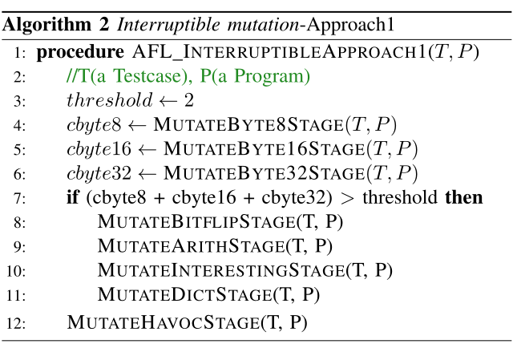

  * 首先，AFL-int在给定测试用例T上执行三种类型的字节翻转（bitflip 8/8，bitflip 16/8，bitfilp 32/8），并将每一个新发现的路径计数存储在cbyte8、cbyte16和cbyte32中（Line 4-6）。
    * 比特翻转比其他变异类型来说，对测试用例的影响更大，因为它在变异时影响所有比特；
    * bitflip 1/1、bitflip 2/1和bitflip 4/1生成大量测试用例（大约占确定性阶段的40%），因此非常耗时且效率较低。

  * 接下来，AFL-int检查cbyte8、cbyte16和cbyte32之和是否大于预定义的阈值，如果总和大于阈值，则认为测试用例T值得在确定性阶段进行持续性变异（Line 7-11）。
  * 否则，AFL-int将直接跳过havoc阶段。更具体来说，该阈值是可配置的，在我们的具体实现中将其设置为2。
    * 如果一个测试用例在三种变异类型中都不能够生成超过2个新路径的测试用例，那么该测试用例很难在其他变异阶段产生更多的路径

* 下面算法给出了可中断变异的第二个方法：

  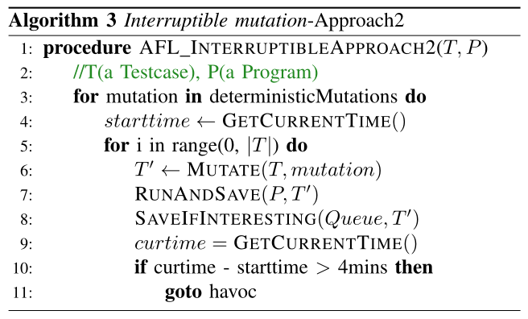

  * 首先，AFL-int记录当前变异阶段开始时的时间（Line 4）。
  * 然后，它使用当前变异策略从头开始对测试用例T进行变异，并将变异后的测试用例投喂给目标程序，同时保留那些感兴趣的测试用例（Line 6-8）。
  * 当AFL-int在任何变异阶段（如位翻转）达到最大运行时间时，AFL-int直接跳转到havoc阶段，以减轻确定性变异的过度开销（Line 10-11）。

​		在我们的实现中，我们将最长时间设置为4分钟，因为根据其早期的时间，4分钟的时间足以让单一类型的变异生成新的路径。

#### 2）局部变异

* 为了解决C2，我们提出了基于局部的变异：
  * 使用一个动态计算的偏移值来对每一个测试用例进行标记，重点对其周围的字节进行变异

* 如果通过对一个特定偏移进行变异而产生的测试用例触发了一个新的路径，那么如果模糊器更加关注该偏移量周围字节的变异，则更有可能生成更有趣的测试用例
  * 原因：此偏移量周围的字节包含影响程序控制流的数据的概率更高

* 下面算法描述了在给定测试用例T中基于局部变异的操作流程

  * AFL-loc为每个测试用例维护了一个变量`offset`，该变量记录了相应测试用例的有趣偏移量。`offset`根据以下规则进行设置：
    * 对于用户提供的每个测试用例，其偏移量用一个特殊值`0xffffffff`进行初始化，该值对用户提供的种子输入进行掩码操作
    * 对于每个能够触发新路径的变异的测试用例，其`offset`值是其父级的变异位置（Line 13-14）。

  * 在确定性变异阶段，如果测试用例是种子，则AFL-loc会对每个字节进行变异；否则，它只会改变偏移量周围的第一个0x100字节和内容（[offset - 0x100, offset + 0x100]）
    * 根据经验，C/C++中的结构体或类的大小不会超过0x100字节
    * 0x100并不会很大，从而导致很大的开销，也不会过小，从而错过在同一个结构体或对象中变异有用字段的机会
    * 保持第一个0x100字节变异的原因是该区域很可能是大多数测试用例的感兴趣数据（即许多文件格式利用前几个字节存储关键数据）

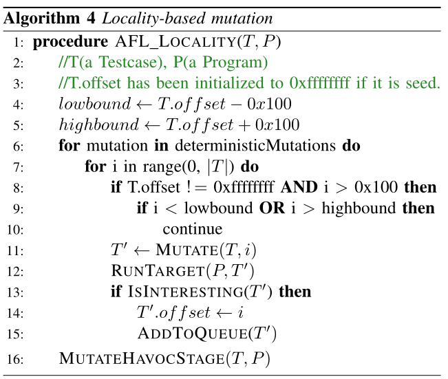

#### 3）利用HitMap实现热点感知模糊测试

* 两个直觉：
  * 改变元数据可能会导致新的覆盖范围：因为元数据通常包含`type`、`offset`和`number`等有趣的字段，其中`type`可以在一个包含`switch`的测试场景使用，而`offset`可以对未引用的内存进行访问；
  * 改变不属于元数据的数据区域会阻碍目标程序探索新的路径

* AFL对测试用例不敏感，因此无法区分元数据和非元数据

* 将HitMap引入AFL中：

  * HitMap的每一位表示相关代码覆盖率的状态：其中0表示该代码覆盖状态并没有被任何测试用例所到达，1则相反
  * 将AFL根据`trace_bits`计算的32位哈希值作为键
    * HitMap设置为512MB（(2^32)/8字节）

  * 在模糊测试开始时，HitMap的每一位都被初始化为0。然后，AFL-hot在每次运行测试用例后更新HitMap。当一个测试用例运行完后，其路径（`trace_bits`）哈希值所对应索引的HitMap值的比特将设置为1.

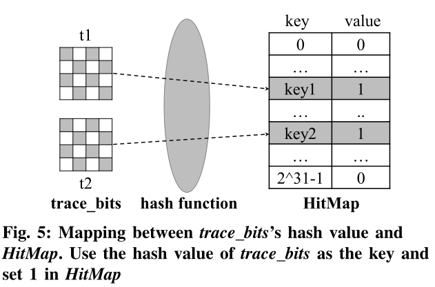

* 热点感知模糊测试算法如下所示：
  * 第一个阶段，热点感知模糊测试对每个测试用例执行预评估过程（Line 11-15）：首先，它分配一个数组`unchangearr`来存储当前测试用例T的预评估结果，其大小由`T`的长度和变量`step`决定。并且`unchangearr`中每一个元素表示`T`中控制流是否对相关区域敏感。然后，热点感知模糊测试迭代变异T中`step`字节（一次性翻转包含`step`字节特定区域的所有比特，Line 12）。在每次变异后，热点感知模糊测试检查变异测试用例的运行结果。如果`trace_bits`哈希值是先前出现过的，这意味着T中已变异区域没有触发新的代码覆盖率。因此热点感知模糊测试将在unchangearr数组中将其设置为`True`（Line 15），表示稍后AFL不应对该区域进行变异。
  * 第二个阶段，热点感知模糊器通过检测`unchangearr`来检查当前变异偏移量是否对控制流敏感。更具体来说，热点感知模糊测试将当前的变异偏移量分步分割，并将分割结果作为索引值更新`Unchangearr`值。如果当前偏移对控制流敏感，则热点感知模糊在当前偏移处进行正常确定变异该进行的操作，否则跳过当前变异偏移量并继续检查下一个偏移量（Line 19）。最后，热点感知模糊释放`unchangearr`以避免内存泄露。

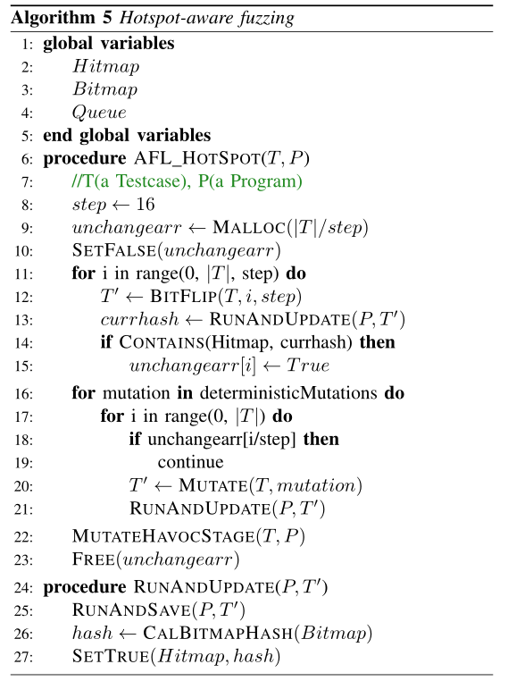

:x: 上述算法Line 13行将直接将`SetTrue(Hitmap, hash)`放置在`RunAndUpdate()`函数中，那如果当`T'`触发了新路径，在`RunAndUpdate()`将其Hitmap中该路径哈希值对应索引设置为True，那么Line 14恒为`True`，从而`unchangearr[i]`也恒为`True`。**应该将`SetTrue(Hitmap, hash)`放置在Line 14中的if条件中。**

## 评估

### A. 实验设置

1）基线模糊器：AFLTurbo和AFL、AFLFast、FairFuzz进行比较

2）基准：

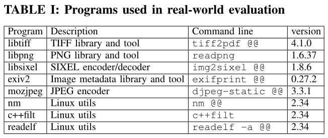

3）实验基础设施

### B. 路径发现性能

1）设置：

* **四种不同配置的模糊器**（AFLTurbo、AFL-int、AFL-loc、AFL-hot）和**三种基线模糊器**在**8个真实环境的程序**

* 单核心模糊测试，每个模糊器24小时，并重复每个实验10次
* 使用随机收集的测试用例（测试用例较小）

2）路径覆盖率：

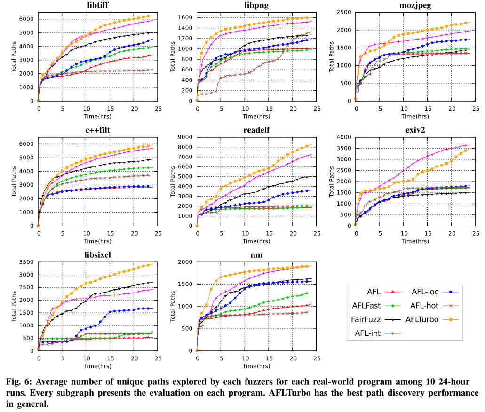

* AFLTurbo在除exiv2之外的所有程序上实现了最佳性能，在exiv2中，AFL-int在24小时内发现的路径数最多。但exiv2的趋势是，如果我们继续对其进行模糊测试，AFLTrubo将取代AFL-int

* 总体而言，在所有情况下，AFLTRBO在路径发现方面都显著优于其他基线模糊器。

3）每种方法的贡献：

* 可中断变异对AFLTurbo的性能有很大的贡献
* 局部变异对AFLTurbo的贡献也很大
* 热点感知模糊测试对AFLTurbo的影响很小，这是因为我们只使用较小的种子作为这些模糊器的输入，热点感知模糊在小测试用例上表现不好。

### C. LAVA-M的漏洞检测

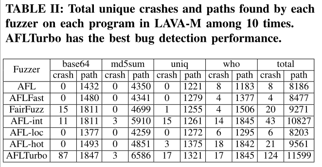

* AFLTurbo在bug检测方面明显优于所有基线模糊器
* 每种方法对AFLTurbo的贡献不同
* 更好的路径覆盖往往会导致更好的bug检测能力

### D. 测试用例大小的影响

* 认为AFL-hot效果不佳的原因在于测试用例的大小

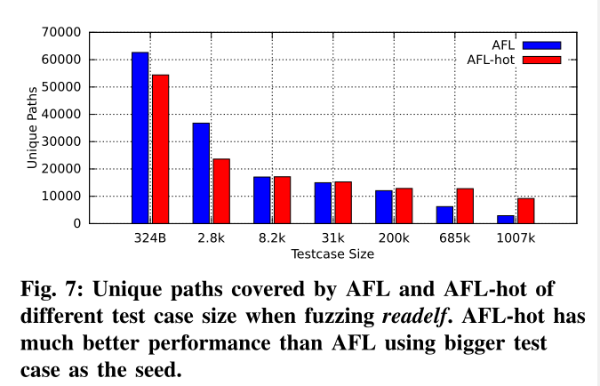

### E. 0day漏洞的发现

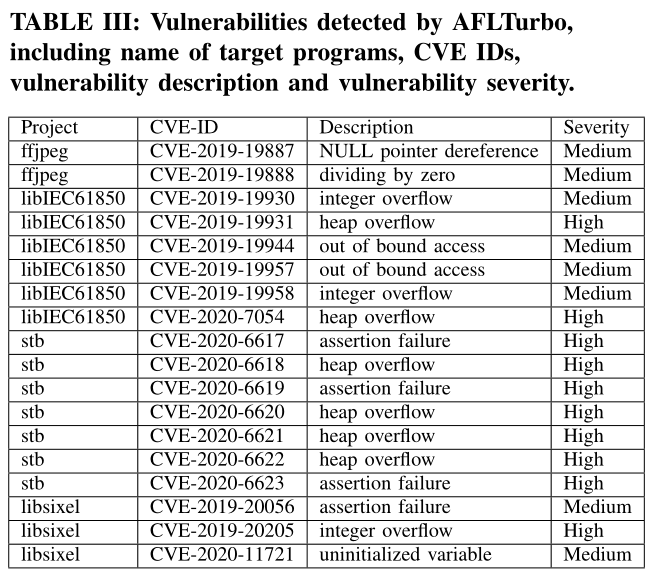

## 我的看法

亮点：

1. 设计了三种策略：

   * 可中断变异
     * 其新生成路径数量阈值**保证了种子的质量[对其变异更有可能触发路径提高的测试用例]**（:star:）
     * 其运行时间阈值**避免AFL的确定性变异策略在大的测试用例处浪费过多的时间**（:star:）
   * 局部变异
     * 考虑了**敏感字段**，着重对**关键字段**（`offset`）处前后100字节内的数据集中进行变异

   * 热点感知模糊测试
     * 从偏移量为0开始，选取两字节进行变异，如果触发了新路径，则对其进行变异，否则跳过
     * 考虑了**两个字节共同构成敏感字段**的情况，并对双字节敏感字段进行变异

2. 分析了热点感知模糊测试在实验中低效的原因，并研究了测试用例大小对于热点感知模糊测试效果的影响

不足：

1. 仅考虑单字节敏感字段和多字节敏感字段的变异情形，其他长度的敏感字段并未考虑
2. 论文没有阐述自身工具的局限性和未来的工作进展方向
3. AFLTurbo中热点感知模糊测试策略使用了512MB大小的HitMap，额外增加内存的开销