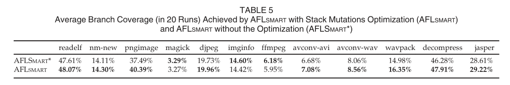

# Smart Greybox Fuzzing

## 引言

* 基于覆盖的灰盒反馈CGF其中一个最重要的缺陷：**缺少对输入结构的感知**

* CFG工具的变异操作基本上作用于**比特层面**，但许多安全相关的应用或库将高度格式化的文件如图片、音频、视频、数据库、文档或表格文件等作为输入，如果格式非法，则会被程序解析器拒绝

* 为了解决上述的问题，提出了两种主流的方法：

  * **字典：**

    * AFL创造者Zalewski提出了字典的方法，一种轻量级的技术，在变异过程中，在种子文件的随机位置插入有趣的字节序列或tokens。

    * Zalewski担忧对输入感知的**完全支持**可能会影响模糊测试的**效率或可用性**
    * 当想要猜解出magic树或块标识符以探索新路径时，AFL可以从字典中获益

  * **动态污点分析：**

    * Rawat等人利用动态污点分析和控制流分析来推断输入数据的位置和类型（VUZZER）

  字典和动态污点分析并不能改变文件高级结构，还是处于比特级别的表示

* **智能黑盒fuzzers**已经具有输入结构感知并利用文件格式从现存有效文件中构造新的有效文件：

  * Peach：使用一个输入模型去反汇编有效文件并将它们重新组合成新的有效文件（删除块，修改重要的数据值）
  * LangFuzz利用JS上下文无关语法从JS中提取代码片段，并将其重新组装成新的JS文件

  Peach缺少覆盖反馈信息，其性能比AFL差得多

## 贡献

1. 提出智能灰盒模糊测试（SGF）原型AFLsmart，使灰盒模糊测试可以对输入进行格式感知
2. 定义了新的变异操作，该变异操作作用于文件的虚拟结构上，而不是作用于比特级别
3. 提出了一种新的基于有效性能量调度算法，该算法将更多的能量分配给有效性更高的种子
4. 通过实验将AFLsmart与AFL和VUZZER进行比较

## Motivating example

### WAVE文件格式

* WAVE文件(*.wav)包含音频信息并且能够被广泛的媒体播放器和编辑器处理

* WAVE文件由块组成，每个块由块标识符、块长度和块数据组成。每个块信息如下图所示：

  

* 块的结构是分层次的。根块要求文件的前四个字节为RIFF（unicode），然后四个字节指定字块的总大小n+4，接下来四个字节必须是WAVE（unicode）。WAVE文件其余部分包含子块、强制fmt块、几个可选块和数据块。数据块本身受到进一步的结构约束。

* WAVE文件将音频信息和元数据嵌入到分层块结构中。所有WAVE文件应遵循WAVE文件格式以允许对音频信息进行高效、系统的解析

### 剖析主流音频压缩库中的漏洞

* 讨论AFLsmart在WavPack库中发现的一个漏洞

* 构造方式(chunk construct)： RIFF+fmt1(IEEE float)+fmt2(PCM)+data

* 解析部分源码如下所示

  

* CVE-2018-10536漏洞：构造个多个相同的块

* 产生原因：第一个fmt块经过第2-4行的解析后，format=3（IEEE float），32bits/sample，1个通道和4个块对齐。该配置能够通过第6-10行的合法性检测，并相应的设置全局配置（第11行）；第二个fmt块被解析为format=1(PCM)，1bit/sample，1通道和1个块对齐（第2-4行）。当WavPack没有将IEEE float作为wave格式数据并重置float_norm_exp时，新配置将会有效。但，此时WavPack配置了IEEE float，虽然该配置不能通过合法性检测，但由于第2-4行改变了全局的bits_per_sample，由此可以导致缓冲区溢出，攻击者可以控制该溢出。

* 解决办法：当*.wav文件包含多于一个fmt块时提前终止解析程序。

### 传统灰盒模糊测试的困难

* 传统灰盒模糊测试总的算法如下图所示

  

  1. 引导：

     基于覆盖率的灰盒fuzzer由搜索策略和能量调度指导。搜索策略决定在种子库中选择种子的顺序，并在chooseNext中实现。能量调度决定种子的能量，即通过对该种子模糊测试来生成多少输入，并在assignEnergy中实现。

  2. 比特级别的变异：

     传统的灰盒fuzzer不知道输入结构。为了产生新的输入，根据预定义的变异算子修改种子。变异算子是一种转换规则，例如bitflip。给定一个种子输入，在种子输入中随机选择一个变异位置，并应用变异算子以生成新的测试输入。在算法1中mutate_input方法就是通过种子变异实现输入生成。

     下图展示了规范WAVE文件的前72个字节内容。要找到前面所述的CVE-2018-10536漏洞，就必须在现有的fmt和data块之间添加第二个有效fmt块。显然，AFL极不可能通过比特变异运算插入额外有效的块。

     

  3. 字典：

     为了更好的促进结构化文件的模糊测试，许多灰盒fuzzers（包括AFL），允许指定一个有趣的字节序列列表，称为字典。在这个示例中，这样的字节序列可以是单词，如RIFF/fmt/data（unicode），也可以是公共值，如22050和88200（需要用十六进制表示）。然而，字典对于插入额外一个有效块的贡献不大。

## 智能灰盒模糊测试SFG

* 智能灰盒模糊测试比智能黑盒模糊测试或传统灰盒模糊测试更有效
* SFG允许深入到接受高度结构化输入的程序中，而不会陷入程序的解析器代码中去
* SFG利用覆盖率信息和能量调度更有效探索程序的行为

### 虚拟结构

* SFG有效性来自其**智能变异算子**的设计（三个设计原则）：

  * 变异算子应该充分利用从种子输入中提取的结构信息，在块级别和比特级别应用高阶变异操作
  * 使用统一的操作以支持所有基于块的文件格式（例如MP3、ELF、PNG、JPEG、WAV、AVI、PCAP）
  * 所有这些操作都必须是轻量级的，以保证灰盒模糊测试的效率

* 为了实现上述三个设计原则，引入了一种新的轻量级且通用的数据结构——虚拟结构。该结构可以简化结构变异操作。每个输入文件都可以表示为**解析树**。**该树的节点称为块或属性**，**块是树的内部节点**，**属性是树的叶节点**。

  * 块是文件中连续的字节序列
  * 根块横跨整个文件

  如下图所示，每个块都有一个start_index和end_index来表示文件中字节序列的开始和结束，一个type字段用来区分不同的块（例如，在WAVE文件格式中，fmt块不同于data块）。每一个块可以有零个或多个块作为子块，也可以由另个或多个属性。属性表示文件中与结构无关的重要数据，例如WAVE文件中的fmt块中的wFormatTag。

  

  ---

  :star:举个例子

  如图3的规范WAVE文件具有如下虚拟结构。根块（riff）有起始索引和终止索引{0,2083}，根块有三个属性，即ckID，cksize和WAVEID，有两个子节点{12,35}和{36,2083}。第一个子块fmt有8个属性，名为ckID，cksize，wFormatTag、nChannels、nSamplesPerSec、nAvgBytesPerSec、nBlockAlign和wBitsPerSample。 

  ```mermaid
  graph LR
      subgraph virtual structure
      root("Chunk:{0,2083}, riff")--attr-->attr1[[ckID]]
      root--attr-->attr2[[cksize]]
      root--attr-->attr3[[wFormatTag]]
      root-->subNode1("Chunk:{12,35}, fmt")
      root-->subNode2("Chunk:{36,2083}, data")
      subNode1 --attr--> sb1[[ckID]]
      subNode1 --attr--> sb2[[cksize]]
      subNode1 --attr--> sb3[[wFormatTag]]
      subNode1 --attr--> sb4[[nChannels]]
      subNode1 --attr--> sb5[[nSamplesPerSec]]
      subNode1 --attr--> sb6[[nAvgBytesPerSec]]
      subNode1 --attr--> sb7[[nBlockAlign]]
      subNode1 --attr--> sb8[[wBitsPerSample]]
      subNode2 --"other"--> sb9[[...]]
      end
  ```

* 如何构造虚拟结构？

  * 构建一个文件格式规范和一个解析器

  * 给定规范和文件，解析器根据给定的内容构造虚拟结构

  * 使用Peach中一个稳定性较好的解析组件`File Cracker`：

    * 给定一个输入文件和输入格式规范Peach Pit
    * 对File Cracker进行**扩展**以准确将文件解析并分解为块和属性（:star:），并提供边界索引和类型信息

    WAVE文件格式的Peach Pit的一个例子：

    

    在上面这个规范中，我们可以指定有效的WAV文件中块和属性的结构、类型、顺序，并将其转换为一个虚拟结构。

### 智能变异算子

* 基于虚拟输入结构，定义了三种**通用**的结构变异算子：
  * 智能删除
  * 智能添加
  * 智能拼接

#### 智能删除

* 给定一个种子文件s，选择任意块c并将其删除
* SGF将所选块c结束索引之后的字节复制到c的开始索引位置，并相应的修改所有受影响块的索引


#### 智能添加

* 给定一个种子文件s1，选择任意第二个种子文件s2，在s2中任选一个块c2，将c2添加到s1任意块c1[c2的父节点和c1的父节点相同，即c1.parent.type==c2.parent.type]
* SFG将c1结束索引之后的字节复制到一个新的索引中，其中新块c2的长度被添加到给定种子文件s1中c1的当前结束索引；然后，SGF将第二个种子文件c2的开始索引和结束索引之间的字节复制到给定种子文件s1中现有块c1的结束索引处。


#### 智能拼接

* 给定一个种子文件s1，选择s1中的任意块c1，选择任意第二个种子s2，选择s2中的任意块c2，并满足c1和c2具有相同的类型
* 使用c2替换c1


#### 相关讨论

:star:  **保持结构完整性**

* 现有位级变异算子的一个关键挑战是保持生成输入的结构完整性

* 不能保证上述结构变异算子能够保持结构的完整性：

  * 例如，Peach Pit格式规范可能允许添加或删除fmt块，而严格来说，合法的WAVE格式规范只允许一个fmt块
  * 但是，宽松的规范允许发现浅层的漏洞，如需要两个fmt块才能触发的漏洞
  * 不可变属性的规范允许智能灰盒fuzzer仅将比特级别变异运算符应用于可变异属性索引

  因此，严格执行结构完整性并不可取，而要达到解析器代码更高的层级是有必要的。

:star: **保持语义完整性**

* 保持数据字段的隐式约束：即修改一个数据字段中的字节可能需要智能修改另一个字段中的字节，例如在数据字段上计算检验和。

* 智能灰盒fuzzer可以采取几种方法解决这个问题：

  :one: 在插入的片段中保留这种隐含的约束

  :two: 一些约束，如检验和，可以事后修复

### 基于区块的智能变异

本节讨论智能变异的挑战和机遇

#### <span id="stack">叠加变异</span>

* 为了生成有趣的测试用例，同时应用几个结构化和比特变异运算符是有必要的（stacking）
* 对结构变异算子进行堆叠是比较困难的：
  * 对于每个结构变异，文件本身和相应的虚拟结构必须一致更新
  * AFLsmart复制了种子虚拟结构，并通过将它们一致应用于虚拟结构和文件本身来堆叠变异算子

#### 基于片段和区块的突变

* 在实现叠加变异后，观察到许多输入被添加到种子语料库中，这些输入在格式规范中无效
* AFLsmart使用规范将有效文件分解为片段，片段是文件解析树中的子树，按照前述内容可以添加、删除和替换这些片段
* :star: 问题：由于大多数新添加的种子无法成功解析，而没有成功解析的种子不会生成解析树，**因此基于片段的智能灰盒fuzzer很快会退化为一个dumb灰盒fuzzer**

---

如何解决上述问题？**引入区块（细粒度）**

通过解析器的解析表返回的区块来解决这一问题：

* 区块是文件与规范中的data块或属性相关联的连续字节序列
* 如果文件损坏，解析器将在某处解析失败。在该处之前，可以导出符合规范的块
* 为了填充虚拟结构，AFLsmart使用Peach Cracker组件中的解析表来为每个块派生开始、结束索引以及类型属性。

#### <span id="delay">延迟解析</span>

:star: 问题：为种子输入构建虚拟结构会产生巨大的时间成本，例如构建一个218字节的PNG文件的虚拟结构需要2到3秒。如果SGF为发现的每一个种子输入构建虚拟节点，SGF可能很快就会落后于传统的灰盒模糊测试

* 开发了一种延迟解析的方案
* 以一定概率p构造种子输入的虚拟结构，该概率p取决于发现新路径的当前时间
  * t为上次发现新路径的时间点
  * s为当前选择的种子，假设s的虚拟结构并未构建
  * 给定一个阈值 ϵ，根据下面式子计算概率prob_virtual(s)以构造s的虚拟结构：

$$
prob_{virtual}(s)=min(\frac tϵ, 1)
$$

​		根据上述概率公式，其概率会随着t的增加而增大；当t >= ϵ时，prob_virtual(s) = 100%

### <span id="validity">基于有效性的能量调度</span>

* 能量调度决定了在基于覆盖率的灰盒模糊测试过程中分配给给定种子的能量，种子能量决定了下一次选择该种子进行模糊测试的时间
* 相关文献中能量调度策略：
  * AFL最初的能量调度将更多的能量分配给执行时间较短、体积较小的种子
  * AFLfast基于梯度下降的能量调度算法将更多能量分配给使用低频路径的种子

* 定义了一个简单的基于有效性的能量调度：

  有效性从直观上是一个布尔变量：有效（1）、无效（0）

  建议将有效性用一个比率表示：一个种子在一定程度上是有效的

  * 种子s的有效性的度v(s)由构造虚拟结构的解析器决定，如果所有文件都能成功解析，则v(s) = 100%。如果仅有65%的种子能够被成功解析，则v(s) = 65%
  * 一个文件虚拟结构部分有效也同样部分构造，对于部分结构，将一个块添加到后续不可解析的其余部分

  给定一个种子s，p<sub>v</sub>(s)定义如下：
  $$
  p_v(s)=
  \begin{cases}
  2p(s){\quad}if{\,\,}v(s)≥50\%{\,\,}and{\,\,}p(s)≤\frac U2\\
  p(s){\quad}if{\,\,}v(s)<50\%\\
  U{\quad}otherwise
  \end{cases}
  $$
  其中p(s)是传统灰盒fuzzer（AFL）原始能量调度分配给s的能量，U是AFL可以分配的最大能量。该能量调度实现了一个**hill climbing metaheuristic（爬山算法）**，总是将两倍的能量分配给有效率至少为50%且原始能量p(s)小于U/2。

* 从上述启发式算法可以看出：
  * 基于有效性的能量调度将更多能量分配给**有效性较高**的种子
  * 使用结构变异算子的次数随着有效性的增加而增加
  * 可以从已经有效的输入中生成更多有效的输入
  * 搜索遵循梯度下降
  * 有效性较高的种子总是比有效性较低的种子分配更多的能量

## 文件格式规范

* 手动构建这种高度结构化和复杂文件格式的高质量规范耗时也容易出错
* 分析了180种最常见的文件类型，重点是文档、视频、音频、图像、可执行文件和网络数据包文件
* 通过阅读规范或使用解析工具识别这些文件的格式，找到关键insight
* 关键insight解释了文件格式的常见结构，同时也展示了数据模型的完整性和精确度与智能灰盒模糊测试成功之间的相关性

### Insight-1 块继承

* 思想来源：大多数文件格式由数据块组成，这些数据块通常共享一个**公共结构**
* 首先建模一个包含文件格式的所有块共享的属性的通用块，然后对继承通用块属性的具体块进行建模。因此，我们只需要插入/修改特定于块的属性
* 块继承的目的是 :question: 
  * 提供模块的可重用性

清单2和3展示了一个例子关于如何将区块继承应用于WAVE音频文件格式的输入规范中。


清单2中的通用块模型指定每个块都有其块标识符、块大小和块数据，其中块大小约束块数据的实际长度。此外，每个块的末尾可以有填充字节，以使其与单词（2字节）对其。


清单3显示了format块的模型，WAVE文件中的一个特定数据块，它继承了通用块的块大小和填充属性（ref=“Chunk”）。它只对特定块的属性进行建模，比如其字符串标识符和存储在其数据中的内容。

:ballot_box_with_check: 010Editor之类的十六进制编辑器工具可以检测文件格式，并快速将样本输入文件分解为具有所有属性的块。下图显示了使用010Editor打开WAVE文件。


### Insight-2 规范完整性

* 由于智能灰盒fuzzer同时支持在块级别进行结构变异操作，因此无需指定块中所有的属性。

* 可以从粗粒度的规范开始，并逐渐使其更加完整

  清单4显示了format块的简化定义，其中我们只指定块标识符，不定义其数据中的子属性

  

* 基于Insight-1和Insight-2，可以快速编写一个简短但精确的文件格式规范

### Insight-3 宽松的约束

* 块中可能有许多约束（例如，块标识符必须是一个常量字符串，块大小属性必须与实际大小匹配，或者块的有序性）
* :star: 但是，由于模糊测试或压力测试的主要目标通常是探索**边角案例**（corner cases），因此我们应该放宽一些约束，只要这些放宽的约束不影响解析器分解文件即可。
* :thinking: 清单5展示WAVE文件格式的定义


​		当我们使用choice元素来指定潜在块（包括强制块和可选块）的列表时，许多约束都被放宽了：

​		1.块可以以任何顺序出现

​		2.某些块（包括强制区块）可能不存在

​		3.可能会出现一些未知块

​		4.某些块可能会出现不止一次

:ballot_box_with_check: 事实证明，这个宽松的模型能够暴露出更多的漏洞

### Insight-4 可重用性

* 文件格式规范可用于模糊测试所有采用相同文件格式的程序（可重用）

## 实验设置

* 扩展AFL：ALFsmart
* 将AFLsmart与灰盒fuzzer【AFL、AFLFast】和智能黑盒fuzzer【Peach、VUzzer（污点分析）】进行了实验比较

### 研究问题

| RQ   | content                                                |
| ---- | ------------------------------------------------------ |
| 1    | 智能灰盒模糊测试比传统灰盒模糊测试更有效吗？           |
| 2    | 智能灰盒模糊测试比智能黑盒模糊测试更有效吗？           |
| 3    | 变异叠加策略是否有助于提高智能灰盒模糊测试的有效性？   |
| 4    | 智能灰盒模糊测试比基于污点分析的灰盒模糊测试更有效吗？ |

### 实现：AFMsmart

* AFLsmart架构：相较于AFL，添加并修改四个组件来进行扩展，分别是File Cracker、Structure Collector、Energy Calculator和Fuzzer本身。

  

#### File Cracker

* 作用：解析输入文件（文件规范）并将其分解为数据块和数据属性，还可以根据解析成功的文件量得到输入文件的有效性
* 修改智能黑盒fuzzer Peach的Cracker组件来实现File Cracker

#### Structure Collector

* 该部件连接了AFLsmart fuzzer和File Cracker
* 作用：当Fuzzer请求当前输入的结构信息以支持其操作时，它将输入传递给Structure Collector以收集有效性、分解的块和属性
* AFLsmart Fuzzer只对这些信息收集一次，并将其保存以备将来使用

#### Energy Calculator

* 实现了前述讨论的[基于有效性的能量调度](#validity)，AFLsmart会将能量更多分配给语法上更有效的输入

#### AFLsmart Fuzzer

* 设计并实现了一个虚拟结构，可以再一个层次结构中表示输入格式
* 基于这个数据结构，实现了所有在块级别工作的智能变异操作
* 修改fuzz_one函数，以支持[延迟解析](#delay)和[叠加变异](#stack)

>注：
>
>修改不影响AFL的插桩
>
>亦可以对程序二进制文件进行模糊测试，使用诸如DynamoRio等工具

### 主要程序

* 未使用LAVA-M，原因是其基准大多数程序不处理结构化文件
* 对于RQ1和RQ2：选择11个实验对象，涵盖6种基于块的文件格式：ELF PNF JPEG JP2(JPEG2000) WAV AVI。
* 对于RQ4与VUzzer比较，选择论文中所使用的的基准，该基准包括6个老版本的程序mpg321 gif2png pdf2svg tcpdump tcptrace 和 djpeg


### 语料库、字典和规范

#### 格式规范

* 这些文件规范将被开发为Peach Pits

* 在实验室，使用了十个文件格式规范（见下表）

  <span id="table2">

  </span>

* WAV格式作为一个免费的Peach样例，然而其他格式的Peach则需要从头开发

#### 种子语料库

* ELF文件：主机bin和/usr/bin文件夹中收集二进制elf文件

* 其他文件格式的种子，从保存样本文件的网站上下载了种子

  [表2](#table2)展示了我们用于每种文件格式的输入语料库大小

#### 字典

* 为ELF WAV AVI和JP2设计了字典，AFL已经为PNG和JPEG图像格式提供了字典
* 字典的编写仅仅是手工从规范中提取token字段（如签名、块类型等）

### 基础设施

* 计算资源
* 重复试验
* AFL和AFLFast的设置
* 计算分支覆盖
* 衡量独特bug

## 实验结果

### RQ1 SGF :vs: 传统灰盒模糊测试

* 就分支覆盖率而言，AFLsmart明显优于AFL和AFLFast，如下图所示。


* 下图展示了所有基于AFL的fuzzer内部统计数据

  

* 在漏洞发现方面，AFLSmart在10个程序中发现了漏洞，而AFL和AFLFast在其中4个程序中未发现漏洞。表4显示了AFLsmart发现的详细漏洞和与基线fuzzer的比较。

  

### RQ2 SGF :vs: 智能黑盒模糊测试

* AFLsmart在所有十二个程序中的表现都**明显**优于Peach（见[表3](#table3)和[表4](#table4)）,AFLsmart平均将分支覆盖率提高了133.95%，并且能发现33个0day漏洞，而Peach只能在WavPack库中找到一个漏洞

* 无结构化的模糊测试在基准测试中很难发现0day漏洞，但结构化的Peach也难以发现0day漏洞，原因在于缺乏

  **1） 覆盖引导机制**

  **2） Peach的性能在很大程度上取决于文件格式规范的精度和完整性**：

  ​		Peach可能需要更详细的输入模型，其中（几乎）所有块和属性都用精确的数据类型指定，以生成更有趣的文件；

  ​		相比之下，AFLsmart不需要非常详细的文件格式规范就可以推倒文件的虚拟结构并应用结构变异操作。

### RQ3 叠加变异的贡献

* 在12个程序中，有9个程序在采用叠加变异优化的AFLsmart优于未采用叠加变异的AFLsmart，如下图所示



### RQ4 SGF :vs: 基于污点分析的灰盒模糊测试（VUzzer）

* AFLsmart在VUzzer的基准测试项目上表现优于VUzzer。


## 案例研究：AFLsmart找到的:bug:

* 在FFmpeg中找到的漏洞：


## 讨论

### 智能fuzzers的必要性

* AFL fuzzer的输入与格式规范无关，导致模糊测试时大量时间被浪费在生成与语法无关的输入上
* 设计基于文件格式感知变异、基于有效性的能量调度以及一些优化（延迟解析、叠加变异等）的智能灰盒fuzzer
* 实验验证了智能灰盒fuzzer（AFLsmart）的有效性

### 真实世界的影响

* 与LPM团队的讨论

### 可复现性

* 为了确保实验的可复现，开源了AFLsmart项目：

  https://github.com/aflsmart/aflsmart

### 未来的工作

* 将AFLsmart的输入文件格式扩展到协议模糊测试中（AFLNet？）
* 自动学习输入格式（Profuzzer？ATTuzz？）
* 提供自动漏洞挖掘过程的保证（:question:）

## 我的观点

亮点：

1. 考虑到传统灰盒模糊测试对于有结构化程序输入的局限性，体现在**模糊测试将花费大量时间生成无效的种子**，因此模糊测试整体效率不高。将Peach中对规范的设计、解析与AFL相结合，以支持生成具有结构化的输入；
2. 考虑到**传统灰盒模糊测试在基于比特的变异策略在针对结构化输入时显得很"dumb"**，因此需要在更高的层级（**块级别**）对结构化输入进行变异；
3. 为了适应结构化输入，设计了基于文件格式感知变异、基于种子有效性的能量调度和其他一些优化（延迟解析、叠加变异等）的智能灰盒fuzzer——AFLsmart。

不足：

1. 文件规范需要人工编写，虽然规范可以是粗粒度的，但也需要人工去标识规范中的各个块。（自动对种子输入字段进行探测的研究也有很多，如Profuzzer、ATTuzz等都表现出不错的结果）
2. 延迟解析的意义何在:question:
3. AFLsmart在linux平台下运行效率不高，原因是:question:

