# Better Pay Attention Whilst Fuzzing

## 摘要

1. 现有的模糊测试方法无法将模糊测试过程中的注意力集中在覆盖难以触发的程序路径上，导致覆盖率几乎没有提高
2. 由于在获取测试输入和程序覆盖率之间的复杂关系方面存在根本困难，生成的输入往往不能有效提高覆盖率

## 现有fuzzer的局限性

1. 缺乏对程序的全面分析，以确定最"有价值"的种子
2. 缺乏有效的变异策略，可以不断选择和变异更相关的种子"字节"。

* 动机：基于AFL的fuzzer存在的**两个问题**
  * 基于AFL的fuzzer选择那些能够覆盖新分支的种子作为边，这样的策略在初始时很有效，**但随着时间的推移，能够覆盖新边的测试用例越来越少**，从而导致该策略不是很有效
    * 解决办法：识别最有价值（就覆盖那些未曾覆盖的分支而言）的测试输入作为种子
  * 基于AFL的fuzzer在种子上应用大量的变异操作以生成新的种子，在覆盖了容易覆盖的分支后，覆盖剩下的分支通常需要对**特定字节进行特定的变异**
    * 解决办法：清楚在哪里和如何应用变异操作以覆盖那些未曾覆盖的分支

* 其他文献对于上述两个问题提出的解决办法

  针对问题1：识别最有价值的测试用例

  * LibFuzzer：启发式
  * AFLfast：优先考虑那些可以触发较少访问路径的种子
  * Entropic：根据固定的熵测量选择携带更多程序信息的种子
  * Fairfuzz：定位并选择触发低概率边的种子
  * Cerebro：基于代码复杂度、执行时间和覆盖率等因素选择种子

  在某些程度上，上述方法是有效的，但这些方法**缺乏对模糊测试下程序的全局视图**，因此随着时间的推移，往往会错过最有价值的种子。例如，如果高概率边导致大量未覆盖的分支，则低概率边可能不如高概率边"有价值"

  ---

  针对问题2：有选择的应用变异操作
  * Steelix、REDQUEEN和其他一些工作建议执行动态污点分析，确定输入中的特定字节以解决所谓的"magic bytes"问题
  * MOpt利用定制的粒子群优化来指导变异调度
  * 机器学习引入模糊测试：RNN fuzzer、FuzzGuard、Neuzz

  ---

  混合fuzzers：

  * Driller：concolic
  * QSYM：二进制转移以解决符号模拟问题

## 贡献

1. 提出了一种轻量级的全局分析方法，可以在模糊测试过程中动态地、自适应地将最有价值的测试输入识别为种子。 
2. 建议使用可解释的深度学习模型和从大量模糊数据中学习到的注意机制来识别已识别种子的特定字节上的有效突变。 
3. 我们设计、实现和评估了**ATTuzz**，并证明它在广泛的现实程序中显著优于4种最先进的模糊器

## 背景

1. 覆盖引导的模糊测试

   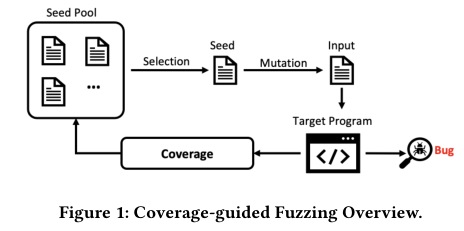

2. 深度学习和注意力机制

3. 问题定义

   * 如何将注意力集中到最有价值的种子上
   * 如何将注意力集中到最有价值的字节和变异操作上

## ATTUZZ框架

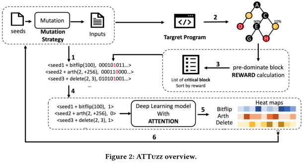

ATTuzz包含四个主要阶段：数据收集、奖励计算、模型训练和变异策略更新

### 数据收集

ATTuzz收集由载体fuzzer生成的测试输入的相关信息，即种子文件和使用的变异；对于覆盖范围，ATTuzz记录AFL位图以跟踪触发的基本块。

* 例子：对于图3的程序，AFL对种子文件<0,5>的第一个字节实现一个Arth+的操作，并且得到最终输入<5,5>，该输入能够覆盖块1,2和3，因此我们记录(<0,5>,arth+,5;111000)在一系列变异操作后，我们能够得到相同格式的数据，例如(<-5,0>,arth+,5;110101),(<0,0>,bitflip,5;100101),(<0,0>,dictionary,0xFF;1001010)

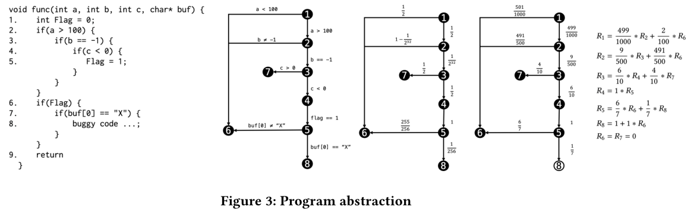

### 奖励计算

定义：

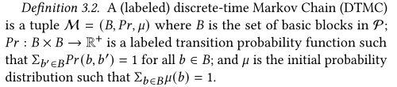

若在程序的初始状态上施加初始分布，则可以将程序抽象称为DTMC，其中程序中的每个控制位置都称为DTMC的一个状态，并且两个控制位置之间的每条边都与条件概率相关联。如图3左侧显示的程序可以转化为右侧的DTMC。

构造DTMC的关键是根据模糊测试记录估计边（块转移）的**条件概率**：

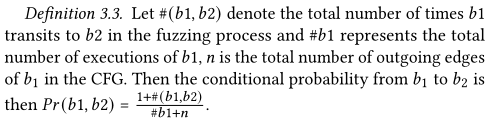

一个基本块的奖励定义如下：

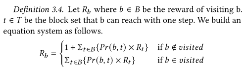

借助程序的CFG计算每个基本块的奖励。对于那些无法通过静态分析提取的间接调用，使用动态模糊数据来补充静态分析的CFG。

* 例子：使用图3的程序作为例子演示奖励计算过程。如图3所示，在进行998次程序执行后，我们可以从基本块覆盖信息中估计DTMC。建立的方程组如图3右边所示。通过求解方程组，我们可以得到覆盖每一个基本块的奖励值。

（k% + predominant + filter）当知晓了每一个未曾覆盖基本块的覆盖奖励，ATTUZZ选择前k%个块作为目标未覆盖块B_c（最高奖励分的）。如前所述，由于我们没有未覆盖块的标记数据，我们通过静态分析获得每一个目标块的主导块，记为pre(B_c)，pre(B_c)中的块是我们模糊测试的目标。为了进一步减少目标数量（同时减少将要产生的变异数量），对pre(B_c)中这些块进行**过滤**，根据DTMC，过滤掉那些具有高概率能够达到块。在pre(B_c)中，我们更倾向于那些具有低概率到达更有趣的关键块。实际上，我们忽略那些概率高于阈值k'的pre-dominant的块。用B_critical表示最终选择的pre-dominant块用于深度学习。

### 训练注意力模型

构建一个深度学习模型以系统地预测一个种子变异组合是否可能覆盖某个代码块。

选择了一种基于注意的深度学习模型，该模型可以自动从输入中提取特征，并对块是否被覆盖到进行正确分类。 

更重要的是，注意机制使我们的模型能够区分不同变体和参数对不同种子文件每个字节的影响。 

特别的，准备的训练数据包括两个部分：

* 种子文件
* 变异操作和相应的变异参数

1）将种子文件转化为一系列向量：

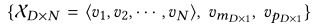

D是字节嵌入或像素向量维度，N是收集种子文件中最大尺寸。

注意到对于那些大小小于最大长度的输入，对输入进行填充使其长度恰为N。

2）针对不同类型的程序定制模型以提取相关特征

例如，对于将image作为输入的程序，使用传统卷积神经网络CNNs；对于字节序列作为输入（XML文件、JSON字符串），使用循环神经网络RNNs去捕获序列信息。

提取特征向量记为

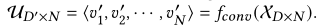

---

为了进一步利用变异信息，添加变异算子（\<mutator, parameters\>）。

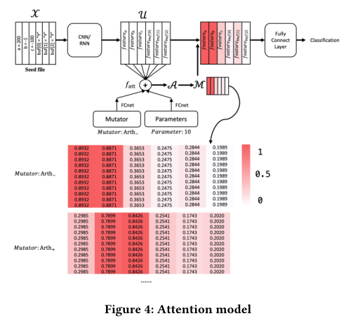

如图4所示，对于每一个向量u，我们可以计算注意力权重α：

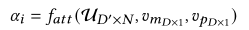

f_att函数由一个激活函数（通过一个全连接层合并了三个元素【特征、变异算子和参数】的向量，接着通过一个非线性softmax函数）组成：

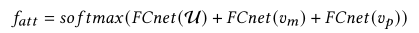

结合所有α，我们得到向量A_1xN=\<α\_1,α\_2,...,α\_N\>，然后使用矩阵W=\<α\_11‘,α\_12’,...,α\_1N‘\>对A进行标准化，同时将W的维度扩展到D’xN以生成一个掩码矩阵M，这样M可以用于u中的每一个向量：

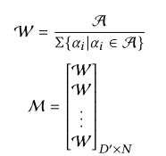

然后将矩阵M中的元素放缩为u，得到最终的注意力层输出向量u‘。接下来，使用一个全连接层进行分类。

通过训练注意力层，我们可以通过热度进一步可视化特征u中的信息，该热图衡量输入特征的重要性。为了得到热图，根据不同的变异对数据集进行聚类。对于每一个聚类，我们将数据输入进注意模型，并在计算精度时从每一个输入中获得矩阵A。最终，我们每一个变异算子的热图，如图4所示。红色越深，代表响应的种子区域在分类中起到了更重要的作用。

总之，注意力模型主要由三个部分组成：

* 根据输入类型是图片还是字节序列，分别使用三层CNN或RNN来提取特征
* 引入注意力层，对每个特征计算权重
* 将加权特征传递给一个全连接层进行分类

​      举例：如图3的程序为例，在一个小时的模糊测试，AFL使用给定的种子，仅可覆盖第2,3,4,6行。所以第7行称为程序未覆盖的块。第6行是关键块（仅1/1000输入到达了第6行）。AFL花费了大量的努力生成测试用例，但仍然不能到达第6行。例如，90%生成的测试用例不能达到第6行。ATTUZZ引入了一个注意力模型去预测在一个固定输入上进行固定变异操作能否覆盖第6行。例如，Arth- 在种子文件{<a=200, b=-1, c=-10, buf[0]="Y", buf[1]="Y", buf[2]="Y">}变异影响可以由图4底部的热力图表示，我们可以看到变量a和变量b对于有着高权重的覆盖来说是重要的，并且Arth-在其他变量上的操作不影响程序执行时的覆盖。这与程序路径是一致的。>和==比较相应的变量a和b，减少它们的值将很可能导致比较的错误，并且相应程序的覆盖信息也会改变。相似的，对于Arth+，变量b和变量c对于种子文件的覆盖是重要的，对变量a做加法将不会影响>比较的结果。

### 变异指导

通过注意力模型，我们不仅可以了解输入是否能够达到一个特定的块，还可以得到每个变异的热图。

ATTUZZ使用热图引导fuzzer生成可以到达选定关键块的输入。在热图中，热度级别量化了种子文件相应位置在特定变异下的分类结果的重要性。越热意味着其在分类中更重要，也意味着这些hot bytes决定一个输入是否能够到达感兴趣的关键块。如果hot bytes使用特定的变异算子进行变异操作，有高概率导致覆盖率发生变化。

算法1描述细节关于ATTUZZ如何高效的生成大量输入，并在热图的指导下到达关键块。

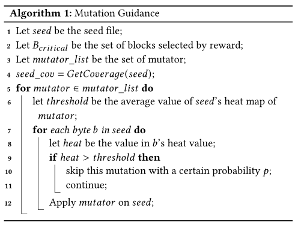

如果种子文件可以覆盖我们选择的任何关键块，那么对于每一个变异算子，我们跳过hot bytes以避免覆盖率的变化。我们注意到一个种子文件可能覆盖多个关键块，在这种情况下，只要一个字节不是所有块的hot byte，它就会发生变异。

除此之外，ATTUZZ仍然采用一些随机性来提高变异的多样性，即选择以较小的概率p对hot byte进行变异。

* 例子：接着图3的例子，种子文件能够覆盖第6行且我们引入变异指导策略。使用Arth-的热图（图4）为例，我们在算法1中设置hot阈值为该种子文件所有热图值得平均值，例如0.4794.变量a，b都比阈值的热值高。因此，对于Arth-操作，我们避免对a，b变量进行减法操作，并且对剩下的变量进行变异。相似的，对于Arth+操作，我们避免添加变量b和c因为它们的热值大于均值0.5123。

### 总的算法

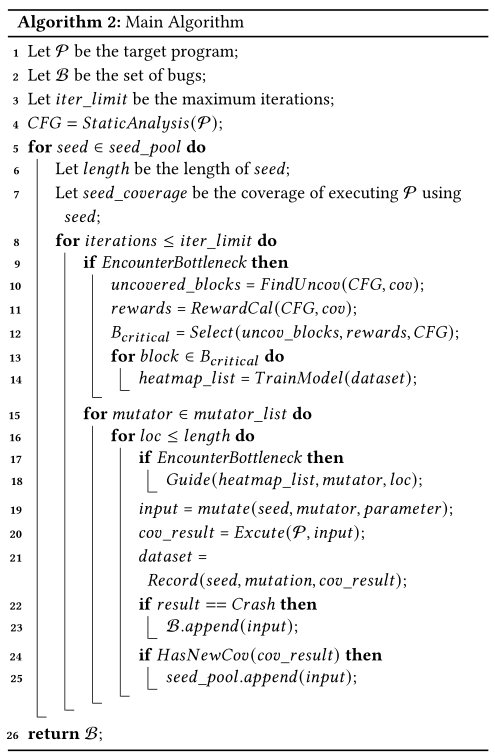

首先获得目标程序的CFG，接下来，对于种子池中的每一个种子，在一个变异budget中，我们首先决定是否会遇到一个bottleneck（这在模糊测试的初始阶段并不常见）。因此，ATTUZZ将根据默认策略首先执行载体fuzzer（line 15-25）。在这个过程期间，ATTUZZ变异种子（line 19），执行程序（line 20）并且收集数据（line 21）。如果一个输入引起了新边覆盖率（line 24），它将会被加入到种子池中（line 25）。在之后，可能会遇到一个bottleneck（line 9），这时候ATTUZZ开始工作，找到未覆盖的块（line 10）、计算覆盖它们的奖励（line 11）、从它们的主导块中选择关键块（line 12）。接着对于每一个关键块，我们使用收集的数据集对每一个变异算子训练一个注意力模型。在模型训练完成后，ATTUZZ继续指导接下来的模糊测试过程（line 18）。注意到，无论何时触发一个crash，我们都将该输入添加到bug-触发输入B中。

* 例子：以图3中的程序为例。起初，ATTUZZ使用默认的变异策略运行AFL并收集数据。在模糊测试的早期阶段，AFL能够成功的覆盖第2-6行。但1小时后，AFL遇到了bottleneck。我们识别了未覆盖的区块，即第7行，通过奖励计算和支配块计算，我们选择第6行作为学习的关键块。ATTUZZ使用之前收集的数据来训练注意力模型并获得热图。ATTUZZ优先考虑可以到达第6行的种子文件，以根据热图进一步指导变异，以生成大量flag设置为1的数据。策略能够使ATTUZZ有效突破bottleneck并到达第7行（触发bug）。

## 实现细节

### 数据收集

* 收集种子文件、变异算子、变异参数和每个程序执行的基本块覆盖率
* 使用AFL++作为载体fuzzer（覆盖率信息更全面，无哈希碰撞）
* ATTUZZ通过静态分析程序的插桩二进制文件提取ICFG并以与AFL相同的方式计算每条边的哈希值。在对程序进行模糊测试时，每当AFL得到程序执行路径的哈希值时，可以**查找字典**并得到相应的基本块

### 热图采集

* 在实践中，关键块的覆盖要么被几乎所有输入覆盖，要么只被少数输入覆盖
* 对数据进行抽样，以确保其分布平衡
* 虽然覆盖某些感兴趣的块的概率通常相对较低，但我们能够收集数以百万计的模糊测试数据，这足以训练出一个合理的模型
* 随机选择相同数量的正负标记数据，以尽可能保持训练数据的平衡
* 使用pytorch训练深度学习模型
* 训练模型和获得热图平均需要40到60分钟，这可以与正常的模糊测试过程并行。

### 变异指导

* 使用平均热值来确定一个字节是否是hot byte（大于均值）
* 选择以5%的概率对hot byte进行变异以便在变异中引入一些随机性

### bottleneck判断

* 直觉上，如果覆盖率在一定时间内没有增加，模糊测试就会遇到bottleneck
* 在实践中，通过计算最后一个小时的覆盖率增长是否小于阈值（5%）来判断每小时（与模型训练时间一致）是否遇到一个bottleneck

## 评估

* 与AFL、AFLfast、Vuzzer、Driller和NEUZZ进行比较

* 四个问题：
  * ATTuzz是否有效地提高了代码覆盖率？ 
  * ATTuzz能让我们有效地突破bottleneck吗？ 
  * 奖励计算和注意力引导是互补的吗？ 
  * ATTUZZ能发现更多bug吗？

### 实验设置

目标程序：

* 9个真实世界的应用程序

  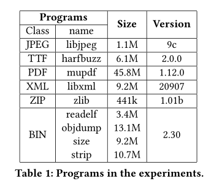

* LAVA-M数据集

实验装置：

24小时5次

### RQ1 ATTuzz是否有效地提高了代码覆盖率？ 

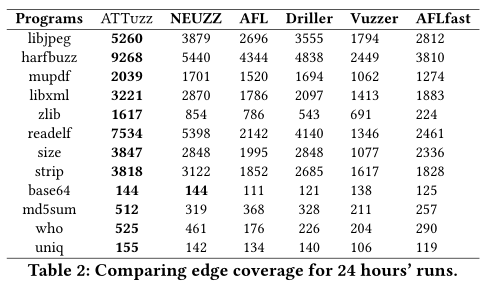

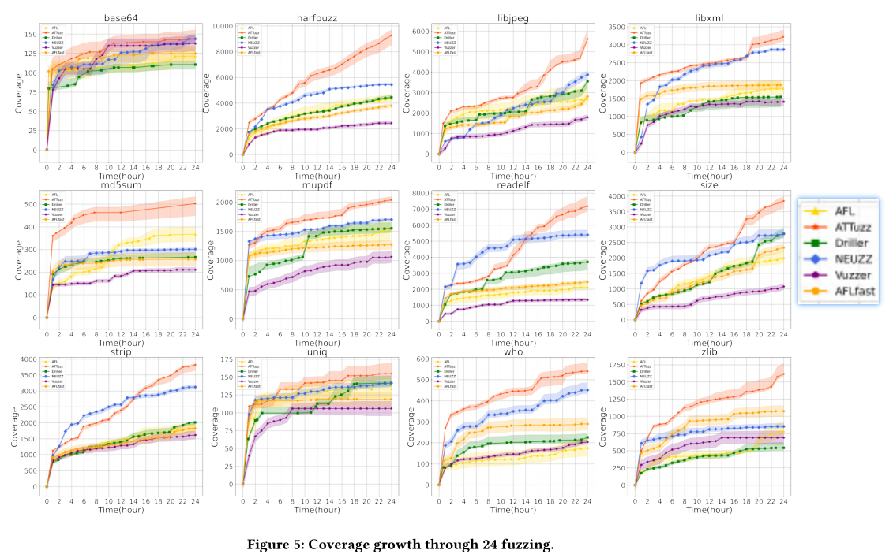

### RQ2 ATTuzz能让我们有效地突破bottleneck吗？ 

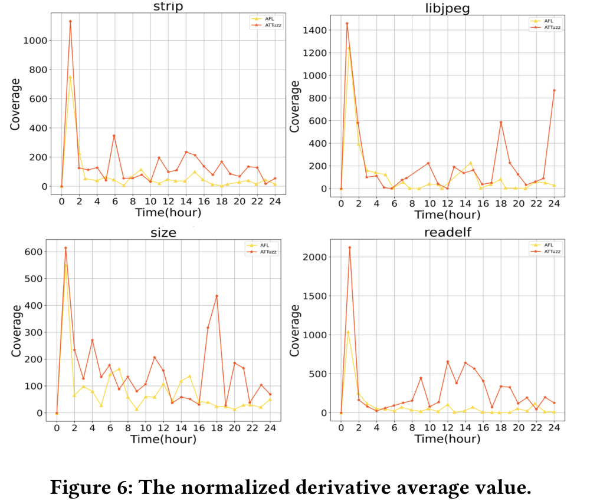

**变异指导评估：**

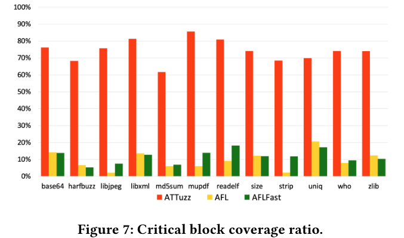

**热图的案例研究：**

以libjpeg为例：图8的上半部分是在编辑器中打开jpeg格式文件的开始部分，其中不同颜色表示文件的不同区域和结构。具体来说，红色圆圈中的部分代表一个特殊的字段标识符。如果这些字节中的任何一个发生变化，文件通常都无法识别为jpeg文件，而对其余字节进行变异不会直接导致此类问题。

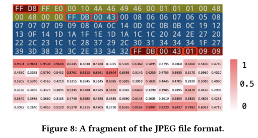

程序覆盖率和字节变异之间的对应关系成功地反映在热图（图8的下半部分）中，即红色圆圈中的字节大多具有高热值（热字节）。ATTUZZ避免对这些字节进行变异，以确保生成的输入仍然有效。

同样的，对于XML语法的有效性至关重要的字节被成功识别为hot byte。

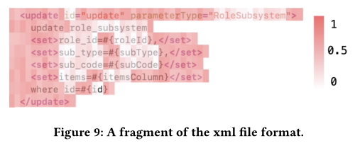

### RQ3 奖励计算和注意力引导是互补的吗？ 

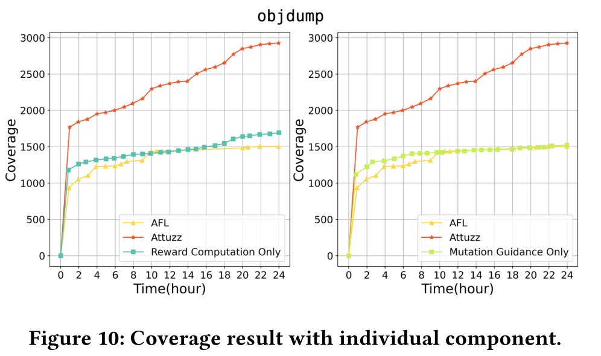

### RQ4 ATTUZZ能发现更多bug吗？

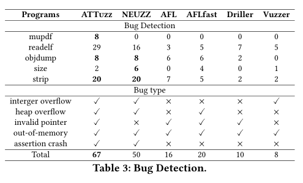

## 我的看法

亮点：

* 使用深度学习网络来指导对何字节进行何种变异从而能够覆盖那些从未被覆盖的块
* 突破了bottleneck（随着时间增长，覆盖率越来越低的现象）
* 对具有语法格式的文件很有效，其思想于Profuzzer类似，也是寻找关键字节，尽可能多的变异热度低的字节

不足：

* 深度学习训练与建模时间过长，虽然可以与模糊测试并行，但仍占用较大的内存空间，带来额外的开销
* 代码未开源

