# CSI-Fuzz: Full-Speed Edge Tracing Using Coverage Sensitive Instrumentation

## 贡献

* 分析了现有full-speed模糊测试存在的问题：首先介绍了边碰撞问题，其次是其不能准确统计路径频率 :arrow_right: 影响模糊器的效率和有效性
* 利用覆盖率敏感插桩来设计CSI-Fuzz。它直接在预定义的边进行插桩，并且仅对引起覆盖率增加的测试用例进行跟踪；对于间接边，它在其源块处插桩来实现full-speed模糊测试
* 在基于覆盖引导的模糊器AFL和AFLFast上实现了CSI-Fuzz。实验结果表明，CSI-Fuzz在边发现、执行速度和bug发现方面是有效的

项目开源：https://github.com/Vul4Vendetta/csi-afl

## CSI-Fuzz概述

### 模糊测试的背景

* UnTracer通过在每个未覆盖的基本块的开头插入中断来跳过跟踪非覆盖率增加的测试用例，然后，它移除已覆盖块的中断。如图1所示。

  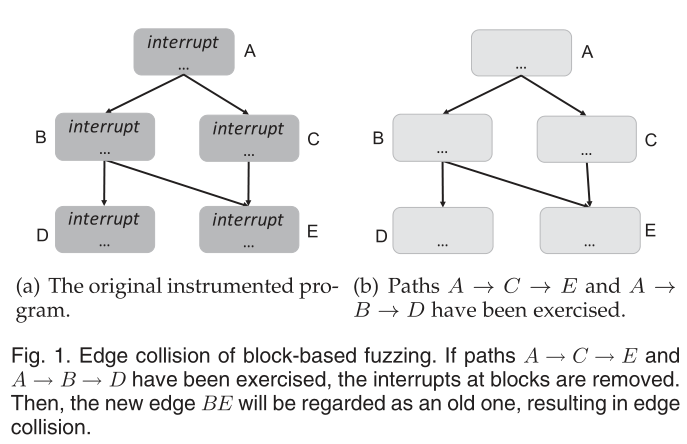

* 在每个块的开始处，插入一个中断来结束执行（图1(a)）。当模糊测试执行路径A->C->E和A->B->D时， A、B、C、D和E被覆盖到，因此其断点将被移除（图1(b)）。

* UnTracer通过改进模糊测试循环中的覆盖监控来加速模糊测试
* 存在的问题：粗粒度的覆盖率统计
  * 接着上面的例子， A、B、C、D、E的断点均已被除去，此时有一个路径A->B->E被执行时，UnTracer将不跟踪该路径的覆盖率信息，而边BE是一个新边，但被UnTracer视为旧边。

### 边插桩

* 图2展示了CSI-Fuzz的概述图。

  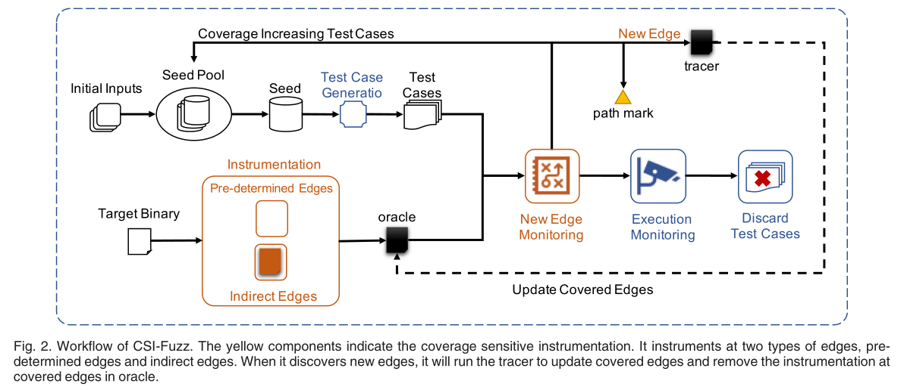

* CSI-Fuzz插桩两类的边：**预确定边**和**间接边**

  * 预确定边包含条件执行边、条件未执行边、无条件跳转边和无跳转边：
    * 条件执行边是当测试用例满足比较指令时执行的边
    * 条件未执行边是当测试用例不满足比较指令时执行的边
    * 无条件跳转边指的是没有分支的jmp
    * 无跳转边指的是改边没有使用jmp

  * 间接边包括间接调用和间接跳转

* **预确定边**：图3显示了CSI如何对预确定边和间接边进行模糊测试，在图3(b)中，预确定边AB被检测到，因此边AB处的插桩将在以后的执行中被移除。

  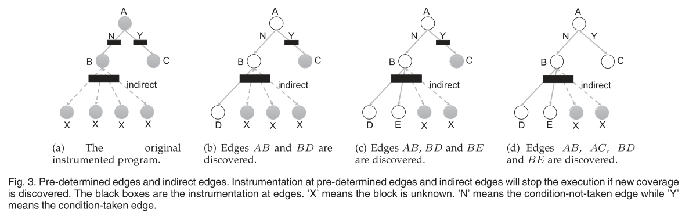

* **间接边**：
  * 间接边很难通过静态分析得到
  * CSI-Fuzz在间接调用点和间接跳转点进行插桩：当目标程序到达间接边的源块时，他会将当前目标块与历史目标块（先前检测到的块）进行比较，如果当前目标块存在于历史块中，则表示当前间接边已被检测过
  * 如图3(b)(c)所示，间接边BD和BE是新发现的，程序将在这些边退出执行。由于边BD和BE被记录（实际上是基本块D和E被记录），下次模糊测试将不会终止边BD和BE的执行

### Full-Speed边跟踪

* CSI-Fuzz对一个目标二进制进行插桩，然后生成两个不同的插桩二进制文件：`oracle`和`tracer`

#### Oracle

* 过滤能够引起覆盖率提升测试用例的一个对目标二进制插桩的文件
* oracle中被插桩的边使用了`exit()函数`：如果测试用例执行到oracle的一个新边，oracle将退出
* 然后在oracle中删除这些边上的插桩或记录的目标块

#### Tracer

* 进行完整覆盖率信息统计的一个已插桩的二进制文件
* 桩代码包括记录一条路径中所有的边
* tracer为oracle提供了当前测试用例所覆盖到的边的信息

注：除了oracle，tracer也能够触发crash： oracle在发现触发新的边时会结束自身，它可能会在触发crash之间结束进程；tracer在发现一个新边之后，可能会触发crash

#### Crasher

* 使用crasher来确定新的crash
* 在oracle或tracer触发crash时，才会调用crasher：crasher在未覆盖的边插入`exit()`函数，只有在oracle和tracer触发crash时才会被调用
* 如果crasher结束执行而没有产生crash，这表明测试用例触发了一个新的crash，然后crasher移除测试用例执行路径上边的插桩和记录的边
* 如果Crasher崩溃，则表明测试用例触发了旧的崩溃

PS：其本质逻辑和AFL判断unique crash的逻辑差不多，而这个crasher插桩就相当于一个历史crash覆盖边的记录（数据库）

### 路径标识

* 执行路径由边构成，当测试用例在目标程序中发现新的边时，该测试用例被视为找到新的路径
* CSI-Fuzz在新边上留下标记，然后在模糊测试过程中，根据路径上的所有标记来计算路径标识，用来记录路径
* 下图展示了在路径上创建标记的过程：图4(a)是一个尚未被测试的目标程序，它有所有的插桩。如果第一个测试用例执行路径为A->B->C->D，第一个新边AB设置为路径A->B->C->D的标记，如图4(b)所示。当oracle遇到第一个新边AB时，它将退出。CSI-Fuzz接着调用tracer跟踪路径上的所有边，即边AB、BC和CD。然后，如果第二个测试用例执行路径为A->B->F->H，新边BF设置为路径A->B->F->H的标记，如图4(c)所示。

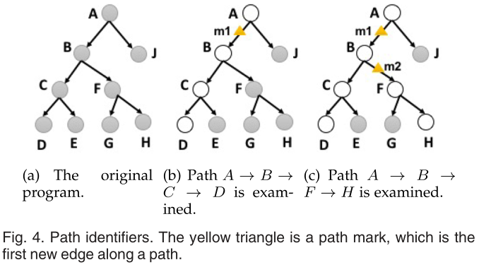

​		最后，CSI-Fuzz使用同一路径的所有路径标记来计算路径标识。例如，如果另一个测试用例执行路径也为A->B->F->H（图4(c)），CSI-Fuzz将使用标记m1和m2来计算路径A->B->F->H的路径标识。

## CSI-Fuzz的实现

* CSI-Fuzz利用插桩工具Dyninst在边插入函数`exit(N)`。当一个新边被触发，目标程序将会以一个特殊的代码退出。然后，CSI-Fuzz在预确定边的插桩或记录间接边的目标。下次模糊测试再次触发相同的边，目标二进制将不会退出。

* CSI-Fuzz将退出代码N=66用于预确定边，将退出代码N=67用于间接边，选择这两个退出代码的原因是因为它们和系统常用的退出代码不同。

* CSI-Fuzz模糊测试实现算法如下所示：在AFL初始设置（Line 1）之后，CSI-Fuzz使用不同方案对oracle和tracer进行插桩（Line 2-4）。oracle在触发新边时终止，然后tracer记录当前执行路径的所有边。由于oracle需要接收tracer传回的边信息，因此两者之间需要使用相同的边信息（如边标识）。然后CSI-Fuzz在一个循环中无限测试目标二进制文件，直到用户终止模糊测试循环（Line 6）。在无限循环中，如果oracle因为66或67的退出状态码而终止，表明oracle触发了一个新的边。然后CSI-Fuzz将设置第一个新边作为路径标识，并将相关联的测试用例保存下来作为一个新的种子（Line 8-10）。在之后，tracer将被调用去跟踪所有当前测试用例的边覆盖信息（Line 11）。CSI-Fuzz利用tracer提供的边信息，删除tracer跟踪到的预确定边的插桩（Line 16-17）。因为CSI-Fuzz使用路径标识来支持诸如AFLFast的模糊器，因此它向oracle添加路径标记来计算路径标识（Line 18）。为了共享间接边的信息，oracle在启动forkserver前更新间接边的信息（Line 19-21）。forkserver fork出一个进程来执行目标程序，这样模糊测试就不需要重复获取间接边，从而节省了模糊测试的时间。由于程序中的循环很复杂，CSI-Fuzz为执行循环的测试用例提供了更多的变异能量（Line 14）。**而UnTracer中则忽略了循环**。

  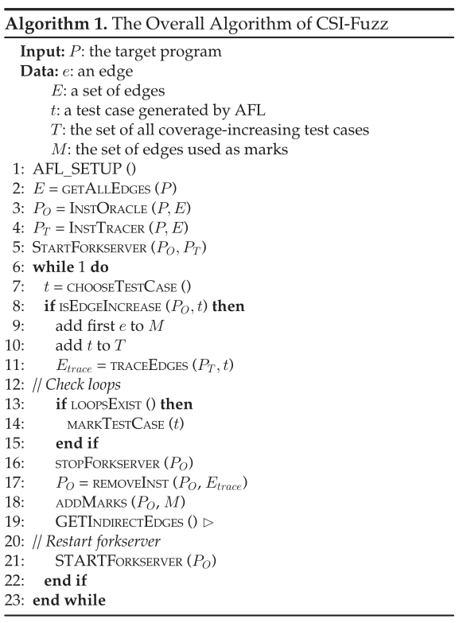

### 边覆盖

* CSI-Fuzz静态插桩oracle和crasher来区分边。当一个新的边被触发时，已插桩的程序将以66或67的退出码结束进程。通常，当程序成功执行时，退出代码为0。否则，当它有一些错误时，退出代码将为1。因此，特殊出口代码66或67不会与系统出口代码混淆。

* 算法2：使用不同指令插桩不同类型的边

  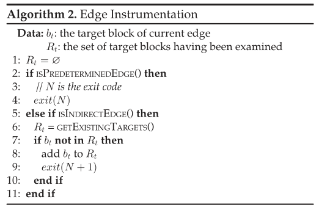

* 在未触发的预确定边上，CSI-Fuzz将直接插入`exit(66)`（Line 2-4）。CSI-Fuzz首先将边标识分配给每一个预确定边，并在共享内存中保存已经覆盖的边标识。因此，当tracer在共享内存中记录当前已经被执行到的边信息，oracle可以通过查找共享内存快速获得覆盖到的边。当一个新边被触发时，CSI-Fuzz将会移除预确定边的插桩。
* 对于间接边，CSI-Fuzz在它们的`call`和`jump`点进行插桩。在调用或跳转点上，插桩将在与当前目标块进行比较之前获得所有历史目标块（Line 6-7）。如果当前目标块不存在于记录的块中，则表明这是一个新边。然后，当前目标块将被添加到历史记录块中（Line 8-9）。对于间接边，其源块和目标块的地址都记录在一个文件中。历史间接边的列表在forkserver之前被读入内存。因此，可以在列表中搜索与每个源块关联的目标块的记录。

- [ ] :grey_question: 什么是间接边

### 删除方案

* 对Dyninst进行修改来输出一个映射表：建立边与在二进制程序中对该边插桩的地址范围的映射（边 -> 插桩地址范围）

* 当CSI-Fuzz删除边的插桩时，它会查找插桩映射表以确定插桩的范围，并用**无条件跳转替换插桩的第一条指令**，即不执行插桩代码。

* 举例：

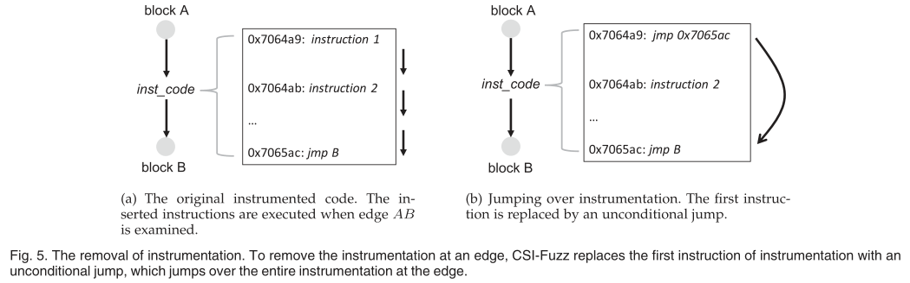

### 路径标识

* AFL中使用队列来记录有关种子的信息，例如种子文件的名称和位置
* CSI-Fuzz将路径标识信息添加到队列中，以便统计执行路径的频率
* 路径标识是基于路径上的路径标记计算的哈希值，当测试用例执行现有路径时，oracle会将当前路径标记写入共享内存。路径标记是路径中第一条新边的边标记。然后CSI-Fuzz从共享内存中获取字节，并计算路径标识符的哈希值。
* CSI-Fuzz通过比较当前路径标识和队列中的标识以知晓执行的是哪个现有路径。

## 二进制文件评估

### QEMU模式下的评估

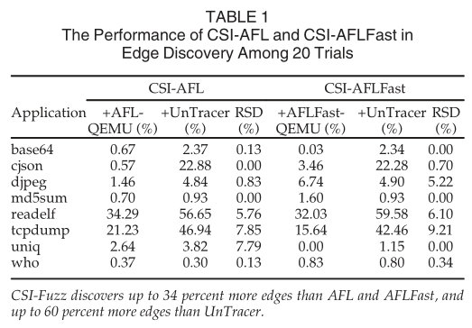

>注意： 边发现具有可变性（由模糊测试算子的随机性决定），因此引入RSD（相对标准偏差）进行评估。上述结果表明，CSI-Fuzz在边发现方面表现稳定，且表1中的大多数RSD均小于10%。

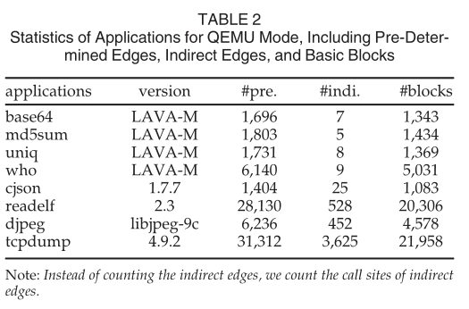

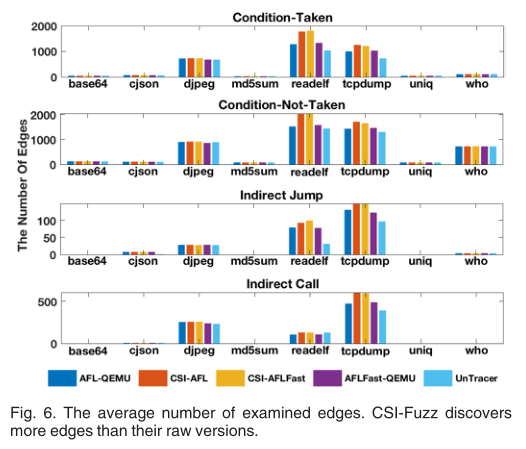

### Dyninst模式下的评估

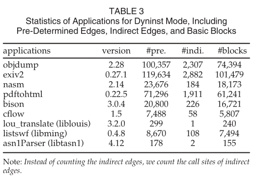

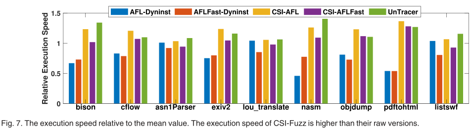

* 图7表明，在小型应用程序（例如asn1Parser和lou_translate）上，模糊器的执行速度都差不多。另一方面，对于大型程序，CSI-AFL和CSI-AFLFast执行二进制文件的速度要比原始版本快得多。原因是跟踪小应用程序占用了一点时间，而大型程序需要很多时间来跟踪覆盖率。
* 注意到，CSI-Fuzz插入额外代码来处理间接边，同时花费额外的时间来确定当前执行路径频率。因此，UnTrancer在四个应用程序上的执行速度高于CSI-AFL，在七个应用程序上的执行速度高于CSI-AFLFast。

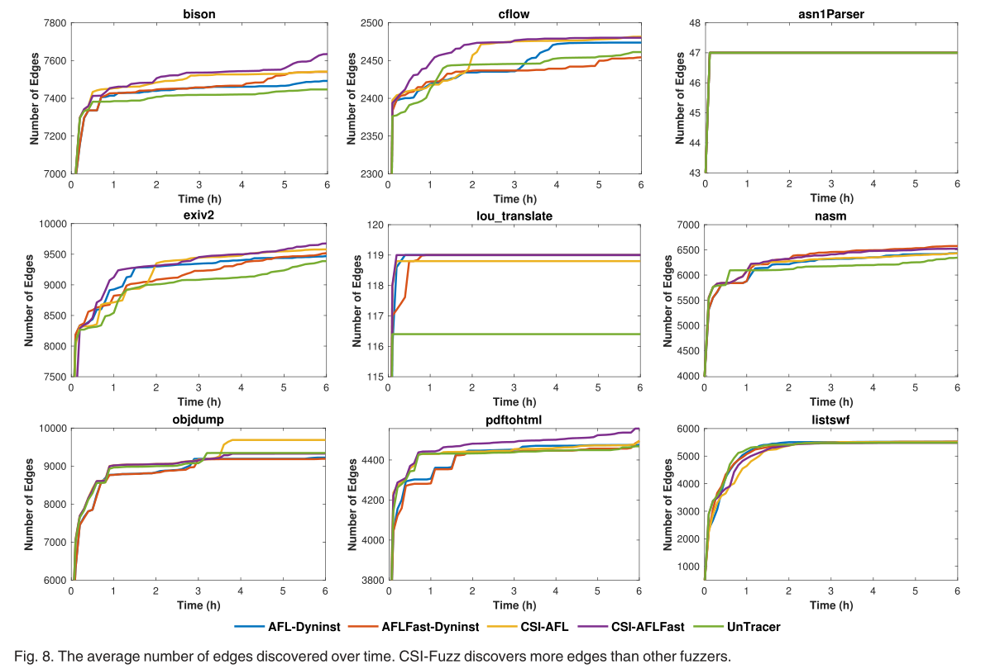

### Bug发现

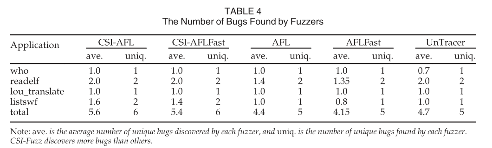

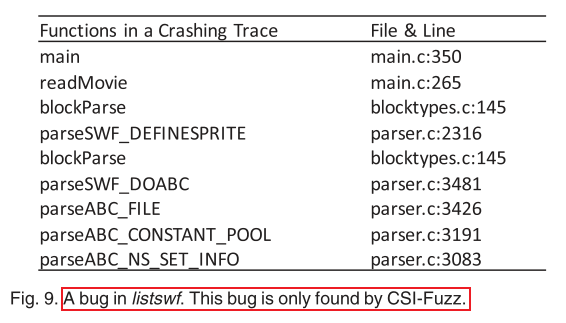

## 未来的工作

* Dyninst本身可能存在bug，从而伪装成程序产生的crash
  * 改进Dyninst或使用其他工具

* 路径标识：使用路径标识区分路径的方案可能会存在两条路径发生碰撞的可能，然而，其他计算路径频率的解决方案也会导致路径冲突（如AFL中计算位图的哈希值，并将哈希值作为路径标识）
  * 没有提出任何关于路径覆盖的模糊器
  * 未来的方向可以研究一种更有效的路径标识设置方法

## 我的看法

亮点：

1. UnTracer的oracle仅在基本块级实现中断，只能过滤那些触发新的基本块的测试用例。由于使用粗粒度的覆盖率信息，因此可能会导致一些测试用例不能够进入跟踪阶段。而CSI-Fuzz使用**更细粒度的边覆盖信息**，从而在过滤阶段筛选那些能够触发新边的测试用例并进入到跟踪阶段，细粒度的覆盖指标使其能够探索更深层次的代码。
2. CSI-Fuzz设计了一个**新的删除插桩的方案**，与UnTracer的方案不同，CSI-Fuzz维持了一个边到插桩范围的映射表，当要删除该边对应的插桩时，仅需将桩代码起始设置为jmp xxx（其中xxx为插桩范围结束地址）即可，没有直接删除删除，而是关闭了该桩代码的执行选项（不执行桩代码）。
3. CSI-Fuzz本身可以与任何GCF（灰盒覆盖模糊器）结合使用

不足：

1. [未来的工作](#futurework)中提到的两点：*Dyninst本身存在的bug*和*路径标识碰撞问题*
2. 评估实验部分略显不足：
   * 在对比的模糊器选择方面，仅选择AFL和AFL-Fast这两者进行比较，未与QSYM等混合模糊器结合进行比较
   * 仅在QEMU和Dyninst模式下与UnTracer机制进行比较

3. 不解的地方有：
   * 路径标识的算法感觉存在问题
   * 没太看懂针对间接边处理的策略
