# Full-speed Fuzzing: Reducing Fuzzing Overhead through Coverage-guided Tracing（UnTracer）

## :star: 贡献

* 我们介绍了覆盖率引导的跟踪：一种通过将跟踪限制在覆盖率增加的测试用例中来减少模糊开销的方法。
* 我们量化了八个真实应用程序中覆盖率增加的测试用例的频率。
* 我们表明，对于两种不同类型的覆盖率引导模糊器：AFL（”盲目“测试用例生成）和Driller（”智能“测试用例生成），它们将大部分时间用于跟踪测试用例。
* 我们实施和评估UnTracer；UnTracer是我们基于黑盒二进制插桩器Dyninst而实现的覆盖率引导跟踪器。针对三种流行的、最先进的白盒和黑盒二进制模糊测试跟踪方法（`AFL-Clang`/`AFL-QEMU`/`AFL-Dyninst`）在八个实际应用程序上对UnTracer进行了评估。
* 我们将UnTracer与最先进的混合模糊器QSYM集成，并证明QSYM UnTracer优于QSYM Clang和QSYM-QEMU。
* :happy:我们公开了我们的评估基准、实验性基础设施和基于AFL的UnTracer实现。

## 背景

### A. 模糊测试概述

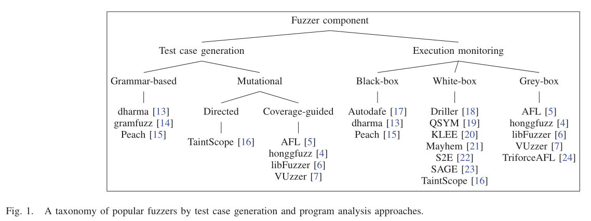

### B. 覆盖引导的模糊测试

* 覆盖率引导的变异模糊器的高级架构：

  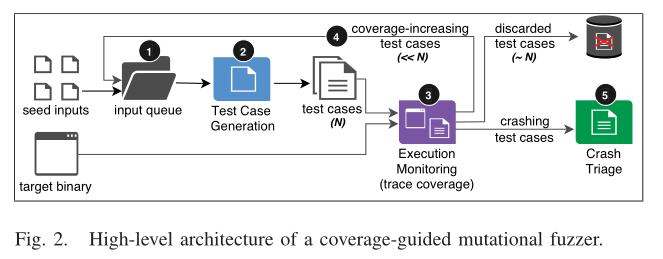

  给定一个目标二进制文件和一些初始输入种子集`S`，模糊测试工作如下：

  1. 将所有初始种子 `s∈S` 放入队列中用于变异

  2. **测试用例生成：**选择队列中的一个种子，并对其变异若干次，产生测试用例集`T`

  3. **执行监控：**对于所有测试用例`t∈T`，跟踪他们的代码覆盖率并寻找crash
  4. 如果测试用例引起了覆盖率增加，则将其放入种子队列，并确定下一轮变异的优先级；否则，丢弃它
  5. **Crash分类：**报告任何引起crash的测试用例
  6. 返回[步骤2](#step2)并重复

### C. 覆盖率跟踪性能

* VUzzer使用PIN动态插桩黑盒二进制文件
* AFL的QEMU用户模式模拟也会进行动态插桩，但它产生的开销高达1000%
* 为了解决动态重写必须实时翻译基本块的缺点，Cisco Talos提供了一个静态二进制重写器AFL Dyninst

### D. 本文的重点

* 提出了覆盖率引导的跟踪，它将跟踪仅限于增加覆盖率的测试用例
* 实现的UnTracer是一个用于覆盖率引导的模糊器的覆盖率引导跟踪框架

## 丢弃测试用例的影响

* 传统的覆盖率引导模糊器依赖于**“盲目生成”（基于随机变异的）**测试用例，覆盖率增加的测试用例会被保留下来，而绝大多数是非覆盖率增加的测试用例，并随覆盖率信息一起被丢弃
* 为了减少非覆盖率增加的测试用例的生成：
  * 更**“智能”**的生成测试用例
  * 智能变异基于**源代码分析**（如符号执行、程序状态和污点分析）来生成更高比例的能使覆盖率增加的测试用例
  * 尚不知晓生成用例时间是否比测试用例执行/覆盖率跟踪上花费的时间要多:question:也不清楚智能变异在提高覆盖率方面的效果如何:question:（**缺少ablation study**）

* 测量了AFL（盲目生成测试用例）和Driller（智能生成测试用例）在八个二进制文件上执行/跟踪测试用例所花费的运行时间，每个时间为1小时，以及他们相应的覆盖率增加测试用例：

  * AFL：
    * 依赖于随机突变来生成覆盖率增加的测试用例，并用于变异
    * AFL对黑盒二进制文件使用基于QEMU的动态检测或白盒二进制文件的汇编/编译时插桩来跟踪测试用例覆盖率
    * 评估AFL-QUMU和AFL-Clang

  * Driller：
    * 使用选择性符号执行（求解路径约束）来增加盲目变异的效果
    * 生成更少的非覆盖率增加的测试用例来提高性能，其符号执行可以解决路径约束，而盲模糊器通常会暂停
    * 评估Driller-AFL（别名ShellPhuzz），与AFL一样，Driller-AFL也利用QUMU进行黑盒二进制覆盖跟踪

### A. 实验阶段

* 在run_target()中插入计时代码：计时并记录生成测试用例总数
* 检查AFL队列目录，记录每个fuzzer的覆盖率增加的测试用例，并统计AFL所有保存的测试用例中追加了+cov的测试用例（表明测试用例增加了代码覆盖率）

### B. 结果

* 实验结果

  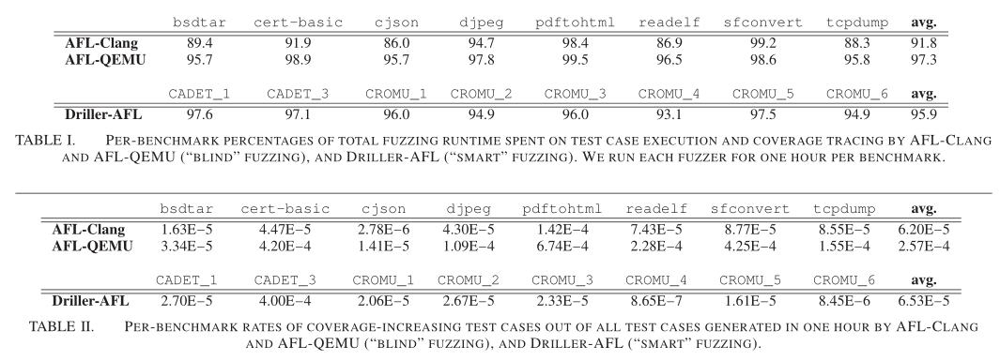

* 表1所示，AFL和Driller都将大部分运行时间用于测试用例执行/覆盖跟踪：AFL-Clang和AFL-QEMU平均每小时分别占91.8%和97.3%，而Driller AFL平均每小时占95.9%
* 表2显示了每个fuzzer在所有一小时试验中增加测试用例覆盖率的比例：AFL-Clang和AFL-QEMU的覆盖率分别提高了0.0062%和0.0257%，Driller-AFL平均覆盖率为0.00653%。
* 结果表明，尽管采用了不同的测试用例生成方法，但基于覆盖引导的模糊器AFL和Driller都**将大部分时间用于执行和跟踪没有引起覆盖率增加的测试用例**。

## 覆盖率引导跟踪

* 现有的覆盖率引导模糊器跟踪所有生成的测试用例，将它们各自的代码覆盖率与一些累积的全局覆盖率【数据库】进行比较：
  * 具有新覆盖率的测试用例将保留用于突变；
  * 没有新覆盖率的测试用例将与其覆盖率信息一起丢弃。

* 覆盖率引导跟踪旨在跟踪更小的测试用例集合（仅包含那些能够增加覆盖率的测试用例）

---

### A. 概述

* 覆盖率引导跟踪在测试用例生成和代码覆盖率跟踪之间引入一个中间步骤：**interest oracle（兴趣预言机）**

* 兴趣预言机是目标二进制文件的一个修改后的版本，其在每个未覆盖的基本块的开始，通过覆写的方法插入一个预先选择的**软件中断**。

* 触发兴趣预言机中断的测试用例被标记覆盖率增加的测试用例，然后进行跟踪。在记录新的基本块时，相应的中断会从oracle二进制文件中删除，使其越来越像原始目标程序。

  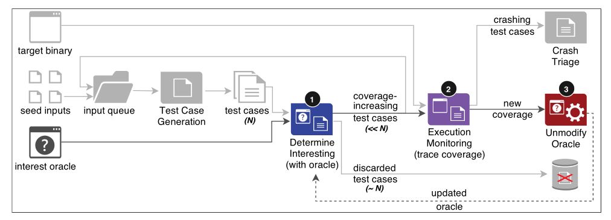

* 如上图所示，覆盖率引导跟踪通过执行以下操作来增强传统的覆盖率引导的模糊测试：
  1. **确定是否感兴趣：**根据兴趣预言机来执行一个生成的测试用例。如果测试用例触发了中断，则将其标记为覆盖率增加的测试用例，否则，返回[步骤1](#step1)。
  2. **完整追踪：**对于每个增加覆盖率的测试用例，跟踪其完整的代码覆盖率。
  3. **取消预言机的修改：**对于测试用例覆盖范围内的每个新访问的基本块，从兴趣预言机中删除其相应的中断。
  4. 返回到[步骤1](#step1)。

### B. 兴趣预言机

* 充当从跟踪中过滤出非覆盖率增加的测试用例的机制
* 本质上是目标二进制文件的一个副本，其在每个基本块前添加了软件中断
* 具体机制：如果一个测试用例**触发了中断**，意味着它已经进入了一些以前未发现的基本块，那么它的覆盖率就会增加；然后跟踪覆盖率增加的测试用例的**完整覆盖率**，并在兴趣预言机中它们新覆盖的基本块的断点。

* 具体实现：

  * 需要事先识别二进制文件的基本块地址

  * angr继而Dyninst等工具可以通过静态分析来实现

  * 插入中断需要注意两点：

    :one: 理论上可以使用任何中断信号，但应避免与模糊测试的核心信号（如crash和error相关的信号）发生冲突；

    :two: 中断指令大小不得超过任何候选基本块的大小（例如，单字节块不能容纳两字节中断）

### C. 跟踪

* 兴趣预言机依赖于**块级**二进制文件修改，因此**代码覆盖率跟踪也必须在块级运行**
* 目前，块级跟踪可以支持块覆盖率或边覆盖 :arrow_right: 因此，覆盖率引导的跟踪与大多数现有的跟踪方法兼容

### D. Unmodifying

* 覆盖引导跟踪unmodify阶段删除了预言机在新覆盖的基本块处设置的断点
* 给定一个目标二进制文件、一个兴趣预言机和一个新覆盖的基本块列表，unmodifying将用原始目标二进制文件中的指令覆写每个新覆盖块的中断（指令复原）

### E. 理论性能影响

* 随着时间的推移，越来越多的覆盖率增加的测试用例导致更多的兴趣预言机的基本块处于未被修改的状态，从而**降低了预言机与目标二进制文件的差异**
* 随着预言机与目标二进制文件相似性增加，测试用例覆盖率增加的可能性降低
* 原始目标程序与预言机二进制文件的覆盖未增加的测试用例执行速度相同，随着模糊测试的继续，覆盖引导跟踪的总体性能开销将接近于0%。

## 实现：UnTracer

### A. UnTracer概述

* 对覆盖引导灰盒模糊器AFL 2.52b进行改进

* 实现包含1200行C和C++代码

* UnTracer为目标二进制文件提供了两个不同的版本：

  * 一个用于识别覆盖率增加的测试用例的**兴趣预言机**
  * 另一个是用于识别新覆盖率的**跟踪程序**

  AFL使用forkserver执行模型，将其纳入预言机和跟踪二进制文件

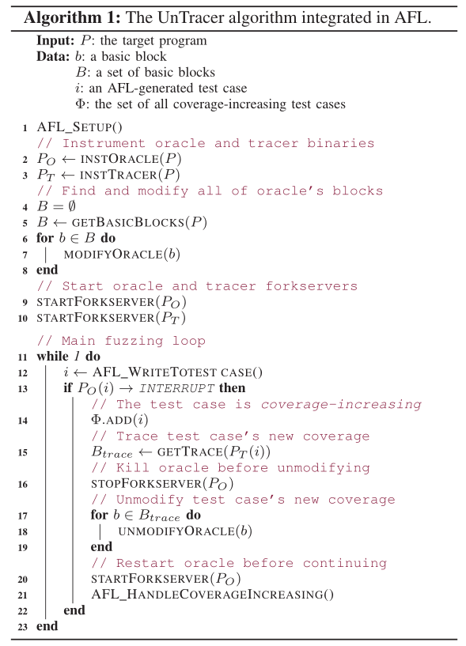

* 算法1显示了UnTracer与AFL集成后所采取的步骤：
  * AFL完成初始设置程序后（例如，创建工作目录和文件描述符）`[Line 1]`，UnTracer对预言机和跟踪二进制文件进行插桩`[Line 2-3]`。预言机二进制文件包含forkserver，而跟踪二进制文件包含forkserver和用于覆盖跟踪的基本块级指令
  * 由于预言机依赖块级软件中断来识别覆盖率增加的测试用例，UnTracer首先使用静态分析识别所有基本块`[Line 5]`，然后，UnTracer在预言机二进制文件中每个基本块的开头插入中断`[Line 6-8]`。
  * 为了初始化预言机和跟踪二进制文件以进行模糊测试，UnTracer启动了各自的forkserver`[Line 9-10]`
  * 在AFL的主模糊测试循环`[Line 11-23]`期间，UnTracer在预言机二进制文件上执行AFL生成的每个测试用例`[Line 12]`，如果该测试用例触发了一个中断：
    * UnTracer将其标记为引起覆盖率增加的测试用例`[Line 14]`，并使用跟踪二进制来收集其覆盖率信息`[Line 15]`。
    * 然后，我们停止预言机forkserver`[Line 16]`，并**取消对每个新覆盖的基本块的修改**`[Line 17-19]`，删除它们对应的预言机中断
    * 在所有新覆盖的块被取消修改后，重新启动更新后的预言机forkserver`[Line 20]`。最后，AFL完成了其覆盖率增加的测试用例处理流程（如加入队列和优先级排序）`[Line 21]`，并对下一个测试用例进行模糊测试`[Line 12]`

* 下图展示了UnTracer的架构

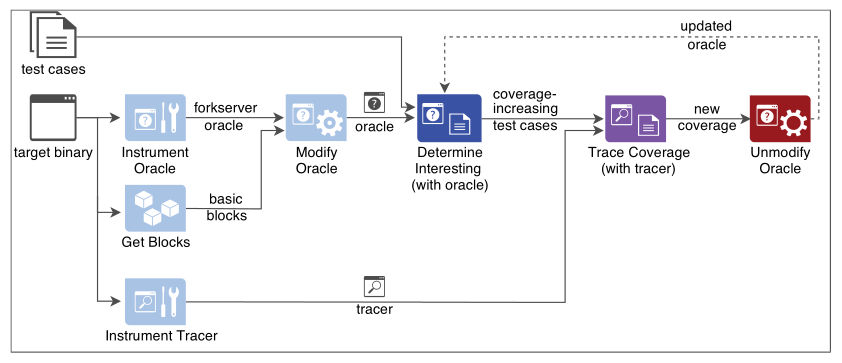

### B. Forkserver插桩

* 兴趣预言机执行所有测试用例以确定哪些测试用例覆盖率会增加
* 跟踪执行所有覆盖率增加的测试用例以统计完整的覆盖率

---

* UnTracer将forkserver执行模型与跟踪程序二进制文件和预言机二进制文件结合在一起：通过`fork()`启动新进程，避免重复的初始化流程，实现了比传统的基于`execve()`的执行更快的速度
* 通常来说，插桩首先将forkserver函数插入到二进制文件的`.text`段，然后在函数`<main>`的第一个基本块中链接该回调函数
* 在跟踪二进制文件中，使用Dyninst的静态二进制重写来进行黑盒二进制插桩，因此在forkserver中使用了相同的技术

---

* 对于预言机二进制文件，最初方法是使用Dyninst对其进行插桩：
  * 初步评估发现了几个性能上的问题
  * 由于预言机会执行每一个测试用例，因此它对性能影响较大

* 为了避免Dyninst的局限性，我们利用AFL汇编时插桩来在预言机二进制中插入forkserver

### C. 兴趣预言机二进制文件

* 兴趣预言机二进制文件构造需要**事先了解目标二进制文件的基本块地址**：
  * 利用Dyninst的静态控制流分析来**输出基本块的列表**
  * 使用二进制文件IO在该列表中**迭代插入中断**

* 为了避免在forkserver初始化之前触发中断，我们不考虑在`<main>`中forkserver回调之前执行的函数，如`<_start>`、`<_libc_start_main>`、`<_init>`、`<frame_dummy>`。

* 使用`SIGTRAP`用于中断信号：
  * 长期以来被用于细粒度执行控制和分析（如gdb和内核探测）
  * 二进制表示形式0xCC是一个字节长，可以覆盖所有大小的基本块

### D. 跟踪二进制文件

* 利用Dyninst静态地向跟踪程序注入forkserver，以实现快速执行，并在其每个基本块中插入覆盖率回调以进行覆盖率跟踪
* 执行时，基本块的回调将其相应的基本块地址附加到位于UnTracer工作目录中的跟踪文件中

---

:disappointed_relieved: 在UnTracer的早期版本中，我们观察到包含重复执行的基本块的覆盖跟踪显著增加了开销：

* 多次记录单个块：表现出**循环行为**的二进制文件通常会减慢UnTracer的跟踪写入操作

* 跟踪读操作也受到影响：一系列块级别取消修改操作将强制处理任何重复执行的基本块

:question: 如何解决上述开销：

* 只记录唯一覆盖的基本块（**去重**）：在跟踪程序的forkserver处使用一个全局hashmap数据结构；在一个基本块执行时，它的回调会使用hashmap查找来确定当前执行中是否已经覆盖该块，如果没有，回调将更新当前跟踪日志并更新hashmap

### E. 取消对预言机的修改

* UnTracer用目标二进制文件中找到的原始字节替换插入的中断（复原）

* 即使是覆盖率增加的测试用例，在覆盖率上也经常有显著的重叠 :arrow_right: UnTracer尝试取消修改许多已经取消修改了的基本块，从而导致开销增加

  :thinking: 如何缓解这一问题？

  * 同样的，引入一种hashmap数据结构来跟踪全局覆盖率：从跟踪日志中取消修改任何基本块之前，UnTracer通过hashmap查找确定是否在先前跟踪过该块，如果是，则跳过该块的处理，否则，则进行取消修改操作，并将该块添加到hashmap中

## 仅跟踪评估

* AFL-Clang | AFL-QEMU | AFL-Dyninst （8个程序）

* 回答三个问题：

1. **与跟踪所有测试用例相比，UnTracer（覆盖引导跟踪）的性能如何？**
2. **什么因素会导致UnTracer的开销增加？**
3. **当引起覆盖率增加的测试用例的占比提高时，UnTracer的开销如何变化？**

### A. 评估概述

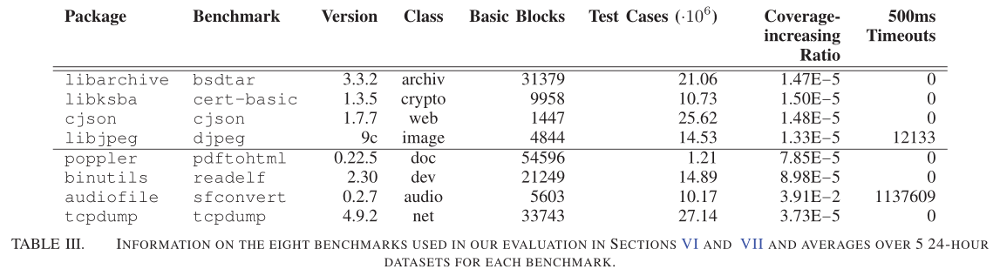

### B. 实验基础设施

* 为了将注意力集中在跟踪开销上，我们只记录执行/跟踪测试用例所花费的时间
* 为了保持公平性，我们在每个基准测试的五个预生成的测试用例数据集上运行所有跟踪程序
* 对于数据集生成，我们实现了AFL的一个修改版本，它将生成的测试用例转储到文件中
* 在我们的评估中，我们使用QEMU作为基线跟踪工具（因为我们的重点是黑盒跟踪），为每个基准生成五个数据集

---

第二个二进制文件`TestTrace`构成了评估基础设施的主干：

* 对AFL进行改进
* 消除了与跟踪无关的组件（如测试用例生成和执行监控）

给定基准、预生成的数据集和跟踪模式（AFL-Clang/AFL-QEMU/AFL-Dyninst/none[baseline]），TestTrace：

1. 一个接一个的复制数据集的测试用例
2. 测量在所有测试中跟踪每个测试用例所花费的时间
3. 将每个跟踪时间记录到文件中

* 对于UnTracer，我们包括初始full-speed执行和任何花费在处理覆盖率增加测试用例的时间

### C. 基准

* 测量指标：
  * 基本块数量
  * 生成的测试用例的平均数量
  * 覆盖率增加测试用例的平均速率
  * 24小时内500毫秒超时的平均数量

* 使用Clang/LLVM编译每个基准测试，所有编译器选项都设置为各自特定于基准测试的默认值

* 添加的特定于跟踪的基准配置：

  1）基线：设计了`ground-truth`基准测试执行模型，以表示已知的最快执行速度：一个没有任何覆盖率跟踪的静态检测forkserver

  2）AFL-Clang：由于GCC中的更改，使用AFL-GCC编译某些二进制文件时会报错，因此我们改用AFL-Clang

  3）AFL-QEMU：我们只需要在评估中提供每个基准的原始未插桩的目标二进制

  4）AFL-Dyninst：使用AFL-Dyninst插桩器进行插桩，配置如下：

  >bpatch.setDelayedParsing = True
  >
  >bpatch.setLivenessAnalysis = False
  >
  >bpatch.setMergeTramp = False

### D. 超时

* 超时的影响：
  * 如果测试用例持续时间超过超时值，则终止对测试用例的跟踪
  * 对于长期运行的测试用例来说，这会导致覆盖信息的遗漏
  * 遗漏覆盖率导致引起覆盖率增加的测试用例会被错误的识别为不能引起覆盖率增加的测试用例，从而对测试用例的生成产生影响
  * 排除超时的但引起覆盖率增加的测试用例会导致生成的测试用例不覆盖率增加的可能性更高，从而无限期地降低覆盖率

* :star: 关键是要**设置合适的超时值**

### E. 未追踪 :vs: 覆盖范围不可知的追踪

* 在测试用例层级使用平均修剪去噪，去除顶部和底部33%的异常值，以减少系统干扰对执行速度的影响 :arrow_right: 得到五个修剪后的平均数据集开销

* 将平均跟踪程序基准测试开销转化为相对基准的执行时间（例如，相对执行时间为1.5x相当于50%的开销）

#### 1）黑盒二进制跟踪

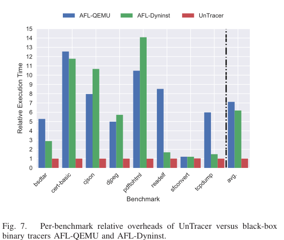

* 对于一个基准`sfconvert`来说，AFL-QEMU和AFL-Dyninst的相对执行时间（分别为1.2和1.22）与UnTracer（1.0）相似，通过[表3](#table3)的数据，我们观察到所有跟踪器中，sfconvert具有较高的超时次数，因此其不同fuzzer之间跟踪开销差距不大
* 500ms的测试用例超时时间大大覆盖了0.1-1毫秒的典型测试用例执行

---

* 此外，还可以观察到，AFL-Dyninst在三个基准（bsdtar、readelf、tcpdump）上都优于AFL-QEMU，但由于这些基准在复杂度上都有所不同（例如，基本块的数量、执行时间等），我们无法确定哪些基准特性最适合AFL-Dyninst的性能。
* 在所有基准测试中，UnTracer的平均相对执行时间为1.003（0.3%的开销），而AFL-QEMU和AFL-Dyninst的平均相对执行时间分别为7.12（612%的开销）和6.18（518%的开销）

**Mann-Whitney U-test分数：**

* 利用Mann-Whitney Utest来确定UnTracer的执行开销是否随机小于AFL-QEMU和AFL-Dyninst
* 具体细节：计算每个基准和跟踪组合的所有每个数据集的执行时间；然后，对于每个基准数据集，我们对UnTracer与AFL-QEMU的执行时间以及UnTracer与AFL-Dyninst的执行时间进行了显著性水平为0.05的Mann-Whitney U检验

* 结果：与AFL-QEMU和AFL-Dyninst相比，UnTracer对每个基准和追踪方法的组合得出的平均p值小于0.0005。鉴于这些p值远小于0.05的显著性水平，**我们得出结论，UnTracer与AFL-QEMU和AFL-Dyninst的中位执行时间存在统计学显著差异。**

**Vargha和Delaney A12分数：**

* 结果：A12统计值为1.0，超过了0.71。因此，我们得出结论，**UnTracer与任一黑匣子跟踪程序在执行时间上的差异在统计学上都很大**

#### 2）白盒二进制追踪

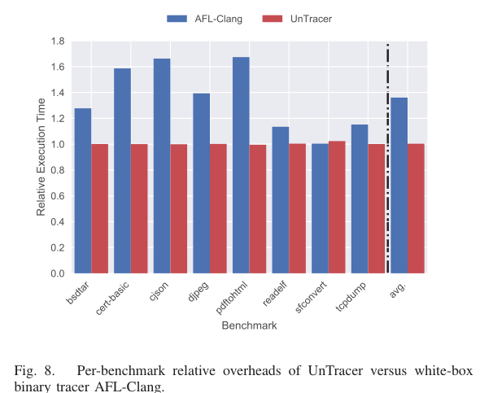

* 在所有八个基准测试中，AFL-Clang的平均相对执行时间为1.36（36%的开销），而UnTracer的平均相对执行时间为1.003（0.3%的开销）（每个跟踪程序的平均RSD小于4%）

* 特例基准：sfconvert  （由于过多的超时，导致AFL-Clang结果和UnTracer近似）

**Mann-Whitney U-test分数：**

* 结果：每个数据集的平均p值范围为.00047到.015，只有一个实例的p值超过了.0005
* 结论：**UnTracer与AFL-Clang的中位执行时间在统计学上存在显著差异**

**Vargha和Delaney A12分数：**

* 结果：在所有试验中，得出的A12统计值范围为0.76到1.0（>0.71）
* 结论：**UnTracer的执行时间优于AFL-Clang**

图9显示了cjson基准的一个数据集上每个跟踪程序的开销分布，其中覆盖率增加的测试用例（红点）与UnTracer的非覆盖率增加的测试用例是明显分开的，覆盖率增加的测试用例产生的跟踪开销是单独使用AFL-Dyninst的两倍。

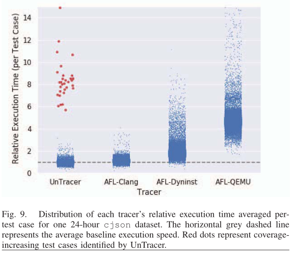

图10显示了UnTracer的开销是如何随着时间和覆盖率的增加而变化的。在模糊化过程的早期，增加覆盖率的测试用例的比率很高，会降低UnTracer的性能。但随着时间的推移，单一覆盖率增加测试用例的影响是无关紧要的，Untacer的开销逐渐接近0%。

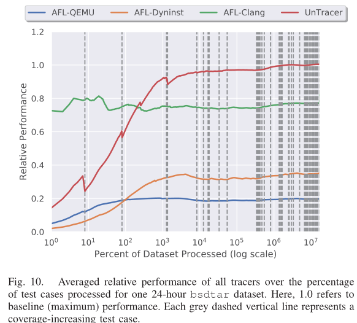

### F. 解析UnTracer的开销

* :thinking: Untracer相对于传统的覆盖不可知跟踪程序，其开销更低，但不清楚哪些操作对性能影响最大
* 如[算法1](#algorithm1)所示，UnTracer的高级工作流程包括以下内容：
  1. **启动**兴趣预言机和跟踪二进制**forkserver**
  2. 在兴趣预言机上执行测试用例来**识别**其是否是能够引起覆盖率提升的测试用例
  3. 在跟踪程序上执行那些引起覆盖率增加的测试用例以收集完整的代码覆盖率信息
  4. 停止兴趣预言机的forkserver
  5. 取消预言机中对基本块的修改（删除中断）
  6. 重新启动兴趣预言机的forkserver

* 显然，绝大多数测试用例都会在不触发任何中断的情况下干净地退出兴趣预言机，这相当于在原始（基线）二进制文件上执行它们。鉴于此，**UnTracer的唯一开销是处理引起覆盖率增加的测试用例**

---

* 为每个组件运行周围**添加了计时代码**，具体组件包括：
  * 使用跟踪器进行覆盖率跟踪（`trace`）
  * 停止预言机的forkserver（`stop fsrvr`）
  * 取消预言机的修改（`unmodify`）
  * 重新启动预言机（`start fsrvr`）

* 实验结果如下：

  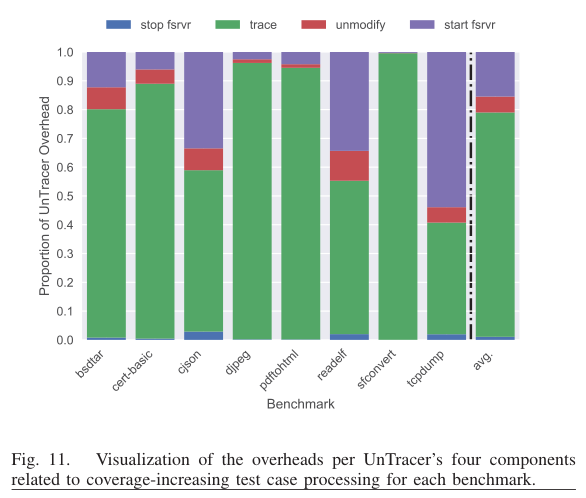

* 图表显示，UnTracer开销中最大的两个组成部分是**覆盖率跟踪**和**服务器重启**

### G. 开销 :vs: 引起覆盖率增加的测试用例

讨论结合覆盖引导和覆盖感知跟踪的混合方法的潜在性能优势：

* 现有的模糊跟踪程序由于跟踪所有生成的测试用例而面临高开销
* 与此相反，UnTracer通过只跟踪覆盖率增加的测试用例来实现接近零的开销，所有基准测试的覆盖率随着时间的推移而降低（图12）

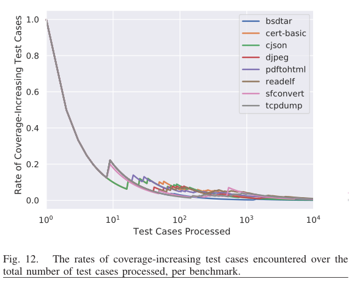

* 与AFL相比，UnTracer的平均覆盖率跟踪较慢，这主要是因为其跟踪读取/写入依赖于缓慢的文件输入/输出操作 :point_right: 当生成的测试用例很少能增加覆盖率时，覆盖引导跟踪提供了显著性能提升；对于能够引起覆盖率增加的测试用例比较高的场景，我们的方法将产生较少的收益。

  :thought_balloon: 覆盖引导跟踪的开销本质上就是**潜在能够引起覆盖率增加的测试用例数与模糊测试开销的平衡**：若能够引起覆盖率增加的测试用例比例很高，那么UnTracer将会退化为普通的fuzzer，但如果引起覆盖率增加的测试用例比例较低，那么UnTracer的性能将会被体现出来。

  :sparkles: 一种简单的想法就是使用混合的方法来最小化开销。**该方法基于观察到的覆盖率增加测试用例，在覆盖率跟踪和覆盖率不可跟踪之间切换**：

  * 首先需要确定一个**阈值**，即引起覆盖率增加的测试用例产生的速率
  * 小于该阈值，则使用覆盖率引导跟踪；大于该阈值，则使用覆盖不可知跟踪。

  :question: 如何**确定该阈值**？

  * 为了制定一个普遍适用的阈值，我们在跟踪基准评估所有实验中对引起覆盖率提升的测试用例的开销取平均值
  * 然后我们**对开销建模为一个以覆盖率增加测试用例比率为参数的函数**
  * 应用这个模型来识别当UnTracer开销超过AFL-Clang、AFL-QEMU和AFL-Dyninst时的覆盖率增加的测试用例比率

  如图13所示，最左边垂直虚线代表所有覆盖率增加的测试用例比率低于2%，此时UnTracer每个测试用例开销都小于AFL-Clang；相似的，对于测试用例比率小于50%的速率（最右边的垂直虚线），UnTracer每个测试用例的开销都小于AFL-QEMU和AFL-Dyninst。

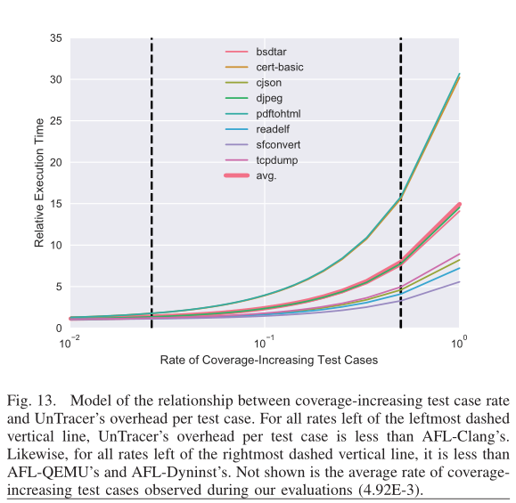

## 混合模糊测试评估

* UnTracer、Clang、QEMU和最先进的混合fuzzer QSYM进行比较，明确UnTracer在混合模糊测试场景中的优势
* :key: 混合模糊器花费更少的时间执行测试用例（跟踪），但花更多时间进行变异

---

### 实现QSYM-UnTracer

* 在QSYM核心基于AFL的模糊器的基础上实现QSYM-UnTracer
* 该模糊器在几个上下文中进行跟踪覆盖范围（调用`run_target()`）操作：
  * 测试用例修剪（`trim_case()`）
  * 测试用例校准（`calibrate_case()`）
  * 测试用例保存（`save_if_interesting()`）
  * 混合模糊测试同步（`sync_fuzzers()`）
  * 对大多数测试用例执行"通用"的模糊测试（`common_fuzz_stuff()`）

---

**修剪和校准：**

* 测试用例修剪和校准必须能够识别先验覆盖范围中的变化
* 因此，兴趣预言机是不合适添加在此处的，因为它只识别新的覆盖范围，而我们**仅使用跟踪该二进制文件**

---

**节省超时时间：**

* 测试用例保存的一个子过程涉及通过跟踪并将其覆盖率与全局超时覆盖率进行比较来识别独特超时生成和独特挂起生成的测试用例
* 由于AFL仅处于报告目的跟踪此信息，并使用兴趣预言机或跟踪器最注重为具有许多超时的二进制文件增加不必要的开销，因此将UnTracer-AFL、AFL-Clang和AFL-QEMU配置为仅跟踪总的超时次数

其他具体实现请参考[UnTracer的实现](#imp)

### A. 评估概述

* 比较了[表3](#table3)的八个基准中的7个基准在所有三个混合模糊测试变体上执行测试用例的数量（100ms的超时值）
* 为每个变体/基准组合进行8次24小时的实验

* 每个基准的结果如下：

  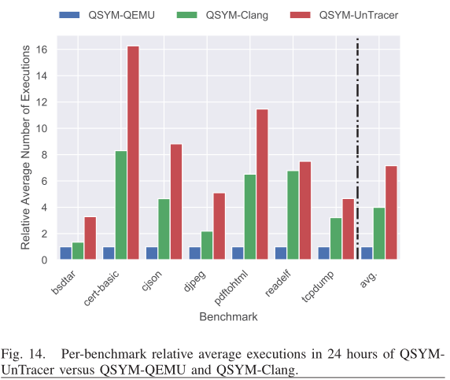

:thought_balloon: 上述结果解读：

* 相同时间（单位时间）内，执行数量越多，意味着除特定运行外，其他开销越小（主要体现在跟踪的开销）
* UnTracer执行数量越多主要在于兴趣预言机需要对测试用例进行初筛，如果未触发断点，该过程开销与原始目标程序运行开销相同，并且绝大多数测试用例不会进入跟踪阶段，因此**减少了额外的跟踪开销**

### B. 基于UnTracer的混合模糊测试算法性能研究

* 如[图14](#pic14)所示，平均而言，与QSYM-QEMU和QSYM-Clang相比，QSYM-UnTracer分别实现了多616%和79%的测试用例执行数。

* 潜在的问题：**过度的测试用例修剪和校准导致的开销**；但最终结果表明，基于兴趣预言机的执行性能远远超过了修剪和校准跟踪带来的性能缺陷

## 讨论

### A. UnTracer和IPT（英特尔处理器跟踪）

* kAFL、PTfuzz和honggFuzz采用IPT进行黑盒二进制覆盖率跟踪：
  * IPT在程序执行时将程序的控制流行为保存到内存的预留部分
  * 执行后，控制流信息的日志与程序的抽象版本一起使用来生成覆盖率信息
  * 因为监控是在硬件层，因此可以在基本块、边或路径级别完全捕获程序的动态覆盖，从而产生适度的运行时开销

* IPT的三个主要局限性体现在：
  * 需要支持IPT的处理器
  * 控制流日志解码耗时
  * 仅与x86的二进制文件兼容

* UnTracer的IPT变体将比基于Dyninst的实现**更快地接近0%的开销**，因为IPT的跟踪开销要低得多

### B. 结合边覆盖跟踪

* UnTracer**使用块覆盖**
* 大多数边覆盖率度量的模糊器实际上依赖于基本的块级跟踪

### C. 全面的黑盒二进制支持

* 当前，UnTracer依赖于黑盒白盒二进制插桩来构建目标二进制的两个版本
* 对于跟踪二进制程序，使用基于Dyninst的黑盒二进制重写来插入forkserver和跟踪相关代码
* 对于兴趣预言机，使用afl汇编器前后端（afl-as）来插入forkserver

问题：

* 最初的实现使用Dyninst来对二进制文件进行插桩，但由于性能问题尚未解决，不得不使用afl提供的编译时forkserver插桩`afl-as`

## 我的看法

亮点：

1. full-speed模糊测试本质上基于一个事实：**对不能引起覆盖率增加的测试用例进行覆盖率跟踪相关代码的执行，从而产生其他的开销**。本文提出的UnTracer使用一个**兴趣预言机**筛选那些能够引起覆盖率增加的测试用例（**初筛**），然后再对这些测试用例进行覆盖率跟踪的操作，**避免无效的覆盖率跟踪收集**。
2. 本文也提出了一种混合已知覆盖率增加的跟踪和不可知覆盖率跟踪的模糊测试，通过对覆盖率增加的测试用例的占比设置一个阈值，当其值超过阈值时，表明能引起覆盖率增加的测试用例很多，因此使用不可知覆盖率跟踪的方法，节省已知覆盖率增加的跟踪中兴趣预言机的开销；如果其值低于阈值，则切换为已知覆盖率增加的跟踪，避免无效测试用例带来的跟踪开销。
3. 实验部分很详实：
   * 分析了超时对于覆盖率信息的影响
   * 从黑盒和白盒二进制跟踪这两个方面进行比较
   * 详细解析了UnTracer的开销：发现开销主要体现在覆盖率跟踪和forkserver重启
   * 详细UnTracer兴趣预言机对于整个模糊测试过程所带来的开销，并提出基于阈值的混合跟踪切换方法来进一步提升性能
   * 将UnTracer应用于混合模糊器QSYM上，并分别将其黑盒、白盒下的跟踪进行评估

4. 项目开源：https://github.com/FoRTE-Research/UnTracer-AFL

不足：

1. UnTracer使用**粗粒度的块覆盖**
2. UnTracer早期的实现使用Dyninst对兴趣预言机进行插桩，但存在性能上的问题，并未分析其主要的原因
2. 仅对AFL系的模糊测试器进行实现，但该idea理论上可以应用于任何基于覆盖的模糊器

