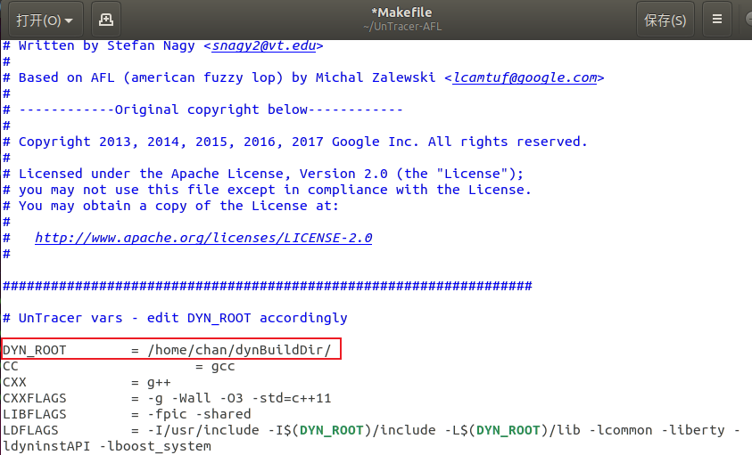

---
UnTracer-AFL
Reference: https://github.com/FoRTE-Research/UnTracer-AFL
Paper: Full-speed Fuzzing: Reducing Fuzzing Overhead through Coverage-guided Tracing (2019 IEEE Symposium on Security and Privacy)
License: MIT License
Disclaimer: This software is strictly a research prototype
---

# 安装

**1. 下载和构建Dyninst（我们使用v9.3.2）**

```bash
sudo apt-get install cmake m4 zlib1g-dev libboost-all-dev libiberty-dev
wget https://github.com/dyninst/dyninst/archive/v9.3.2.tar.gz
tar -xf v9.3.2.tar.gz dyninst-9.3.2/
mkdir dynBuildDir
cd dynBuildDir
cmake ../dyninst-9.3.2/ -DCMAKE_INSTALL_PREFIX=`pwd`
make
make install
```

---

:question: 遇到的问题：


:happy: 解决办法：

```bash
apt-get update
cmake ../dyninst-9.3.2/ -DCMAKE_INSTALL_PREFIX=`pwd`
make
```

---

**2. 下载UnTracer-AFL**

```bash
git clone https://github.com/FoRTE-Research/UnTracer-AFL
```

---

**3. 配置环境变量**

```bash
export DYNINST_INSTALL=[/path/to/]dynBuildDir
export UNTRACER_AFL_PATH=[/path/to/]Untracer-AFL

export DYNINSTAPI_RT_LIB=$DYNINST_INSTALL/lib/libdyninstAPI_RT.so
export LD_LIBRARY_PATH=$DYNINST_INSTALL/lib:$UNTRACER_AFL_PATH
export PATH=$PATH:$UNTRACER_AFL_PATH
```

---

**4. 构建UnTracer-AFL**

将`UnTracer-AFL/Markfile`文件的`DYN_ROOT`配置为Dyninst的安装目录，如



```bash
make clean && make all
```

# 使用

* 使用forkserver-only对目标二进制进行插桩
  * 手动设置C编译器（`untracer-clang` 或 `untracer-gcc`）和/或 C++编译器（`untracer-clang++` 或 `untracer-g++`）

* 仅支持**non-position-independent**（地址有关）的目标二进制，所以在编译所有目标二进制时应添加CFLAG `-no-pie`（Clang不是必须的）

* **举例**

  >注：我们提供了一系列可模糊测试的基准：https://github.com/FoRTE-Research/FoRTE-FuzzBench

  ```bash
  $ CC=/path/to/afl/untracer-clang ./configure --disable-shared
  $ CXX=/path/to/afl/untracer-clang++.
  $ make clean all
  Instrumenting in forkserver-only mode...
  ```

  然后，如下运行`untracer-afl`：

  ```bash
  untracer-afl -i [/path/to/seed/dir] -o [/path/to/out/dir] [optional_args] -- [/path/to/target] [target_args]
  ```

  

# 运行结果


* `calib execs`和`trim execs`：测试用例进行校准和修剪相应的执行数。将对完成这些操作的测试用例进行跟踪

* `block coverage`：块覆盖率（左）和总共块个数（右）
* `traced / queued`：跟踪与排队测试用例的比率。此比率理想情况下为1:1，但会随着跟踪超时的发生而增加
* `trace tmouts (discarded)`：在跟踪期间超时的测试用例数，和AFL一样，我们不会将这些加入队列
* `no new bits (discarded)`：被预言机标记为覆盖范围增加但实际上没有增加覆盖率范围的测试用例数量。理想情况下为0。