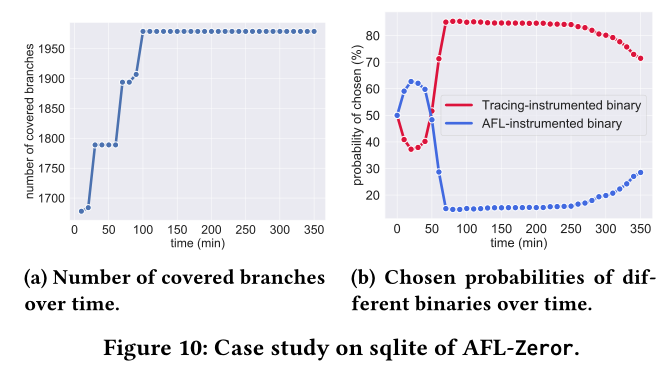

# Zeror: Speed Up Fuzzing with Coverage-sensitive Tracing and Scheduling

## 引言

* AFL平均花71.85%（最高98.5%）的运行时间来跟踪覆盖率信息
* 从插桩角度减少开销
  * INSTRIM通过对一部分基本块进行插桩并重构覆盖率信息来降低插桩开销
  * UnTracer通过删除已访插桩点的方式来避免对不能引起覆盖率增加测试用例的跟踪
  * 插桩开销降低 :arrow_right: 跟踪覆盖率信息的开销降低
  * 上述两个工具能有效减少开销，但不能保留**细粒度的覆盖率引导**，这限制了它们漏洞检测的能力

* 主要挑战是在**插桩开销**和**覆盖率收集粒度**之间保持良好的**平衡**

## 贡献

* 提出一个**覆盖敏感跟踪和调度框架**，集成多样化插桩二进制并支持它们之间的自适应切换以加快模糊测试速度，同时保持漏洞检测能力不变
* 提出了一种自修改跟踪机制来减少覆盖收集开销，通过使用这种机制，模糊器将对边级别覆盖粒度敏感并只对覆盖率增加的测试用例进行跟踪
* 提出了一种实时调度机制，该机制能够动态地选择合适的已插桩二进制文件进行模糊测试（保证速度和精确度）
* 实现了`Zeror`的原型，可以应用于大多数最先进的模糊器，如AFL和MOPT。与现有的speed-up框架（如UnTracer和InsTrim）相比，`Zeror`能提高执行速度并发现漏洞的速度更快

## 背景

### 覆盖引导的模糊测试

### 覆盖率跟踪

## 动机

* 尚不清楚粒度与跟踪覆盖率和开销的关系

* 评估每种粒度的效率：

  * AFL（边）
  * AFL（基本块）
  * AFL（粗粒度基本块）

  在Goole fuzzer测试套件上运行上述三种机制（6个小时）：

  * **观察1：追踪准确覆盖率开销大**

    * *覆盖率跟踪*和*内部执行逻辑*是模糊器运行时的两个组成部分

      

  * **观察2：每个覆盖率粒度的效率因目标程序而异**

    

* **:star: 本文的关注点**

  * 从观察1中，我们发现追踪覆盖开销很高

    * 遗传算法，有效性受到执行速度的影响

      :arrow_right: 通过减少覆盖率收集开销来提高模糊测试效率

    * 提出一种新的自修改跟踪机制来消除不必要的覆盖收集

  * 从观察2中，我们没有在模糊测试速度和覆盖精度之间进行权衡
    * 提出了一种调度方案：通过集成不同的检测二进制文件来帮助模糊器实现模糊测试速度和覆盖精度之间的平衡

## Zeror设计

* 总体设计图

* 两个主要组件
  * 覆盖跟踪程序
    * 收集覆盖率：如果种子是感兴趣的，则将种子存储到语料库中，并将**统计数据发送给二进制切换调度器**
    * 自我调整：
      * 对于AFL插桩的二进制文件，从边计数器哈希表（bitmap）中读取覆盖率信息
      * 对于自修改跟踪插桩的二进制文件，监视子进程的状态并修改子进程的插桩
  * 二进制切换调度器
    * 记录覆盖跟踪器的统计数据，根据统计数据估计每个插桩指令的二进制的效率
    * 切换二进制文件并选择最佳二进制文件作为模糊测试目标
    * 利用经验贝叶斯的方法来估计效率，并使用指数平滑来平滑随时间变化的效率

### 自修改跟踪

* UnTracer使用静态二进制重写技术，该技术覆盖不精确、耗时且在许多复杂程序上不可扩展
* 自修改跟踪：采用自身修改代码技术，使模糊器可以：
  * 在模糊测试过程中动态删除访问的插桩点
  * 感知细粒度覆盖
  * 几乎没有引入新的开销

---

**自修改代码（SMC）**

* 描述：在程序执行过程中修改自身指令的代码
* 特点：SMC具有快速建立路径、减少重复条件分支、提高算法效率等优点
* 操作：在编译阶段获得插桩点地址，并在运行阶段进行自我地址的修改

* 举例：

  

* 细节：

  * 在编译阶段，生成一个零开销二进制文件，并获得插桩点的地址

    * **注入插桩点**：构建控制流图CFG，并在每个基本块的开头注入一个插桩点，如在每个基本块开始的地方使用一个`CALL`指令来调用回调函数
      * 可以添加”虚拟块“来表示临界边，将插桩从基本块级别增强到边级别
      * 代码优化前插桩允许控制流图保留源代码的语义，以便准确收集覆盖率信息

    * **记录 & 清除**：记录注入`CALL`插桩的相应基本块符号并在编译器在IR阶段完成平台无关的代码优化之后清除所有注入`CALL`指令。
      * 生成的IR可以不插桩，记录的基本块符号继承插桩点的细粒度覆盖信息
    * **发送地址：**通过记录的基本块符号获得插桩点的地址，在生成的目标文件中分配内存，并在编译器在特定机器中间表示（MIR）级别完成平台相关代码优化之后将地址发送到内存中
      * 地址是对象文件中一系列偏移量，当链接器生成可执行二进制文件时，地址将重新定位到绝对地址
      * 插桩点的地址被写入到生成的二进制文件中，并且可以在运行时访问这些地址以执行自修改跟踪

    在[图5](#pic5)步骤2之后，我们以蓝色高亮了四个地址（0x2b1980，0x2b198d，0x2b1994，0x2b1999）来表示插桩点的地址。为简单起见，我们只显示基本的块插桩；然而，我们的解决方案通过添加“虚拟块”来表示临界边，从而增强了从基本块级别到边级别的插桩能力 。在编译阶段之后，生成一个零开销的二进制文件，并为模糊测试做好准备。

  * 在运行阶段，Zeror的覆盖跟踪程序将执行零开销二进制文件，向其中注入断点，并在此目标上执行模糊测试

    * 算法1：详细说明了跟踪覆盖程序的操作
      * 如Line 2-8所示，模糊器执行二进制文件，接受插桩点的地址，并用`0xcc`替换原始指令
      * 相应的演示如[图5](#pic5)步骤3所示，插桩点的二进制代码替换为`0xcc`，一旦进程执行`0xcc`，它将触发`SIGTRAP`中断，并等待父进程恢复
      * 注入后，模糊器对子进程执行模糊测试，并监视其状态。一旦从子进程接收到`SIGTRAP`，模糊器将当前输入存储为感兴趣的种子以供进一步变异，恢复输入该地址的指令并恢复子进程（Line 11-18），相应的演示如[图5](#pic5)步骤4所示

>在自修改跟踪中，我们维护了一组在模糊测试过程中从未访问过的插桩点（算法1中的`unvisitedAddrs`），随着模糊测试程序更深入探索目标程序的状态时，该集合将趋向于一个空集。

### 二进制文件切换调度

* 在模糊测试过程中切换不同插桩的二进制文件来提高模糊测试性能
* 评估不同插桩指令的二进制文件的效率很有挑战性：
  1. **程序相关效率**：每个二进制文件的效率随目标程序的不同而不同，无法在不同程序之间共享一组静态参数配置
  2. **时变效率**：即使测试一个目标程序，每个覆盖率粒度的效率也会随着时间的推移而变化，因为模糊器会更深入探索目标程序的状态
  3. **经济高效的解决方案**：由于模糊测试的高吞吐量，解决方案应该是经济高效且不频繁的

* 提出了一种实时调度机制来解决上述问题：
  * 以设定的间隔在不同插桩二进制文件之间进行自适应切换
  * 在模糊测试过程中，收集统计数据（感兴趣种子数量、执行数量和模糊测试所花费的时间），动态监控每个二进制可以发现的感兴趣种子数量，并在切换时间结束时选择一个 最优二进制作为模糊测试目标
  * 利用经验贝叶斯方法以经济高效的方式估计效率，并采用指数平滑来对时变效率进行平滑处理

#### 估计效率

* 简化时变问题，将连续时间离散为时间段，并假设每个时间段的效率不变。对于二进制文件，时间段的效率`t`定义为

$$
e_t=\frac{I_t}{T_t}=\frac{I_t}{M_t}*\frac{M_t}{T_t}=r_t*s
$$

​		其中，It 表示在执行期间`t`内发现感兴趣种子的数量，Tt表示在执行期间`t`内模糊测试花费的时间，Mt表示在执行期间`t`内的执行数，rt表示It和Mt的商（记作有趣测试用例比率，`ITR`） ，s表示执行速度，该速度可视为二进制文件的常量。et从严格意义上**表示有趣测试用例的生成速率**。

​		给定一个在当前时间段`t`之前的二进制统计数据 [I1，I2，...，It ]，[T1，T2，...，Tt ] 和 [M1，M2，...，Mt] ，我们计算估计值ITRs rt，然后进一步计算二进制文件在当前时间段`t`的效率估计值et。

​		使用经验贝叶斯方法，条件概率分布上的积分由观测数据中的经验统计数据所取代，允许我们估计后验概率，例如利用其统计数据中的信息得到二进制文件的ITRs。对于每一个二进制文件，ITR有一个潜在的概率分布，并且在每个时间段`t`内，ITR rt 能够视为分布的结果。我们使用 β 分布来参数化生成过程，定义为`Beta(α, β)`。此外，很明显，对于时间段`t`内的每个二进制文件，感兴趣的种子数 It 服从参数为 Mt 和 rt 的二项分布。因此，我们得到了统计数据的 β-二项复合分布。我们的贝叶斯模型的生成过程描述如下：

其中，Γ 是伽马函数。因此，所有感兴趣种子的可能性为

接下来，通过不动点迭代（FPI）计算最大似然：

其中Ψ表示digamma函数，可以通过Bernardo算法快速计算

​		通过等式（3），α^ 和 β^ 可以迭代估计。此外，当前时间段的ITR的后验估计可以计算为

​		为了加快迭代法的收敛速度，我们使用矩量法计算初始值 α0^ 和 β0^。除此之外，为了平滑时变观测数据，我们利用指数平滑来计算平滑后的感兴趣种子数：

​		

​		其中 Ii‘ 是观察到的感兴趣种子数，Ii 是方程(3)中所使用的的有趣种子的平滑数， γ∈(0, 1) 是平滑因子。随着时间的推移，平滑的 Ii 称为其过去观测值的指数递减加权平均值，这样，我们可以捕获ITRs之间时间的关系。

​		一旦二进制文件ITR rt^的后验估计被估计，其效率估计 et^ 将可以通过等式(1)计算得到。因此，当前时间段`t`内，我们可以估计每一个多样插桩二进制文件的效率 [et1， et2，...，etk ]，并通过规范化这些效率来形成一个概率分布：

其中，etj 表示二进制文件 j 的效率。当到了切换时间，我们可以根据概率分布选择目标二进制文件来进行模糊测试

#### 在二进制文件中切换

* 根据效率估计，实现二进制切换调度器，算法如下：

* 细节：首先，调度器随机选择几个二进制文件，并通过执行器（executor）对这些二进制文件执行模糊测试处理（Line 1-3）。对于每个二进制文件，执行器将`fork`出一个子进程来对它们进行测试，这类似于AFL的fork-server。然后调度器异步监听来自执行器和计时器的事件。执行器将定期报告统计信息（执行次数、感兴趣的种子数、在该时间段内模糊测试花费的时间），调度器将在从执行器收到这些统计信息时将其记录下来（Line 5-8）。如Line 10-18所示，当切换二进制文件时，执行器将停止其子进程，然后，调度器将计算每个二进制的ITR的后验估计，并根据等式(5)的概率分布选择用于模糊测试的最佳二进制文件。注意，调度器不仅支持在单一模式下运行（即单核模糊测试），还支持在并行模式下运行（即多核模糊测试），这在实际工业实践中更为常见。

## 评估

* 自修改跟踪中的**插桩机制**是在LLVM 10.0.0顶层实现的。

* **记录 & 清除**过程在`llvm::MachineModuleInfo`的初始化中实现，**发送地址**过程在`llvm::AsmPrinter`的`EmitBasicBlockStart`方法中实现
* 创建一个全局变量来记录MBB符号和MBB id的映射

* 自修改跟踪中监视进程状态和修改内存指令的运行时逻辑基于`ptrace`
* 调度器组件包括基于自修改的零开销二进制文件和集成模糊器（如AFL或MOPT）的原始完全插桩的二进制文件。切换二进制文件和报告统计数据的间隔分别设置为600秒和60秒，几乎不会引入新的开销
* 受AFL持久模式的启发，框架设置了一个线程，该线程运行ptrace任务来监视子进程的状态。一旦子进程触发崩溃或超过超时限制，线程将终止并重新生成子进程

从三个方面评估`Zeror`：

* 将`Zeror`应用于AFL，并将其性能与两种最先进的模糊加速框架UnTracer和INSTRIM进行比较，以评估其效率。
* 将`Zeror`应用于MOPT，研究其可扩展性
* 评估`Zeror`各部件的有效性

### 实验设置

* 从执行时间、分支覆盖率和暴露已知错误的时间三个方面评估模糊器的性能

### Zeror效率

结论：

* Zeror提高了AFL的执行速度
* Zeror帮助AFL覆盖更多的分支
* Zeror帮助AFL更快的暴露bug
* 与其他模糊测试speed-up技术相比，Zeror具有更好的性能

案例研究：

* 下图显示了在AFL上应用不同的模糊测试加速方法时，harfbuzz上覆盖分支的实时变化

* 大多数情况下，AFL+Zeror比所有其他方法覆盖更多的分支
* 与其他方法相比，UnTracer在大多数情况下覆盖的分支更少，甚至与原始AFL相比

结论：

* 借助Zeror，模糊器能够获得更高的加速比，覆盖更多的分支，并更快地暴露错误
* 与其他模糊测试speed-up技术相比，Zeror在覆盖率增加和漏洞发现方面表现出更好的性能

### Zeror可扩展性

* 在MOPT上实现Zeror，以研究Zeror的可扩展性

* 结果：

  

结论：

* Zeror适用于其他模糊测试的优化，如MOPT
* Zeror可以进一步提高模糊测试漏洞发现能力

### 单个组件的评估

* Zeror两个机制：**自修改跟踪**和**实时调度**

* 两个变体：
  * `Zeror-`：使用AFL作为种子生成器并只集成自修改跟踪机制
  * `Zeror`：使用AFL作为种子生成器的模糊器。此外，它还集成了自修改跟踪和AFL插桩来收集覆盖率，并基于实时调度机制在模糊测试过程中动态切换两个插桩的二进制文件

#### 自修改跟踪评估

* 与UnTracer进行比较。两种方法都通过删除访问的插桩点来消除非覆盖率增加测试用例的覆盖率收集开销，但方法不同。

* 结果：

  * 移除插桩点的开销：

    

  * 相对覆盖分支的改进：

    

#### 实时调度评估

* 结果：

### 讨论

* 调度机制能够帮助fuzzer转换为适当的二进制文件？

  

* 由上图所示，覆盖分支数在30-60min时达到峰值，AFL插桩的二进制被选择的概率下降。当AFL插桩二进制不能够进行任何处理时，Zeror有高概率会转移到更快的二进制（自修改跟踪插桩的文件）。观察表明，调度方案确实有助于模糊器正确选择二进制文件执行，然而，调度方案仅收集执行统计数据，这可能不足以充分显示其他效率。可以通过从数据流分析和控制流分析中获取的更多信息来进一步改进它。

## 我的看法

亮点：

1. 相较于UnTracer，使用更轻量级的int中断来实现断点，并使用自修改的方式恢复断点处的原始代码，实现零开销
2. 集成了一个基于经验贝叶斯推理【主要基于感兴趣种子的生成速率，在UnTracer论文中也提到过，不过使用阈值的做法】的实时调度机制，为模糊测试选择合适的二进制插桩文件（在零开销和跟踪二进制文件之间进行切换），以进一步提高模糊测试效率
3. 相较于UnTracer，Zeror使用插入虚拟块的方法解决粗粒度块覆盖的问题，因此可以使用更细粒度的边覆盖进行插桩

不足：

1. 工具未开源
2. 可以引入更多的指标来进行效率评估
