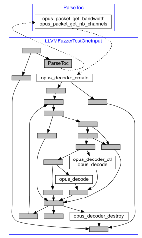
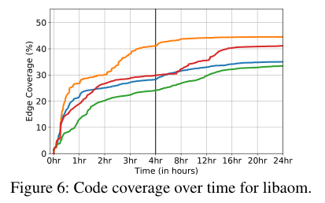

# FuzzGen: Automatic Fuzzer Generation

## 贡献

1. 设计了一个完整的系统分析：根据使用目标库的程序和库，推断出特定库的有效API交互，并将信息抽象为抽象API依赖图（A<sup>2</sup>DG）。
2. FuzzGen基于A<sup>2</sup>DG创建libFuzzer stubs，这些stub可以构造复杂的程序状态来暴露库函数中深层的漏洞，而fuzzers在没有人工参与的情况下自动生成。
3. 在AOSP和Debian上对原型fuzzer进行评估，评估证明了FuzzGen技术的有效性和通用性。

## 动机

* 对库进行模糊测试是**困难的**
  * 无法作为独立程序运行
  * API中**不包含依赖信息**

* 对库进行模糊测试是**具挑战性的**
  * 库不能直接执行，因此需要硬编码的<span style="color:red">**fuzzer stubs**</span>
  * 触发库中深层的bug很难，因为建议程序状态<span style="color:red">**需要特定的库函数调用序列**</span>

* 目标：**使用正确的参数以正确的顺序调用API**
  * 构造复杂、共享的状态以在调用之间传递
  * 减少误报（如不对buffer的长度进行模糊测试）

* 现有的方法：AFL，LibFuzzer
  * 低代码覆盖率，手工，不可扩展

## FuzzGen背后的直觉

* 单单仅有库代码是不够的
* 利用整个系统分析来合成fuzzers
* 使用”库消费者“去：
  * 推断库API
  * 展示API之间的交互

* 抽象API依赖图
  * 将其翻译为(lib)Fuzzer stub


## 举例：libmpeg2

* 通过观察使用libmpeg2的模块，fuzzer可以观察API调用之间的**依赖关系**以及**初始化API调用的顺序**
* 依赖项主要由两种形式：
  * **控制流依赖**
  * **共享的参数**


## 设计

* 四个阶段：


### API推断

* F<sub>lib</sub>：所有在库中声明的函数

* F<sub>incl</sub>：在所有消费者头文件中声明的所有函数

* 最终库函数的API为：
  $$
  F_{API}\leftarrow F_{lib}\cap F_{incl}
  $$

### 构建A<sup>2</sup>DG

#### 抽象API依赖图（A<sup>2</sup>DG）

* 描述单个库消费者的抽象布局
* 暴露复杂的API交互和依赖关系
* 封装控制和数据依赖关系
* 由CFG生成的API调用有向图
  * 节点：一个API调用
  * 边：两个API调用之间的控制流

---

#### 算法


---

#### A<sup>2</sup>DG构建举例

**CFG :arrow_right: A<sup>2</sup>DG**：

 :arrow_right: 

---

#### A<sup>2</sup>DG聚合

* 每一个库消费者有其对应的A<sup>2</sup>DG
* 将这些A<sup>2</sup>DGs聚合为一个A<sup>2</sup>DG
* A<sup>2</sup>DGs中至少有一个**公共节点**
  * 公共节点：相同的API调用和相同的参数类型

* 通过公共节点合并来聚合A<sup>2</sup>DG

---

#### A<sup>2</sup>DG聚合举例

* 寻找**公共节点**


* 聚合结果


### 参数值推断

* 不是所有的参数都应该被模糊测试：

  * ```c
    void *memcpy(void *dest, const void *src, size_t n);
    ```

  * ```c
    if (argc > 3) { … }

* 决定**哪一个参数将被模糊测试**和**如何对其进行模糊测试**
  * 参数空间推断（数据流分析 + 向后切片）
  * 寻找参数之间的数据流依赖

* 为每一个参数提供一个属性值：
  * 

### 合成Fuzz Stubs

* 目标：将A<sup>2</sup>DG提升到C++语句中
* 在运行时利用fuzzer熵来遍历A<sup>2</sup>DG
  * fuzzer探索**更好**的路径

* fuzzers应该能够快速地最大化随机输入测试
  * 对A<sup>2</sup>DG的每一条边进行编码来降低性能

* ”扁平化“A<sup>2</sup>DG

#### A<sup>2</sup>DG的扁平化

* 目标：保存每个API调用的顺序
* 每个函数只调用一次
* 扁平化算法：
  * 从A<sup>2</sup>DG中删除后向边来使其变成非循环
  * 对节点进行拓扑排序

* 产生一个组序列
  * 在运行时对组内函数进行置换

#### A<sup>2</sup>DG的扁平化的举例


## 实现

* FuzzGen原型是用大约19000行C++代码编写的，其中包括分析和代码合成fuzzer stubs的LLVM passes的实现

  

## 评估

* 在Debian和Android上进行评估：
  * 7个编码器库
  * libfuzzer + ASAN
  * 每个进行24小时*5次的实验 

* 找到17个Bugs，其中6个分配了CVE

### 评估指标

* 与手工编写的fuzzer进行比较
  * 如果网上找不到，则自行创建一个

* 平均边覆盖率
  * FuzzGen fuzzers **54.94%** :vs: **48.00%** 手工fuzzers
  * FuzzGen探索库的更深层次代码

* 漏洞发现数
  * FuzzGen fuzzers **17** :vs: **29** 手工fuzzers
  * 手工编写的fuzzers更倾向于对潜在漏洞的部分进行测试




## 未来的工作

* 最大化代码覆盖率
* 只关注单个库
* 将依赖图聚合成一个统一的A<sup>2</sup>DG

* 误报

## 我的看法

亮点：

1. 根据静态分析提取的A<sup>2</sup>DG<span style="color:red">**自动生成fuzzer**</span>，无需人工的参与
2. 项目开源： https://github.com/HexHive/FuzzGen

不足：

1. 适用场景有限，仅适合**单个输入的库**，如一些编解码器等
2. 由于FuzzGen生成的是基于LibFuzzer的fuzzer，**发现漏洞的能力主要取决于Libfuzzer**，而且Libfuzzer为进程内fuzzer，在触发漏洞之后会直接终止fuzzer。理论上，由FuzzGen生成的调用序列（fuzzer stubs，亦或者称其为harness）可以由其他fuzzer使用
3. **只关注到单个库**，未考虑多个库交叉交互的场景
4. 静态分析和A<sup>2</sup>DG聚合中的不精确性可能会导致虚假路径，从而导致误报

