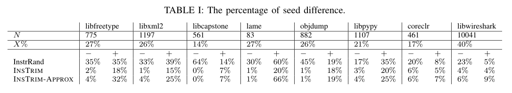
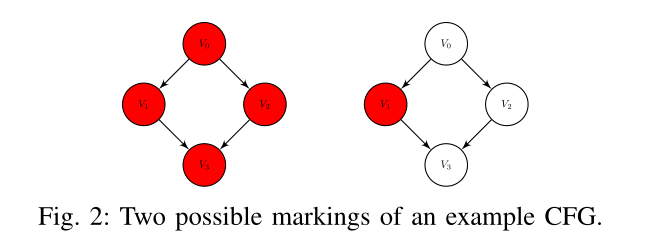

# NSTRIM: Lightweight Instrumentation for Coverage-guided Fuzzing

## 贡献

* 设计并实现了高效的CFG感知插桩算法，该算法利用常见的程序结构（如有向无环子图和简单循环）和编译器优化（如入边的知识）
* 实验结果表明，与InstrAll算法相比，该算法只需对20%基本块进行插桩，没有牺牲覆盖信息的准确性；同时其减少了运行时开销，并在模糊测试期间提供了1.04-1.78倍的加速
* 代码开源： https://github.com/csienslab/instrim

## 背景和相关工作

### 覆盖率引导的模糊测试

* 代码覆盖率是一个重要的指标，可以表示软件测试中正在执行的程序的百分比
  * 基本块
  * 边
  * 路径

* 为了确定给定输入的执行路径是否有助于实现新的覆盖，模糊器需要执行以下两项任务：
  * 跟踪输入的执行路径  :arrow_right:  添加插桩代码
  * 对照过去的路径检查当前路径  :arrow_right:  紧凑的数据结构以进行有效检查

* 插桩带来的额外开销：
  * 执行额外插桩代码的开销 (:star::star::star:)
  * 通过检查和更新维护代码覆盖率信息的数据结构 (:star:)

### 相关工作

* AFL：InstrRand，仅对基本块的随机子集进行插桩，以缓解bitmap饱和问题；但随机策略可能会忽略未插桩指令的块的重要覆盖信息，模糊器可能会错误丢弃有用的种子

* Tikir and Hollingsworth提出了一种启发式方法，有选择地对基本块的子集进行插桩，以恢复精确的执行路径。但是其简单的启发式最终往往会在实践中选择几乎每个基本块
* Ohmann等人考虑了二值化覆盖，并使用整数线性规划对问题进行建模，证明其实NP困难问题。同时他们提出了几种近似算法，需要标记大约一半的顶点；其静态程序分析需要提前知道所有的执行路径

* Ball和Larus描述了一种算法用于选择要插桩的边，并为每个插桩边指定一个值，以便每个不同的路径都有一个唯一的和值

## 问题定义

### A. 控制流图和顶点标记

* 程序控制流图是一个有向图，它抽象了程序可能的执行路径。
  * 每个顶点表示一个基本块
  * 每个有向边表示两个基本块之间的转移
  * 执行路径由图上的一系列顶点表示

* CFG入口顶点（程序入口）的入度为0，出口顶点（程序出口）的出度为0
* 当且仅当相应的基本块被插桩，该顶点才会被标记。因此，选择要插桩的基本块问题可以建模为图上顶点标记问题。

### B. 路径微分问题

* 路径由它所遍历的标记顶点序列表示，而不是由所有遍历的顶点表示

* 考虑近似路径微分问题，在该问题中，容忍一些不同路径被视为相同的情况

* 即使两条不同的执行路径指向相同的基本块，它们也可能受到不同的约束集，因此可能在后续执行中探索不同的基本块。因此，考虑了一个支持基于路径信息的通用定义，其中，如果输入在控制流图上生成新的执行路径（或执行次数超过阈值的路径），则认为输入是有趣的

* 一个例子：

  

  * 当V0、V1、V2和V3被标记时，如果一个路径经过基本块V0、V1和V3，则该路径表示为 [V0，V1，V3]；如果一个路径经过基本块V0、V2和V3，则该路径表示为 [V0，V2，V3]
  * 当仅V1被标记时，如果一个路径经过基本块V0、V1和V3，则该路径表示为 [V1]；如果一个路径经过基本块V0、V2和V3，则该路径表示为 []。**在这种情况下，我们也能够区分这两个执行路径，并且仅用了1/6的时间和内存开销**

## 算法

* 介绍`InsTrim`和`InsTrim-Approx`算法，分别解决精确和近似路径微分问题

* `InsTrim`利用了以下特性：

  * **入边的相关信息**：
    * 通过使用φ节点，我们不仅可以知道访问的基本块，还可以知道块的入边
    * 假设顶点v具有来自顶点v1、v2、...、vn的n条入边，我们仅需要对一个基本块（顶点v）进行插桩即可，而不需要对n+1个基本块进行插桩

  * **通用程序结构**
    * 许多控制流图几乎都是有向无环图（DAG）[通过删除后边可以转换为DAG]，并且DAG比一般图更容易处理
    * 简单循环：其执行时间不影响后续的CFG，可以通过避免跟踪简单循环的迭代次数以进一步减少插桩开销

* 清单1描述了InsTrim的伪代码，其由两个函数组成：

  

  * [**在一个子图上标记节点**](#a)
    * 给定一个CFG的子图，此标记函数按拓扑顺序遍历该图，并确定是否在递归定义中标记该顶点
    * 应用入边和通用程序结构知识来减少标记顶点

  * [**将CFG划分为子图**](#)
    * 进一步降低标记函数的时间复杂度，该函数基于出口顶点的先驱，将给定的CFG划分为更小的子图

* 此外，由于程序通常包含简单循环（如数组初始化），其执行时间不会影响程序的后续控制流，因此我们还提出了一种称为[**InsTrim-Approx的近似算法**](#)，该算法可以减少简单循环内的插桩开销成本

### A. 在一个子图上标记节点

*Line 1-19*

* 首先，我们定义一个有用的符号：

  * 给定一个CFG上的顶点v，我们定义v的先前标记顶点集P(v)，是CFG上以v结尾的所有可能路径中最后访问的标记顶点集

    

    * 例如，根据图3a，P(V0) = φ，P(V1) = {V1}， P(V2) = {V2}，P(V3) = {V1, V2}，P(V4) = {V1, V2}

  * 子图上每个顶点v的P(v)对应于一个顶点标记的指定，因此问题就变成了计算P(v)

  * InsTrim在DAG上递归定义P(v)。我们将CFG（可能包含循环）转换为DAG，然后定义基本情况和递归情况，以便在类似动态规划的方法中计算P(v)：

    * 首先，为了将CFG转换为DAG，我们擦除所有后边（可以通过深度优先搜索来识别）。对于每个后边，直接标记后边指向的顶点。

    * 接着，我们按照拓扑顺序考虑DAG上的顶点（从没有任何入边的顶点开始），并将此问题建模为类似动态规划的问题。

    * 对于递归的情况，对于每个节点x，我们成对检查其传入顶点。如果存在一个顶点k均在P(u)和P(v)中，其中u和v是两个能够到达x的顶点，说明至少有两条路径：一条从k到u再到x，另一条从k到v再到x。为了区分这两条路径，标记节点x就足够了，因为通过标记顶点x，我们知道x的传入顶点。

      形式上，如果x被标记，则P(x) = {x}，否则

      

### B. 将CFG划分为子图

*Line 20-29*

* 通过构建一个CFG的支配树来提取支配关系

:question: 什么是支配树？

>流图中，每一条从入口节点到节点n的路径都经过节点d，则d支配（dominate）n，记d dom n。按照这个定义，每个节点都支配自己。

如上图所示，节点1支配流图中所有的节点，节点2只支配它自己，节点3支配除了节点1和节点2以外的所有节点

* 创建支配树能够允许我们快速检查顶点之间的支配关系，并确定是否应该标记顶点
  * 因为`D.idom(t)`（CFG上`t`的直接支配者，同时D也是`t`的父节点）必须在每一个可能到达`t`的路径上被执行，所以我们能够直接将从`D.idom(t)`到`t`子图全部删除，并分别标记这两个子图
  * 如[图3a](#pic3)所示，其支配树如[图3b](#pic3)。退出顶点（V4）和其所有祖先顶点（V0，V3）将会从标记顶点（V1，V2）中排除。之后，由V3和V4切割的子图将包含顶点V3，V4和它们之间的边。由V0和V3切割的子图将包含顶点V0，V1，V2，V3和它们之间的边

### C. InsTrim-Apporx：循环改进

* 标记所有后边（back edges）指向的顶点
* 如果存在循环，InsTrim将标记表示该循环入口的顶点
  * 问题：执行循环时，插桩的内容将会重复执行，会浪费大量资源
  * 解决方案：在循环入口上方添加一个虚拟标记顶点，该顶点能够帮助我们区分循环是否已执行

## 实现

### 标记并标签基本块

* 在LLVM中将一个函数拆分为几个基本块，每个基本块都分配了一个由伪随机生成器生成的唯一ID
* 获得要标记的基本块列表：为每个标记的基本块分配两种标签：节点标签和边标签，标记的基本块节点标签等于其ID。对于标记的每个基本块的每个入边，还指定一个随机边标签

---

* 在InsTrim-Approx中，我们还需要在每个循环实体前插入一个**虚拟基本块**

* 对于表示循环实体的每一个基本块

  * 首先尝试找到一条入边，该边：
    1) 源自循环外部
    2) 指向一个基本块
    3) 支配该基本块（即在到达基本块之前必须访问该边）

  * 如果找到这样的边，则拆分此边，并插入新的基本块，并标记此新的基本块
  * 如果没有找到这样的边，我们直接标记表示循环实体的基本块

### 记录代码覆盖率

* 与AFL类似，我们将最后标记的基本块节点标签存储在线程本地存储TLS中，并在覆盖率map上记录`path segment pair`（`LastNodeLabel，CurrentIncomingEdgeLabel`）
* 通过根据`path segment pair`来计算代码覆盖率，避免重建原始执行路径的开销

## 评估

* 执行时间测量

* 代码覆盖率测量

* 目标程序

  * libfreetype

  * libxml2

  * libcapstone

  * lame --silent --preset standard

  * objdump -dg

  * ---

    libpypy

  * coreclr

  * libwireshark

* 测试种子收集
  * 使用AFL在24小时内对每个程序进行模糊测试，并收集生成的种子
  * 重播这些种子，以过滤运行时间过长的种子

* 评价指标
  * 标记顶点的百分比：标记顶点数与总顶点数之间的比率
  * 有利种子的差异：提出算法生成的有利种子数与InstaAll算法生成有利种子数的差异
  * 重放种子的执行时间：运行所有测试种子所花费的时间

### A. 实验结果

1. **标记的顶点占比**

* PS：先前的工作指的是[TH算法](#TH)

---

2. 有利种子差异性

* 选择InstrAll选择的种子作为基线
* `+`表示对于所选算法有利的种子，但该种子不在InstrAll生成的种子里；同理，`-`表示该种子仅由InstrAll产生
* 我们认为，如果一个算法的总体差异性越小，则表明其精度就越高

---

3. 执行时间

   

## 讨论和未来方向

* 动态标记算法
  * 考虑运行时的执行信息，评估每个基本块的执行频率，并设计一个加权版本的InsTrim，以最大限度减少插桩带来的延迟
  * 当模糊器在探索过程中收集更多信息时，动态调整标记的顶点

* 缓存感知的插桩

  * 频繁的缓存丢失将显著减缓模糊测试速度
  * 缓存感知插桩一个方面是通过更好的标记算法优化位图访问模式，以便使用更大的位图来缓解饱和问题

  一般来说，用于覆盖引导模糊测试的标记算法应满足三个要求：计算速度快、唯一性（避免冲突）和高局部性（避免缓存丢失）

* Path-segment覆盖与边覆盖
  * InsTrim使用path-segment覆盖率近似边覆盖率，两个指标会产生类似的结果
  * 在部分插桩的情况下，能否在不重建执行路径的情况下获得准确的边覆盖信息？
  * 对嵌套循环的处理不是很好

## 我的看法

* 亮点：
  * 通过局部插桩来减少覆盖率跟踪的开销
  * 提出了一种改进的[InsTrim](#alg)算法来部分选择插桩点，并使用Path-segment覆盖来重建执行路径，以在局部插桩的情况下获得较为详细的覆盖率信息

* 不足：
  * 需要在静态分析阶段进行处理，但缺少动态运行信息的指导，存在一定的局限性
  * 获取的覆盖率信息较为粗糙，缺少边的更详细信息（如命中次数等）