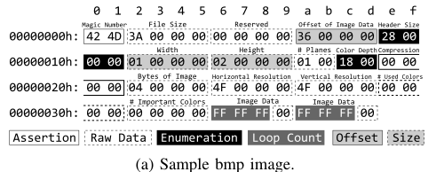

# ProFuzzer：动态输入类型探测以更好的发现0day漏洞

## 摘要

1. 现有的变异策略倾向于对程序的输入进行随机变异，但这样并不能理解底层的**语法和语义**，导致很多随机变异产生的测试用例都是无效的；
2. 本文提出了一种新的即时探测技术（ProFuzzer），它可以在模糊测试过程中**自动复原和理解对漏洞发现至关重要的输入字段**，并相应的智能调整变异策略，以提高命中0day漏洞的概率；
3. 探测技术与常规模糊测试过程相结合，因此**不需要输入规范的先验知识**；
4. 在模糊测试过程中，首先对单个字节进行变异，并自动分析其模糊测试结果并将相关的字节链接在一起，并识别他们的字段类型。这些字节将按照特定类型的变异策略进行变异，**大大减少了搜索空间**；
5. 在所有应用程序中定义普遍的探测类型，且使技术与应用程序无关。

## 引言

传统的变异方法在现代软件中越显不足，原因在于现代软件具有**很大的输入空间**且**输入执行关系复杂**。

### 挑战

1. 基于生成的方法**依赖于描述输入格式的语法**来生成合法的测试用例

2. 尽管构造良好的语法确实减少了搜索空间，但对于各种**输入对程序执行的影响**，它能提供的线索则很少

   >例如，如果一组输入都会导致相同的执行路径，因而只需测试其中一个输入即可。

3. 基于变异的方法不需要输入模型的知识，它使用一组合法的输入实例作为种子，并不断修改它们以探索各种执行路径

4. **深入理解目标程序的输入至关重要**，而这样的输入往往是**结构化数据**，可以划分为一系列具有特定语义的数据字段

   >例如缓冲区大小、类别指示符

   这些字段的语义对于漏洞发现至关重要，有助于帮助测试人员确定要变异的字段、合法值的范围、数据字段对程序执行的影响等。

### 基于类型探测的模糊测试

1. ProFuzzer：通过名叫"probe"的轻量级随机模糊测试过程来自动发现输入域及其语义，以指导种子变异的在线进化

2. ProFuzzer通过变异一组种子对目标程序执行**两阶段模糊测试 **：

   ①.	第一阶段：逐字节顺序探测：

   ​		 每次改变一个字节，根据目标程序枚举其值，然后移到下一个字节。

   ​		 同时收集目标程序在**不同字节值**下的执行路径信息

   ​		 在线**自动分析执行路径信息**，以恢复数据字段并确定其字段类型

   >例如，其特定内容导致发生变异的相同异常路径的连续字节可以分到一个字段中。

   ​		 确定了6种字段类型，模拟了它们的内容影响程序执行的方式，例如大小、循环计数和枚举，描述与模糊测试相关的语义

   ②.	第二阶段：模糊测试，第一阶段提供的数据字段及其类型为此阶段的模糊测试提供了指导。

   ​		 ProFuzzer对每一个字段进行变异，以利用可能导致攻击的值（如一个大数据长度可能会导致缓冲区溢出漏洞），并根据字段类型探索合法值，以实现更好的覆盖。

3. 在AFL上实现该设计。将ProFuzzer与AFL、AFLFast、VUzzer、Driller和QSYM在4个实际应用程序上进行比较。

### 贡献

1. 新的智能模糊测试技术：本文设计了一个高效的智能Fuzzer，通过轻量级**探测发现输入字节和程序行为之间的关系，以指导后续的目标种子突变**。这种方法无缝、透明地将**语义知识发现**集成到模糊测试过程中，不仅提高了模糊测试的准确性，而且提高了模糊测试的性能，同时又不降低适用性。 
2. 0day漏洞的发现：在现实世界的应用程序上运行fuzzer，我们在两个月内发现了42个0day漏洞。研究结果表明，这种**在线语义发现和突变指导技术**提高了技术水平。

## 动机

### 基于变异的模糊测试

### 基于规范的模糊测试

### ProFuzzer基本Idea

ProFuzzer基于两个重要的观点：

1. 模糊测试并不需要一个全面的、特定于应用程序且语义丰富的输入规范

   

   上图是一个简单的bmp图像文件二进制数据，在偏移量为0x26-0x2d暗示了图像的分辨率，这是很重要的字段，但OpenJPEG在图像解析时略过这些字节（**可以理解为对相同规范的不同实现**）。**在对那些在模糊测试没有任何益处的字段应尽量避免变异，因为它们的内容不会影响解析期间的执行路径**。因而需要将更多精力放在对模糊测试至关重要的特殊类型字段的识别上。

   >例如，如果我们知道一个字段描述缓冲区大小，我们可以应用定制的变异规则来确定是否存在易受攻击的缓冲区。 

2. 通过直接观察模糊测试过程，可以理解输入和发现输入的字段和数据类型，尤其是输入内容的变异引起的程序执行路径的变化。

   >因此，现有的输入格式逆向工程技术（如REW-ARDS、TIE、Howard）依赖于重量级分析，既没有必要，也没有成本效益。相反，我们相信输入理解可以无缝地集成到模糊测试过程中，通过对先前模糊测试结果进行动态语义分析，识别输入字段及其类型，然后指导未来的输入突变。 

---

论文设计了一种两阶段模糊测试技术ProFuzzer：

第一阶段：通过对每个字节的变异来探测输入字段和种子输入的字段类型（**识别关键输入字段**）；

第二阶段：使用字段和字段类型信息来指导在线输入变异（**字段变异**）；

## Overview

ProFuzzer体系结构如下图所示：


四个组件：**探测引擎、变异引擎、执行引擎和报告引擎**

1. 探测引擎：

   任务：从给定二进制文件的种子确定输入字段类型并生成类型模板；

   具体方法：

   ​		对每一种子输入，Profuzzer**遍历所有的字节**。

   ​		对于每一字节，Profuzzer**迭代其所有可能值（0x00 到 0xff）**，并收集相应的执行配置文件。

   ​		接着，Profuzzer从这些配置文件中提取一些度量（例如，变异导致的边覆盖变化），并将其用作字节的特征。

   ​		Profuzzer将具有类似特征的连续字节分到一个字段中。

   ​		最后，它根据每个字段的可能值的变化与观察到的特征的相应变化之间的关系来确定每个字段的类型。

   >例如，magic字段的特征是，种子输入中原始值发生的所有变异都会导致无效输入，从而导致短时间执行。

2. 变异引擎：

   使用探测模板（即字段和字段类型）来指导后续变异。

   这种指导性体现在两个方面：

   ​	第一个是以经济有效的方式扩大覆盖范围（避免无效字段）；

   ​	第二个是字段信息可用于指导漏洞生成（如缓冲区大小字段）；

3. 执行引擎和报告引擎：

   每次探测引擎或变异引擎请求执行应用程序时，执行引擎都会派生一个新进程。在执行期间，它会自动收集执行配置文件；

   报告引擎监视执行，尤其是崩溃或挂起。

4. **假设：**

   假设目标程序具有如下属性：

   [1]  执行确定性；

   [2]  初始有效的种子输入具有合理的大小；

   [3]  如果对某些字节的验证失败，执行将很快终止，这意味着异常执行的执行路径比正常执行的更短；

## 设计与实现

### 与模糊测试相关的输入字段类型

定义了**6种输入字段类型**：**assertion, raw data, enumeration, loop count, size and offset**

①. Assertion（断言）：断言类型的输入字段只有一个允许程序正确执行的值，而其他的值将导致程序错误终止。


如上图所示，显然，偏移量0x00和0x01的值形成一个断言域。如下代码所示，OpenJPEG检查该域判断其值是否为0x4d42。

```c
header.bfType = get2Bytes(IN);
if (header.bfType != 0x4d42) exit_error(); (i)
```

②. Raw Data（原生数据）：对于原始数据类型的输入字段，其内容不影响程序的执行（例如，其控制流和内存访问）。

​		如①中图所示，偏移量0x26到0x2d值确定图像分辨率，这对于一个图像渲染应用来说是很重要的。但对于OpenJPEG来说是raw data，因为它只转换格式而不渲染图像。

**在模糊测试过程中，我们不需要对raw data域进行变异**。

③. Enumeration（枚举）：枚举类型的输入字段由一小组有效值组成，其他值会导致程序错误终止。

​	 	如①中图所示，偏移量为0x1c到0x1d的字节表示图片的颜色深度，其值只能为0x01、0x04、0x08、0x10、0x18和0x20（根据文件格式规范）。但是，在OpenJPEG当前实现下，仅支持0x08、0x10、0x18和0x20，代码如下图所示：

```c
header.biBitCount = get2Bytes(IN);
switch (header.biBitCount) {
    case 0x08: bmp8toimage(pData, ...); break;
    case 0x10: bmp16toimage(pData, ...); break;
    case 0x18: bmp24toimage(pData, ...); break; (ii)
    case 0x20: bmp32toimage(pData, ...); break;
    default: exit_error();
}
```

**在模糊测试过程中，我们仅测试合法值**。

④. Loop Count（循环计数）：循环计数类型的输入字段确定循环结构（例如for/while循环或递归调用）中的代码片段应该执行的时间。 

循环计数值对路径计数的影响很大，对路径本身的影响可以忽略不计。 

​		如①中图所示，偏移量为0x36的字节是一个循环计数的实例。根据文件格式规范，该字段是一个raw data域。但是，它在颜色变换过程后用来表示RGB值，它的值会影响变量bpno，如下面代码所示：

```c
data = fread_data(IN);
bpno = color_transformations(data);
for (passno = 0; bpno >= 0; ++passno) (iii)
	{ ... bpno--; }
```

⑤. Offset：偏移类型的输入字段确定程序可以**从哪个位置访问输入文件中的后续数据**。 

偏移量字段对于模糊测试过程来说非常重要，因为**错误的偏移量值可能会导致程序访问范围外的数据**（例如，文件结尾），从而导致在后续验证检查中出现错误而终止。

 在有效范围内，**不同的偏移量会导致访问不同的后续数据**。如果访问的数据对控制流（即非原始数据）有影响，**其不同的值可能会导致执行采用不同的路径**。 

​		如①中图所示，偏移量为0x0a到0x0d是一个Offset实例，指向程序应从何处读入图像数据。在这个例子中，它从文件的第54个字节处开始。

​		如下代码所示，如果offset被设置为大于54的值，fseek()将超过文件尾，从而导致exception。

```c
header.bfOffBits = get4Bytes(IN);
fseek(IN, header.bfOffBits, SEEK_SET); (iv)
if (fread(pData, ..., stride * header.biHeight, IN)
	!= (stride * height)) exit_error();
```

**在模糊测试过程中，一个offset字段需要以与前面的位置移动变异相一致的方式进行改变（例如添加data域）。**

⑥. Size: 大小类型的输入字段决定程序应从输入文件中读取以进行进一步处理的数据量。与偏移类型类似，如果大小值导致任何超出范围的数据访问，程序将以错误终止；在有效范围内，不同的大小可能会导致不同的执行路径，因为处理的数据不同。 

Size和Offset的区别在于，如果一个Size被设置为0，错误一定会发生，然而将偏移量设置为0也许不会导致类似的问题。

​		如①中图所示，偏移量为0x16到0x19是size字段的一个实例，表示图像的高度。其正确大小为0x02。如果该字段设置为0或者大于0x02（如0x03）的值，程序将以错误终止。

**在模糊测试过程中，size域变异受到总输入大小的限制。**

>请注意，这些字段类型不同于编程语言中的传统类型或程序员定义的类型。我们的类型系统的重要设计标准包括应用不可知和模糊相关。**这六种类型可能并不全面**。输入字节可能不属于其中任何一个。在这种情况下，ProFuzzer会回到AFL的常规随机突变。 

### A. 字段类型探测

​		ProFuzzer在探测期间每次更改一个字节的输入，枚举字节的所有256个值，以收集相应的256个执行配置文件。这些配置文件【边向量】存储在一个紧凑的哈希数组中，该数组保存着各个控制流边的执行频率（与AFL统计的信息一致）。

​		在论文提出的系统中，每一个边向量都被用来提取一些特征，这些特征描述了被探测字节的特征。然后利用这些特征将多个字节组合到一个字段中，并进一步确定字段的类型。

#### 定义

1. I：输入，len字节的序列，每个范围从0x00-0xff

2. T<sub>I</sub>：execute函数的输出，该函数将I作为输入运行目标程序，返回边向量，有

   

3. I<sub>[i]:v</sub>为substitute函数的返回值，该函数将I中第i个字节替换为v，有

   

4. S<sub>I[i]:v</sub>表示两个向量（I和I<sub>[i]:v</sub>）边覆盖的相似性，而D<sub>I[i]:v</sub>表示这两个向量边覆盖的差异性，具体计算公式如下所示：
   

   举个例子，T<sub>I</sub>和T<sub>I[0x1c]:0x20</sub>为例，T<sub>I[0x1c]:0x20</sub>将T<sub>I</sub>的第0x1c字节的0x18变异为0x20，然后发现覆盖率信息在索引值为13处具有相同的边命中次数，在583和13052具有不同边命中情况，而在索引值为34093处具有不同的边命中次数。

   

   如上图所示，假设仅有四条边，相似性S=2/4，差异性D=1/2

   **总的来说，S=交集/并集，D=边命中次数不同且都命中该边/边命中次数不同但有一个输入新命中一条边**

#### STEP I：特征提取

提取两个特征：


F<sub>i</sub><sup>S</sup>（**覆盖特征**）将输入I中第i个字节分别替换为0x00、0x01、...、0xff，然后计算相应的相似值S，构成一个大小为256字节的向量，F<sub>i</sub><sup>D</sup>（**频率特征**）同理计算差异值D。

定义α<sub>i</sub>用来表示覆盖特征F<sub>i</sub><sup>S</sup>中心趋势（中值），计算如下：


使用条形图可视化F<sub>i</sub><sup>S</sup>，x坐标表示字节从0x00变化到0xff，y坐标表示字节变化相对应的覆盖相似指标。如下图所示：


#### STEP II：字段识别

目标：将相同输入类型的连续字节分组为一个字段。

尽管字段中的每个字节可能有多个有效值，但通常会导致不同的执行路径和不同的度量，并且许多无效值始终会导致相同的终止路径，这些路径会导致exception且使最短路径。因此，这些无效值必将导致相同的覆盖率和频率指标。

如果满足下述条件，则将i到j的偏移量处的字节分组为一个字段：


>最小覆盖相似性值对应于无效变异引起的最短路径

#### STEP III：字段类型识别

给定一组连续字节作为输入字段，接下来就需要确定字段的类型。

① Assertion字段：

​	满足下述条件，则认为偏移量i到j的字节为Assertion字段：

​	

​	断言字段中仅有一个有效值能使程序正常运行，其他值将导致异常路径使程序终止。而其他值均小于中值。

②  Raw Data字段：

​	满足下述条件，则认为偏移量i到j的字节为Raw Data字段：

​	

​	Raw Data不改变程序路径，因此覆盖相似性恒为1。

③  Enumeration字段：

​	满足下述条件，则认为偏移量i到j的字节为Enumeration字段：

​	

​	Enumeration字段要求在偏移量为x处存在一个字节∈[i,j]和一个集合VS，VS是{0x00,0x01,...,0xff}的一个适当子集，其大小大于1。且对于VS中的任何值v，其相似性得分大于中值，对于不属于VS中的任何字节u，其相似性得分小于中值。

④ Loop Count字段：

​	满足下述条件，则认为偏移量i到j的字节为Loop Count字段：

​	

​	 Loop Count字段中，其覆盖率相似性的方差小于β，β是一个预定义的值，表示较小的数据变化，且其频率差的平均值大于1，这意味着与覆盖率差相比，频率差占主导地位。

⑤ Offset字段：

​	满足下述条件，则认为偏移量i到j的字节为Offset字段：

​	

​	在Offset字段中，偏移量i到j的某一字节便成0后，其覆盖相似性分数大于中值；且存在一个分界值t，在[0,t]区间和(t,0xff]区间有着不同的覆盖相似性分数，且(t,0xff]区间的覆盖相似性分数小于中值。

​	从直觉上说，偏移字段的有效范围由剩余输入的长度（即从字段旁边的字节到末尾）限定。将字段更改为大于界限的任何值可能会导致超出范围的访问，从而导致异常。将字段变异为小于绑定值的任何值都会导致访问不同的后续数据，这反过来可能会导致不同的执行路径。因此，有两个这样的值u和v，它们的覆盖相似性度量是不同的。此外，将字段变为0很可能是有效的，因为这意味着程序将从字段之后开始访问后续数据。 

⑥ Size字段：

​	Size字段与Offset字段满足的条件类似，如下所示：

​	

​	在Size字段中，将该字段设置为0通常会导致提前的程序终止，因此其覆盖相似性分数小于中值。

>区分Size字段和偏移字段的目的：
>
>它们具有不同的变异策略，例如，在将Offset字段增加1时，我们在字段后面插入一个字节，以便在变异运行中访问相同的原始后续数据；
>
>相反，当一个Size字段增加1时，我们会在输入的末尾插入一个字节。以防止输入以断言字段结尾，字节将被添加到断言字段前面。

问题：当Offset字段和Size字段位于Raw data字段旁边时，其边界判定可能会很棘手，因为对Offset/Size字段的最小字节进行变异可能不会导致任何执行更改，从而使其无法与Raw data数据字节区分。

解决办法：将已识别的Size/Offset字节与相邻的Raw字节进行分组来解决这个办法，分组字节所表示的值不超过种子输入的大小。

---

实验结果： 5.2% 假阳性率 和 4.5% 假阴性率

### B. 重新探测

在模糊测试过程中，给定一个新的变异过的输入，ProFuzzer首先尝试重用一个被探测的模板，该模板的执行跟踪与输入的执行跟踪相似。**如果没有这样的模板，我们认为突变输入是一个新的种子输入，并重新探索其领域，就像探测原始种子输入**。在重新探测之前，ProFuzzer利用AFL内置的输入微调功能尽可能减少输入大小，并以较小的大小对输入进行优先级排序。 

**挑战在于，新的种子输入可能不会导致正常执行，而是导致异常执行**。因此，重新探测的基本思想是当变异新的种子输入结果比种子更长的执行时，我们认为重新探测突变越来越接近有效的输入，因此我们用突变的种子替换当前的种子并继续。请注意，**执行时间越长，表示变异种子通过的验证检查就越多**。 

#### 重新探测特征提取

定义：

基于边向量T<sub>I</sub>和T<sub>I[i]:v</sub>的重新探测指标R<sub>I[i]:v</sub>、重新探测特征F<sub>i</sub><sup>R</sup>的计算方法如下：


#### 字段类型重新识别

##### 重新探测Assertion字段


##### 重新探测Enumeration字段


### C.类型引导变异

探测字段将被用于指导变异，这种指导体现在两方面：

一（**exploration变异**）：它将变异限制为字段类型的所有合法值，以实现更好的覆盖；

二（**exploitation变异**）：ProFuzzer对每个字段进行变异，以利用一组可能导致潜在攻击的特殊值（针对特定字段类型）

#### Exploration变异

变异策略：

| 序号 | 变异策略                                                     |
| ---- | ------------------------------------------------------------ |
| ①    | 不对raw data字段进行任何变异                                 |
| ②    | 对于枚举字段，以高概率（0.9）在其有效范围内分配一个值，并以小概率（0.1）在该范围外分配一个值，以探索探测过程中可能遗漏的其他有效值 |
| ③    | 对于断言字段，虽然在模糊测试过程中应尽量避免更改其内容，但仍然以很小的概率（0.1）使用提取的常量来修改它以防止探测过程错误的将枚举字段视做断言字段 |
| ④    | 对于偏移量字段，当变异将其值增加（或减少）X时，在字段后面插入（或删除）X字节 |
| ⑤    | 对于size字段，当变异将其值增加（或减少）X字节时，在最后一个非断言字段之前插入（或删除）X字节（**插入数据是随机生成的**） |
| ⑥    | 对于循环计数字段，我们执行二进制搜索以确定其最小和最大有效值 |
| ⑦    | 对于不能归类为这六种类型之一的其他字段，执行默认的AFL随机每字节变异 |

#### Exploitation变异

手动分析了100多个已知漏洞的POC，发现给定的字段类型通常有一小部分可能导致攻击的值，这种模式与应用程序无关。

下表展示了部分字段的Exploitation规则：


## 评估

### 前期准备

1）目标程序： 40个流行的真实环境下的程序用以研究假设的普遍性，选择其中10个常用于现有模糊测试评估项目

2）计算资源

3）ASAN设置：ASAN禁用与启用

### A. 假设的一般性验证

研究内容：（1）确定性执行，（2）初始种子输入大小，（3）正常执行和异常执行之间的差异

总体而言，所有抽样应用程序都是确定性的，初始种子输入大小适中（78字节到1650字节不等），正常执行和异常执行之间的差异是显著的，后者的边覆盖率平均要小4倍。

### B. 输入大小和路径覆盖

#### 输入大小分布

结论：探测/重新探测的成本与输入大小成正比（ProFuzzer有一些内部机制，允许控制输入大小，而不影响模糊测试效果）


上图（a）右边显示ProFuzzer输入大小，其范围较大，从60字节到80字节不等，少数异常值超过350字节。

即使使用较小的输入，该方法相比AFL而言，实现了93%的路径覆盖率，这要归功于我们对小输入进行优先排序并在可能的情况下重用模板的策略。

#### 输入大小vs路径覆盖率

我们根据大小将生成的测试输入分成不同的组，并计算每个组的平均路径覆盖率。如上图（b）所展示。在OpenJPEG中，当大小小于80时，输入大小的增加会提高路径覆盖率，但当大小超过80时覆盖率会降低：

	1. 输入越大，每次执行所需的时间越长
 	2. 输入越大，验证这些变异所需的变异和时间就越多。

因此，需要优先考虑小size的输入

### C. 探测准确性


### D. 寻找0day漏洞的能力


### E. 对标准基准的评估 

#### Benchmarks

LAVA-M数据集和谷歌fuzzer测试套件

#### Fuzzers

ProFuzzer vs （AFL、AFLFAST、Driller、VUzzer、QSYM）

#### LAVA-M


#### Google Fuzzer Test-suite


### F. 暴露的已知漏洞


### G. 性能


## 我的看法

亮点：

1.推断输入的结构，并将输入分配到特定的字段中。通过观察程序执行路径的变化，探索输入对执行路径的影响。也就是说，考虑了输入与执行结果之间的关联性。

2.对六种不同的字段定制了不同的变异策略，有效的减少输入的搜索空间。

3.Profuzzer产生的模板具有可重用性

4.实验部分结果与论述很详细

---

不足：

1.仅定义了6个字段，不够全面。可能存在除了这6个字段以外的其他字段。

2.字段探测过程中存在误判的可能，但在变异策略中对这一部分进行了考虑。

3.变异引擎部分并未阐述如何对哪些字段进行变异？（变异调度？）

