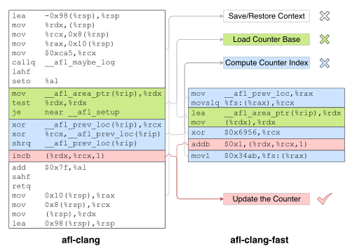

# RIFF: Reduced Instruction Footprint for Coverage-Guided Fuzzing

在这篇文章中，提出了RIFF去减少覆盖管线中的指令足迹并提高模糊测试吞吐量。

RIFF利用编译器分析，并利用处理器（...）

① RIFF减少了目标程序在运行覆盖率收集时的指令执行数量；

​	首先，RIFF通过**在插桩时对边转移进行预计算**以移除运行时边索引值的计算；

​	接着，RIFF通过**为计数器区域分配链接时确定的静态地址**以消除加载计数器区域基址的指令；

RIFF只能在每一插桩点使用一个6字节编码的指令

② RIFF为了移除fuzzers在处理覆盖信息时非必要的指令，**将处理粒度划分为三个阶段：**

​	第一阶段快速处理简单场景，最后一阶段适用于更复杂的场景。对于最常见的情况，RIFF扫描覆盖区域并使用向量指令跳过零值块。

## 贡献

1. 我们观察到在程序覆盖测量的信息收集和信息处理过程显著影响了模糊测试的速度，同时分解了指令和分析代码的开销；
2. 通过静态地使用预计算信息来消除了大部分的运行开销，并通过矢量化加速了执行后处理；
3. 将RIFF应用于流行的模糊测试程序，并在现实世界的程序中实现了运行时间的明显加速。

## 背景

### 覆盖管道的各个阶段

以AFL为例演示了Fuzzer是如何处理覆盖信息：

① 插桩：

​	在编译阶段，afl-clang分配一个65536大小的计数器数组（每一个计数器8bits）去存储覆盖信息。对于目标程序的每一个基本块，afl-as生成一个随机数ID作为他的标识，然后最开始处插入一个afl_maybe_log(ID)的调用。

​	在插桩结束后，fuzzer生成随机输入并对每一个输入投喂给程序执行。对于每一个输入，fuzzer使用一个数据库来检测输入是否触发程序新的状态：

② 更新：

​	在运行阶段，afl_maybe_log更新覆盖计数器以收集边覆盖信息。logging函数将前一个执行块id和当前块id进行hash映射，然后使用该hash值作为计数器的索引值，并将指向的计数器值递增1。

③ 分类：

​	目标程序完成执行后，AFL读取覆盖计数器，将其分类为特征位图。每个非零值的8位计数器映射到8个可能的特征（在AFL中为2的幂）。这些特征用位图表示，其中每个特征对应于8位计数器内的8位之一，分类结果被写回覆盖区域。 

④ 检测：

​	通过将边传输计数分类为位图，AFL扫描未知程序状态的数据库（virgin），以检测新的程序行为：如果触发了以前未知的边转移，则输入将被标记为“新覆盖”；如果已知的边传输具有不同的特征，则将其标记为“新路径”；否则，将丢弃当前输入。扫描后，AFL通过更新数据库删除新发现的特征。 

---

### 覆盖管道的变体

不同方法的覆盖率信息收集：

不同方法覆盖率信息处理：

AFL：两阶段设计，第一阶段批量处理位图转换，第二阶段应用位翻转技术来加速扫描过程；

LibFuzzer：一阶段设计，对于每一非零比特，libFuzzer将其转换为特征索引，然后使用复杂的算法（如二分查找）来更新本地和全局统计信息；

Angora：采用队列的方法，在第一步中，从原始数组中提取一小部分计数器索引和特征掩码；在第二步中，它扫描收集信息以检测新的覆盖率，并将修改写回队列；在第三步中，它锁定全局数据库并应用队列的修改。

## 测量覆盖管道的开销

### 插桩开销

为了公平比较，选择了afl-clang、afl-fuzzbench和afl-clang-fast（因为它们具有相同的覆盖更新方法和基编译器），同时将afl-fuzzbench的优化水平降低到-O2以匹配其他插桩方法。

表3列出了每个收集方法的开销，方法是将每个度量标准化为非插桩基线程序。 

instruction计数列展示了程序运行缓慢的原因。下图列出了afl-clang（最慢的方法）和afl-clang-fast（最快的方法）的指令。以afl-clang为例，对于每一个基本块，**它要插入10条指令共56字节编码**。这些指令保存上下文，调用\_\_afl_maybe_log函数，并恢复上下文。在\_\_afl_maybe_log函数中，**共有44字节的指令被执行**，这些指令更新最后的代码位置并增加计数器的值。这其中甚至包含一个条件跳转，用于检查覆盖率计数器是否已初始化。

同样的问题也出现在afl-clang-fast中，在它执行的所有7条指令中，只有一条指令用于实际更新计数器。

总的来说，在afl-clang和afl-clang-fast的插桩代码中，**存在大量的冗余代码**，如上图所示，因此导致程序运行开销增加。

### Fuzzer中不必要的指令

下图通过采样CPU使用情况，展示了afl-fuzz的开销明细。

从图中我们可以看到，afl-fuzz的大部分时间都花在覆盖管道上。为了检测新的程序状态，**AFL将84.48%的宝贵CPU时间花在覆盖管道上**。CPU使用率极高，这意味着整个系统设计背后存在重大问题，这不可避免地会导致执行指令的冗余。 

---

表4显示，大多数执行并没有提高覆盖率。

如果计数器的值为零，我们称其为“无用”，因为零值计数器从不映射任何特征。

如果一个程序的位图与之前的执行相比不包含任何新特性，我们称其为“无用”。

从表4的第一行结果可以看出，覆盖范围数组的具有稀疏性。换言之，**在覆盖范围分析期间快速跳过零计数器可能是一个主要的性能提升**。 

表4的第二行结果所示，尽管99.997%的输入没有触发任何新的程序行为，但AFL仍执行了许多计算：第一次通过将覆盖率转换为位图，第二次通过重新读取并与未知程序状态的数据库进行比较。

libFuzzer也是如此，它保存了更多的统计信息，包括最小输入大小、每个功能的触发频率、最罕见的功能列表，以及当前输入包含的独特功能列表。分析需要复杂的计算，包括查表、线性搜索和浮点对数。 

## RIFF设计

关键点：

1. RIFF在静态分析过程中，预计算所有可能的控制流边，为每个静态边分配一个固定的计数器索引。

   目的：避免运行时执行地址计算操作

2. RIFF插入代码，通过增加相应地址处的计数器来记录边执行

3. RIFF在编译器后端的帮助下生成机器代码，无需保存或恢复运行时上下文。

---

在目标程序启动时，RIFF的运行时间**将覆盖计数器映射到编译器指定的固定（静态）地址**，简化的插桩和聚合覆盖布局减少了覆盖收集的开销。

当目标程序完成输入的执行后，使用RIFF增强的fuzzer将分成三个阶段处理覆盖信息：第一阶段快速处理简单的情况，最后一阶段处理不常见的复杂情况。

### 单指令插桩

如前所示，收集覆盖率信息的插桩代码具有较高的时间开销，它不仅需要更新每个基本块的计数器，而且**插桩代码在每个计数器更新前后保存和恢复寄存器的值以确保程序逻辑的正确性**。此外，插桩代码**动态加载**计数器基址，并通过对块索引进行散列来计算计数器索引

>  总的来说，开销主要体现在：
>
>1. 保存和恢复上下文
>2. 动态加载计数器基址
>3. 块索引需要计算才可以得到

RIFF**在编译时**执行大部分计算，将代码简化为一条指令。

#### 预计算计数器索引

AFL使用基于哈希的控制流边覆盖，虽然边覆盖可以区分基于块覆盖无法区分的执行跟踪（体现在块与块之间转移的顺序），但动态维护前一个块的标识符和在运行时计算哈希的开销是比较大的。

---

块覆盖的不精确性：

上图展示了块覆盖的不精确性。图（a）显示了两个具有不同边计数但相同块计数的控制流图。理论上，对于具有|V|顶点的有向图，可能存在 (|V||V-1|)/2条边。因此，仅块计数无法确定确切的边计数。然而，在实践中，图形非常稀疏，在某些情况下，边计数可以由块计数唯一确定。

然而计算边计数需要大开销的计算来求解方程组。如图（b）所示，有三个基本块和三条边。假设检测方案分别将基本块A、B和C的计数a，b和c。虽然边AB和BC的命中次数直接表示a和c，但AC边命中次数必须需要计算（a-b）。**求解方程组**将大大降低fuzzer方面的处理速度。

---

RIFF利用静态分析为每一条边分配一个计数器，它通过在需要时创建额外的空基本块来实现这一点。

1. 如果一条边的命中次数可以由source vertex（出度为1）和sink vertex（入度为1）的顶点唯一确定，则块计数将应用于该边。否则，将分配一个空块来表示边。
2. RIFF使用调用块的命中数来表示调用块和被调用入口块之间的边的命中次数（这里要保证调用的块一定能调用被调用的块，否则就无意义了~）
3. 之后，RIFF为每个块依次分配标识符，并移除其中命中次数可由其他计数器表示的插桩点。这些标识符将被用作覆盖率数组中计数器的运行时索引。

#### 固定计数器基址

AFL中共享内存区域不是固定的地址，借助环境变量传递给子程序，因此带来额外的开销。

固定计数器基址分配分两步完成：

在每个基本块的开头，插桩代码应递增其相关计数器的值。如果基址是固定的，并且数组索引已经在编译时分配，那么计数器的地址也可以在编译时计算。然后直接使用incb $ADDR直接增加地址所指向的计数器。

然而，如下图所示，直接在指令内编码目标地址需要一条7字节的指令。RIFF使用一个基于RIP的寻址模式，需要6字节的指令。此外，不再需要寄存器保存/恢复代码。

RIFF将二进制image base固定为0x80000，并为覆盖范围保留0x400000到0x800000的地址范围。

#### 间接控制转移

虽然单指令插桩是有效的，但这种解决方案不能用于间接控制传输。

如GUNC扩展允许switch标签，setjmp和longjmp，函数指针和C++异常展开。

RIFF使用过程间控制流分析来发现这种情况，并返回到动态计算。如果找到代表间接控制传输的边的开始（例如setjmp），RIFF会在执行转移之前将源块ID存储在threadlocal中。在间接控制转移的目标处，RIFF加载源块ID，并通过哈希计算计数器索引。

---

### 热路径向量分析

表4所示，在所有覆盖计数器中，只有少数计数器由目标程序更新；在所有执行中，显示新程序行为的输入极为罕见。结果表明，**fuzzer执行的许多计算不会产生有用的结果**。

**多阶段处理设计简化逻辑**

阶段0是最简单的一个，获取64字节的块，并丢弃所有零块。

阶段1使用掩码为非零的位置进行编码（归并桶）。在阶段1中，计数器在寄存器中被分类为位图，然后直接与未知程序状态的数据库进行比较。如果没有发现新特征，则计数器将被丢弃。

只有在当前输入触发了新的程序行为时，才会调用AFL在阶段2执行原始分析，虽然这个阶段需要复杂的计算，但被调用的概率较低。

---

细节：

#### 向量扫描

为了有效过滤零计数器，使用能够并行扫描计数器的指令。AVX512是intel在2013年提出的一种典型的单指令多数据设计，在现代服务器处理器中得到广泛支持。

在512位向量上运行时，它可以并行比较64个8位整数通道。例如在Skylake-X的处理器上，它能在4个时钟周期内完成扫描，相比之下，基于标量的处理需要64条testb指令，每条指令的延迟为1个周期。

掩码寄存器中的每一位表示向量中的命中数是否为0，该寄存器作为数据库，与新的计数器值进行比较以判断是否触发新的边（或新的命中次数）。

#### 掩码比较

如果一个块包含非0字节，它可能表示触发了新的程序行为。向量扫描将不能丢弃该块，而应将计算委托给下一个阶段，即掩码比较。

这一阶段，对覆盖范围进行分类，然后与数据库进行比较，以检测新的程序行为。**由于覆盖的稀疏性**，大多通道为0。为了消除不必要的计算，从向量扫描得到的掩码将用对非零通道进行移位：仅当掩码暗示了通道值非0，才使用分类器进行桶归类，否则，零通道将被丢弃。

对于每一个非0通道，相应的计数器将被读入寄存器。使用表查找和位操作将原始计数器分类为位图后，它们直接与数据库进行比较。

#### 不频繁的更新

对于那些触发程序新行为的输入，将进入阶段2。

**这个阶段很少被调用**，此阶段执行标准fuzzer执行的原始分析：首先对原始计数器进行分类，并将位图写入内存；其次，读取位图，将其与数据库进行比较，并在需要时更新数据库。扫描位图时，检查变化的计数器值，如果仅仅计数器值（非0）发生变化，则发现了一个”新覆盖“，否则表明发现了一个”新路径“。

## 实现

RIFF编译器部分在LLVM上实现。

具体来说，在编译源文件时，RIFF指示编译器生成LLVM bitcode。这些bitcode文件链接到整个程序的bitcode以供分析使用。接着，RIFF利用DominatorTreeAnalysis和BasicBlockUtils分析对整个程序执行插桩，然后生成机器码到一个简单的object文件。

代码声称过程中，LLVM更喜欢生成7字节的addb指令，而不是6字节的incb指令，incb比addb慢。为了强制指令选择生成incb指令，通过禁用slow-incdec选项来微调LLVM目标属性。

与常规链接一样，单个object文件与系统库链接。在此步骤之后，编译器将表示覆盖计数器开始的符号映射到固定地址（st_shndx中的SHN_ABS）。如清单1所示，在大多数情况下，生成的机器码只需要6个字节，而在间接转移时，RIFF才会进行运行时哈希计算。

由于向量化覆盖率处理依赖于SIMD指令的硬件支持，目前在x86-64上实现了两种变体。如果支持AVX512双字和四字指令（AVX512DQ），则将8个64位整数作为一个块进行处理。如果仅支持AVX2，则64位整数的4个通道将作为块处理，否则将完全跳过阶段0，并执行阶段1。通过内部函数实现这些算法，以利用基于编译器的寄存器分配优化。

---

## 评估

测试套件：Google fuzzer-test-suite和FuzzBench。

在AFL和MOpt中进行实现。

使用afl-clang编译程序，使用RIFF进行插桩。基线版本是从git存储库构建的，无需修改。

将RIFF的热路径加速补丁引用于基线fuzzer。

### 总体结果

图7展示了RIFF到达AFL或MOpt运行3小时、6小时、12小时和24小时相同覆盖率所需要的时间比。

图8显示了24小时实验后的总体结果。在图中，来自AFL和MOpt的基线指标被标准化为红色水平线1.0，而来自RIFF优化的相应指标被绘制为条形。更高的条表示性能更好。 

### 简化覆盖率收集（开销）

### 加速的覆盖率处理过程

## 讨论

目前，由于其他平台上的fuzzer支持不足，我们只评估了我们在x86-64上的工作。例如，AFL仅通过QEMU提供实验性arm支持。虽然实现依赖于目标，但总体思路适用于所有平台：在ARMv8或RISC-V系统上，只需4条指令即可实现最小的插桩逻辑；向量覆盖处理可以使用ARMv8 NEON ISA替代为AVX2或AVX512。

我们的工作可以很容易地适应更多的fuzzer。例如，AFL++[17]的开发人员已经根据他们的代码库调整了我们的工作，并使用Google  FuzzBench[30]进行了独立的第三方评估。根据结果[5]，我们的修改（标记为“skim”）是所有10个变体中性能最好的一个。 

## 我的看法

亮点：

1. 单指令插桩以节省插桩带来的存储开销
2. 热路径向量分析从指令集的角度加快覆盖率信息的处理过程

不足：

1. 可应用的fuzzer具有局限性
2. 虽然运行时间减少，但编译期间的开销将会增大。本质上是通过增加编译时间来降低运行时间
