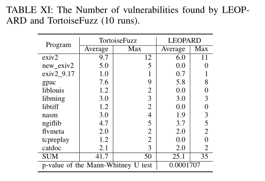

# Not All Coverage Measurements Are Equal: Fuzzing by Coverage Accounting for Input Prioritization

## 引言

* 先前的工作都将平等对待边的信息，而忽略了一点：

  * 边所表示的目的块存在漏洞的可能性是不相同的；
  * 对于所有引起新覆盖率变化的输入，那些执行了不太可能存在漏洞的代码的种子被选择的概率与那些执行了很可能存在漏洞的代码的种子相同，从而导致模糊测试的大量时间都花费在探索那些无意义的代码处，可能会使那些执行了很可能存在漏洞的代码的种子"饿死"。

  * 本质上还是传统模糊测试工具的**种子选择策略**存在缺陷。

* 基于覆盖的Fuzzer目的是尽可能全面覆盖程序的各种分支，但它也会**延迟漏洞的发现**。
  * VUzzer优先选择那些能够导向错误处理代码的种子，但这需要使用污点分析的方法来实现，因此开销较大；
  * CollAFL提出了关于执行路径的替代性输入优先级算法，但它不能保证优先级输入覆盖所有与安全敏感的边，而且它可能导致fuzzer被困在代码的某一小部分中；
  * AFLSensitive和Angora添加更多与边互补的度量，但边仍然被同等考虑，因此对于互补度量值相同的输入，仍然存在种子选择方面的缺陷；
  * LEOPARD考虑函数覆盖率，而不是边覆盖率，并且它对函数分配不同的权重。但整个过程需要静态分析来进行预处理，这会引入额外的性能开销。

  上述这些方法容易受到反模糊测试技术的影响。

## 贡献

1. 提出了**coverage accounting**的方法，这是一种新的输入优先级排序方法，它根据**内存损坏漏洞相关性评估边的指标**，然后使用该指标进行优先级排序。该方法轻量级，没有分析开销小，受反模糊测试技术的影响较小；
2. 设计并开发了基于coverage accounting的灰盒fuzzer：TortoiseFuzz。项目开源地址： :happy: https://github.com/TortoiseFuzz/
3. 使用TortoiseFuzz对30个真实环境下的程序进行评估，并与4个灰盒fuzzer和2个混合fuzzer进行比较。
   * 作为灰盒fuzzer，TortoiseFuzz的表现优于所有4个灰盒fuzzer和1个混合fuzzer。
   * TortoiseFuzz取得了与另外一个混合fuzzer QSYM相当的结果，但只花费了QSYM消耗的内存资源的2%。
   * TortoiseFuzz还发现了20的0day漏洞，其中15个被分配CVE ID。

## 背景

### A.覆盖引导的模糊测试

AFL架构图：

### B.输入种子优先级

* 输入种子优先级是为未来的变异和模糊测试选择输入的测试用例。（种子选择策略）

* AFL及其变体使用边覆盖来确定输入优先级。具体来说，AFL的输入优先级由两部分组成：

  * 输入过滤（图1中第7步）
  * 队列精简（图1中第1步）

  输入过滤是过滤掉不"有趣"的输入（无新边命中且无边命中次数的改变）；

  队列精简是对保存的输入进行排序，以便将来进行变异和模糊测试。队列精简不会丢弃输入，但会改变输入用例在队列中的顺序。

  具有较后排名的输入被选择来模糊测试的机会较小

  每次输入执行时都会进行输入过滤

  队列精简是在一定数量的输入执行之后发生，由变异能量控制。

#### 1）输入过滤

如果输入用例满足以下任一条件，AFL将保留新的输入：

* 新的输入在基本块之间产生新边
* 已命中的边产生了一个新的命中次数（被桶归类之后）

AFL对源、目标基本的ID进行移位和异或计算，然后将计算结果作为两个基本块的边（有序）。

对于每个边，AFL记录是否访问过它，以及先前执行时的访问次数（类似于一个数据库，记录了边命中的相关信息）。AFL为命中次数定义了多个范围（例如桶）。一旦当前输入的某条边的命中次数进入了新的范围，那么AFL将会更新记录并保留该输入。

#### 2）队列精简

* 队列精简的目的是简化输入，同时保持相同的边覆盖率

* 在边覆盖方面，输入过滤过程中留下的输入可能是重复的。在这个过程中，AFL选择比其他输入更有效的输入子集，该子集中的种子覆盖了所有之前访问过的边。

  具体来说，AFL更喜欢**大小**和**执行时间较小**的输入。为此，AFL首先将所有边都标记为未覆盖。接下来，AFL迭代选择未覆盖的边，选择覆盖该边的输入（根据`trace_mini`变量），同时具有最小的文件大小和执行时间（在AFL中，将执行时间和文件大小的乘积作为**score**），并将所有已经访问过的边标记为已覆盖。AFL重复此过程，直到所有边标记为已覆盖。

* 注意，在AFL中，为**每条边找到最佳输入用例的过程是在输入过滤中进行的**，而不是在队列精简中进行的。AFL使用一个名为`top_rated`的数据将边映射到种子以**保存每条边的最佳输入种子信息**。
  * 在输入过滤过程中，如果AFL决定保留输入，它将计算文件大小和执行时间的乘积，并更新`top_rated`。
  * 对于输入执行路径中的每一条边，如果`top_rated`对应边索引的种子分数（文件大小和执行时间乘积）大于当前种子，AFL则会将`top_rated`对应边索引的种子替换为当前输入种子。

#### 3）高级输入优先级算法

* 边覆盖在代码覆盖和路径覆盖中取得较好的平衡，但对于输入优先级来说是不够的，因为它没有考虑更细粒度的上下文

* 先前的工作：

  * Angora建议使用一个调用堆栈
  * AFL-Sensitive提供多个额外信息，如内存访问地址（内存访问感知分支覆盖）和n-基本块执行路径（n-gram分支覆盖）

  这些改进将典型的边覆盖提高到更细粒度的层面，但它仍然存在一个问题，即输入可能会落入程序"冷"的部分，该部分不太可能存在内存损坏漏洞，但会导致新的覆盖。

  :exclamation: 例如，错误处理代码通常不包含漏洞，因此fuzzer应避免花费过多经历来对错误代码进行模糊测试。VUzzer降低导致错误处理代码或频繁路径的输入的优先级，然而，识别错误代码需要额外的开销，这将降低模糊测试的效率。

  * CollAFL提出了与整个执行路径相关的新指标，而不是单个或几个边。它不采用队列精简，而是将具有内存访问权限的指令总数作为输入优先级的度量。

    然而，CollAFL不能保证优先级高的输入能够覆盖所有已访问的边。因此，它可能容易陷入到涉及大量内存操作但不易受攻击的代码片段中，如带有字符串赋值的循环。

  * LEOPARD在保留队列精简的同时，增加一个额外的步骤，通过函数级别的覆盖度量对从队列中选择的输入进行优先级排序，而不是AFL中随机选择。该方法能够在每一个模糊测试循环里访问到所有已访的边，但它性需要对目标程序进行预处理，以进行功能复杂性分析，从而带来性能开销。

### C.输入变异和能量调度

### D.反模糊测试技术

* 当前反模糊测试技术利用了覆盖引导fuzzer的两个设计缺陷：
  * 大多数覆盖引导fuzzer不区分不同边的覆盖
  * 混合fuzzer使用污点分析或符号执行

* 反模糊测试技术通过**插入假路径**、**在错误处理代码中增加延迟**以及**混淆代码来减慢动态分析**的方法欺骗fuzzer。
* 许多基于边覆盖的fuzzer都受到当前反模糊测试技术的影响

## Coverage Accounting

* Coverage Accounting（下简称`CA`）满足两个要求：

  * **轻量级**
    * CA的目的是通过优先级考虑更有可能触发漏洞的输入，缩短漏洞发现的时间
    * 如果CA需要很长的时间，那么意义不大

  * **不应依赖污点分析或符号执行**
    * CA需要抵御反模糊测试技术
    * 反模糊测试技术能够击败污点分析和符号执行

* 设计了内存错误的CA作为内存访问操作的边度量。此外，受HOTracer的启发，从三个粒度（函数调用、循环和基本块）介绍了最近和将来内存访问操作
* 我们的设计不同于已知的内存访问相关的测量

### 1）函数调用

* 将内存访问操作抽象为函数本身。即如果一个函数涉及内存损坏，出现在崩溃的调用堆栈中，那么由于补丁不完整或开发人员的重复错误，该函数可能再次涉及，因此应该优先考虑访问该函数的输入
* 检查了最近四年来在Common Vulnerabilities and Exposures公开的漏洞，以找到包含漏洞的函数。
  * 主要的操作是对CVE描述的网页与子网页进行爬虫，从参考网页中提取调用堆栈，并合成相关函数
  * 其中一部分如下表所示（前20个包含漏洞的函数）

* 给定涉及漏洞的函数，我们通过目标基本块中涉及漏洞函数的数量来评估边。

  令`F`表示涉及漏洞的函数集，令dste表示边`e`的**目标基本块**，令`C(b)`表示基本块`b`中的调用函数，对于`e`，有

  

  其中`Func(e)`表示度量，`card(*)`表示集合的势，即集合中元素的个数。

### 2）循环

* 循环广泛用于访问数据，与内存错误（如溢出漏洞）密切相关

* 引入循环度量来激励迭代循环的输入，并使用后边来表示这一点

  >Tips：后边（back edge）的定义
  >
  >后边其实是DFS算法中的描述，当一个节点返回到之前曾经访问过的节点时，该边变称之为后边，通俗的来说，如果存在后边，那么图中就一定有**循环**！！

* 为了处理后边，引入了CFG级别的插桩来跟踪这些信息，而不是基本的块插桩

* 为目标程序的每个模块构造CFG，通过检测后边来分析自然循环（:star:)

* 令`IsBackEdge(e)`是一个返回值为布尔型的函数，输出边e是否为后边。给定一条由e表示的边，我们有如下循环度量`Loop(e)`：

### 3）基本块

* 基本块度量抽象了紧随边之后执行的内存操作
* 由于一个基本块只有一个出口，所有指令都将被执行，并且这个基本块中的内存访问也被强制执行，因此，将**基本块度量视为coverage accounting的最细粒度是合理的**。
  * 具体来说，通过涉及内存操作的插桩数来评估边的数量
  * 令`IsContainMem(i)`是一个布尔函数，用于判断指令i是否包含内存操作。对于边e的目标基本块dste，我们通过基本块度量`BB(e)`评估边：

### 讨论：coverage accounting设计

* 一个忧虑是：漏洞的选择过于具体且基于启发式，我们试图通过**基于提交历史**和**漏洞报告**进行选择，使其更具一般性；但有人会说，这种方法无法找到与之前或自定义函数中未涉及的漏洞
* 可以通过其他两个更精细的度量来解决
* 所有三个指标互补，都有助于发现漏洞

---

* 选择易受攻击函数的另外一种方法是**代码分析**

* LEOPARD根据函数的复杂性和脆弱性得分，分数基于几个代码特性计算得到，包括循环和内存访问，很想之前提出的三个coverage accounting度量的组合

## Tortoise Fuzz设计

* 在高层，我们设计的目标是对更有可能探索到易受攻击代码的输入赋以更高的优先级，同时确保优先级高的输入覆盖足够多的代码以避免陷入循环或错过漏洞

* 要实现这一目标，将要面临三个挑战：

  * **挑战一**：如何正确定义要覆盖的代码范围，并选择实现完整覆盖的输入子集
    * 基本上，AFL队列精简算法能够保证选择的输入覆盖所有已访问的边
    * 我们的**看法**：由于内存操作是内存错误的先决条件，只有安全敏感的边对于漏洞来说是很重要的，因此选择的种子应完全覆盖与安全敏感的边
    * 基于上述看法，将所有访问的边重新定义为仅安全敏感的边，并将已访的安全敏感边应用到AFL的队列精简算法中（通过这种方式，我们可以选择覆盖所有访问安全敏感边的输入子集）
  * **挑战二**：如何使用coverage accounting来定义安全敏感（security-sensitive）的边
    * 直观的做法是为度量设置阈值，将超过阈值的边定义为安全敏感的边
    * 我们保守设置阈值：只要度量值大于0，该边就属于安全敏感（:star: 未来的工作？如何设置阈值？）

  * **挑战三**：如何使模糊测试朝着漏洞的方向发展
    * :star: **我们的直觉是，输入越多的触及安全敏感边，输入就越有可能触发漏洞**
    * 基于提出的coverage accounting指标，根据命中数对输入进行优先级排序

* 设计基于AFL的TortoiseFuzz，并保留输入过滤和队列精简的组合，用于输入优先级排序

* 下图展示了AFL的算法，其中灰色为TortoisFuzz针对AFL的改进：

  

### A.框架

* TortoiseFuzz两个阶段：插桩阶段和模糊测试阶段
* 插桩将获取初步分析和运行时执行反馈的代码的插入到目标程序中
* 模糊测试阶段，TortoiseFuzz使用测试用例迭代执行目标程序，将感兴趣的用例添加到种子队列，作为未来的迭代选择的输入

### B.插桩阶段

* 对于源代码，在变异过程中添加了分析代码
* 如果目标程序需要特定类型的输入，我们使用插桩修改I/O接口

### C.模糊测试循环阶段（:star:）

* Line 8 - 23
* 在循环的开始，TortoiseFuzz首先从初始种子中创建一个样本队列`Queue`，同时创建一个crashes集合`CrashSet`。每个样本的执行反馈信息记录在覆盖率反馈map中（第5行的`CovFb`）和accounting反馈map（第六行的`AccoutingFb`）。相应的`accCov`和`accAccounting` map是全局结构，用来记录所有覆盖转移和其命中次数的最大值（**全局数据库**）。`TopCov`和`TopAccounting`被用来对测试用例进行优先级排序。
* 对于每一个已经变异的样本，TortoiseFuzz将其投喂给目标程序并报告程序返回状态是否是crash。如果没有产生crash，则使用`Save_If_Interesting`函数判断其是否触发了新的程序状态（满足输入过滤的条件），如果触发了新的程序状态，则将该测试用例添加到队列中。同时更新`accCov`结构内容。
* 对于`Queue`中的每一个测试用例，`NextSeed`函数根据**概率**为下一轮测试选择一个种子，该概率由样本的`favor`属性来确定。如果`favor=1`，则该种子被选择的概率为`100%`，否则，其被选择的概率为`1%`。favor的最初目的是**保持一个能够覆盖到所有已访问边的最小测试用例集**，转而对这个最小测试用例集进行模糊测试，忽略其他测试用例。
* 我们使用两个步骤：`Update`（Line 18）和`Cull_Queue`（Line 22）来对变异测试用例的优先级排序机制进行改进。更具体地说，`Update`将更新结构`accAccounting`，并返回top_rated表`TopCov`和`TopAccounting`，这两个结构将在`Cull_Queue`函数接下来的步骤中使用。

#### 1）更新Top Rated

* 为了对保存的感兴趣变异测试用例进行优先级排序，灰盒fuzzer为每一条边edgei维持一个实体列表`TopCov`以记录最佳的候选测试用例samplej，该种子更应优先被探索。

* 如下图公式4所示，samplej对于edgei来说是"favor"的 当且仅当 samplej能够覆盖edgei，并且之前没有候选种子（或者其开销[file size*execution time]比之前候选种子小）

  

* Cost-favor实体并不能让fuzzer保存与内存操作有关的敏感信息，因此，TortoiseFuzz为每一个内存相关边维持了一个实体列表来记录"内存操作favor"。如公式5所示，如果边edgei没有候选种子，或者如果samplej能够最大化边edgei的命中次数，我们将这个测试用例标记为"favor"。如果命中数和先前保存的命中数相同，并且其开销较低，我们则将其标记为"favor"。`AccountingFb`和`accAccounting`由CA决定。

#### 2）队列精简

* 由TopAccounting列表记录的top_rated候选种子集是能够覆盖所有已访问的安全敏感边测试用例的超集

* 如算法2所示，TortoiseFuzz在每一轮测试之后，重新评估所有top_rated候选种子，挑选一个能够覆盖所有累积内存相关边且没有被模糊测试过的准最小种子子集：

  

  * 首先，创建一个临时的结构`Temp_map`来保存到现在为止看到的所有边
  * 在遍历种子队列`Queue`时，如果一个测试用例被标记为"favor"，我们最终将其确定为"favor"。接着，覆盖了这个测试用例的边将被计算并更新临时结构`Temp_map`。这个过程一直进行到所有已访边均被覆盖到。

* 通过该算法，我们为下一代选择了有利的种子，期望它们能够导致内存错误（line 13）

* 然而，TortoiseFuzz更倾向于探索一个较窄的程序状态（向较于原始路径覆盖来说），因此队列中的测试用例增加将会变得缓慢。为了解决这一问题，TortoiseFuzz使用原始边敏感top_rated实体`TopCov`来重新精简`Queue`，此时`Queue`中无favor测试用例（line 15-24）。当TopAccounting发生改变时（line 5），TortoiseFuzz将切换为安全敏感策略，否则继续边敏感策略。

#### 讨论：抵抗反模糊测试

* TortoiseFuzz和CA对代码混淆非常有效，因为它不需要污点分析或符号执行
* 不会受到反模糊测试的高度影响，因为输入优先级有助于避免执行错误处理代码，错误处理代码通常不包含密集的内存操作
* 此外，CA对模糊测试创建的插入假分支具有鲁棒性，这些分支包含pop和ret。由于CA不将pop和ret视为安全敏感操作，因此它不会优先考虑访问假分支的输入

:star: 如果在假分支中添加内存操作，对TortoiseFuzz是不利的。然而，由于内存访问的成本远高于算术运算等其他操作，在伪分支中添加内存访问操作可能会导致速度减慢，这对于真实的软件来说是不可接受的。

:star: 因此，我们认为，虽然不能保证TortoiseFuzz现在和将来能够抵御所有的反模糊技术，但它将显著增加成功反模糊的难度。 

## 实现

* 基于AFL实现，约1400行代码实现，包括插桩（~700行）和模糊测试循环（~700行）
* 编写了一个包含34行的python程序来抓取漏洞报告
* 对于函数调用级CA，通过在LLVM过程中调用getCalledFunction()来获取指令中的函数名，并通过匹配表1中的高风险函数列表来计算权重值
* 对于函数调用级CA，通过在LLVM过程中调用getCalledFunction()来获取指令中的函数名，并通过匹配表1中的高风险函数列表来计算权重值Memory()和mayWriteToMemory()函数标记指令的内存访问特性
* 对于基本块级AC，使用LLVM中的mayReadFromMemory()和mayWriteToMemory()函数标记指令的内存访问特性

## 评估

### 五个问题:question:

| ID   | RQ                                                           |
| ---- | ------------------------------------------------------------ |
| 1    | TortoiseFuzz能否找到真实环境下的0day漏洞                     |
| 2    | 在真实环境的程序中，TortoiseFuzz的结果与之前的灰盒或混合fuzzer结果相比较如何？ |
| 3    | 三个CA指标与其他覆盖率指标或输入优先级算法相比较如何？       |
| 4    | CA是否能够与其他模糊测试技术结合以帮助漏洞的发现？           |
| 5    | CA能否抵抗当前的反模糊测试技术？                             |

### A.实验设置

* 数据集：
  * 从2016年到2019年发表的论文中收集了30个应用
  * LAVA-M不适合真实环境下的场景
  * 有18个应用程序没有发现任何漏洞，为演示，仅评估其余12个应用程序的结果

* 比较的fuzzers：
  * 
  * 最终选择4个灰盒fuzzers（AFL、AFLFast、FairFuzz和MOPT）和2个混合fuzzers（QSYM和Angora）

* 实验环境和过程
  * 对于每个目标应用程序，使用相同的种子和字典配置所有的fuzzer
  * 根据CollAFL，每个目标程序运行每个fuzzer 140小时，并按照Klees等人的建议重复所有实验10次。
  * 分两步标识漏洞：
    * 使用ASan的自编写脚本筛选出无效和冗余的crash，然后手动检查剩余的crash，并报告与安全相关的crash
    * 对于代码覆盖率，使用了gcov，是一个著名的覆盖率分析工具

### B. RQ1：寻找0day漏洞

### C. RQ2：TortoiseFuzz :vs: 其他fuzzers

#### 漏洞发现

* 总的来说，我们的实验结果表明，TortoiseFuzz优于AFL、AFLFast、FairFuzz、MOPT和Angora，在发现漏洞方面与QSYM相当。

#### 代码覆盖

* 尽管AC的目的不是提高代码覆盖率，但度量代码覆盖率仍然有意义，因为它是评估程序测试技术的重要指标

* TortoiseFuzz :vs: other fuzzers:

  

* p-value of the Mann-Whitney U test:

  

* AC不会影响模糊测试过程中的代码覆盖率，**主要原因在于[队列精简](#cull_queue)时仍保留边敏感策略，使TurtoiseFuzz能够朝着覆盖率更高的方向变异**。

* 虽然TortoiseFuzz的目标不是高覆盖率，但它的性能在所有fuzzers中是公平的

* 同时研究了覆盖率变化情况：

  

  

* 观察到在大多数测试用例中，TortoiseFuzz在代码覆盖率方面的性能是稳定的

#### 表现

* 鉴于TortoiseFuzz与QSYM的结果相当，我们将TortoiseFuzz与混合fuzzer QSYM的资源性能进行了比较

  

* 与QSYM相比，TortoiseFuzz花费的内存资源更少，这反映了混合fuzzer需要更多资源来执行重量级分析，如污点分析、共同执行和约束求解。 

#### 案例研究

* 在第二轮模糊测试过程中，TortoiseFuzz和AFL曲线开始分离。AFL会优先考虑其他种子，而不是种子147，因为种子147是内存密集型的，会导致更长的执行时间
* 然而，当内存操作视为一种CA指标时，TortoiseFuzz会优先考虑这样的种子；因此，Seed 147将进化并最终称为触发漏洞的输入
* 内存操作虽然花费更长的执行时间，但有助于生成触发内存损坏错误的输入，因此应将提高其模糊测试的优先级

### D. RQ3：覆盖率指标

* 对CA三个指标的内部调研

* 与其他覆盖率指标的比较

  

### E. RQ4：使用CA来提高模糊测试水平

### F. RQ5：抵抗反模糊测试技术

## 讨论

### A. CA指标

* TortoiseFuzz通过覆盖和安全影响的组合来优先考虑输入
* 在函数、循环和基本块级别，对三种不同粒度的内存操作来代表安全性影响
* 未来工作：
  * 考虑更多的启发式方法，并应用机器学习来识别有效模糊测试的可行特征

### B. 安全敏感阈值

* 理想情况下，阈值应该特定于程序
* 未来的工作：
  * 设计方法，通过静态分析或在模糊执行期间自动生成每个程序的阈值。 

### C. LAVA-M :vs: 真实世界的数据集

* LAVA-M数据集涉及magic词的测试用例，这使得测试套件在测试漏洞生成工具时存在偏见
* LAVA-M的基本二进制文件并不像我们测试的实际程序那样复杂
* 未来的方向：
  * 系统的将LAVA-M中插入的bug与大量实际程序进行比较，了解当前测试套件的差异性和局限性
  * 构建一个更全面、更能代表实际情况的测试套件

### D. 每个程序#漏洞的统计学意义

* 在评估中，我们没有报告TortoiseFuzz与其他fuzzers的关于每一个程序漏洞数量的统计学意义
* 很难从单个程序中区分模糊测试程序的有效性差异

## 我的看法

* 亮点：
  1. 本文基于一个事实，**大部分的漏洞都发生在使用了与内存安全有关的函数中**，将与内存安全敏感的边作为覆盖统计信息，引导模糊测试尽可能命中更多与安全有关的边。
  2. 保留了原始的边敏感策略以生成足够多的测试用例
  3. 代码开源
  4. 实验部分内容详实
  5. 鲜有从抵抗反模糊测试技术角度考虑fuzzer的设计，本文率先在设计TortoiseFuzz时，将反模糊测试技术作为一个考虑点，通过关注安全敏感边来规避主流的反模糊测试技术的影响

* 不足：
  1. 本质上还是沿用AFL覆盖指标计算，而TortoiseFuzz只是将与安全敏感的边引入作为覆盖指标
