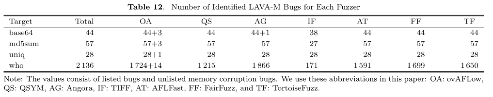
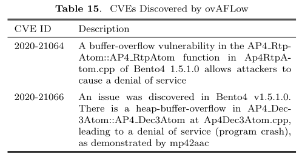

# ovAFLow: Detecting Memory Corruption Bugs with Fuzzing-Based Taint Inference

## 1. 贡献

1. 揭示了以前内存bug模糊器的污点目标的缺陷，并将其扩展到**内存操作函数参数和内存访问循环计数**

2. 意识到在以前的模糊测试工具中存在着重量级污点分析的不适当性，我们**使用`FTI`来识别污点输入字节**，这些字节可以用可接受的性能开销污染我们的目标程序

3. 我们提出了基于污点信息的定制**变异**和**种子优先级策略**，将模糊测试过程引导到更敏感的内存操作处，并比以前使用粗粒度优先级策略的工作更接近内存损坏到的发现
4. 对ovAFLow与现实世界程序和LAVA-M数据集中最先进的模糊器进行了广泛的比较，结果表明，ovAFLow以可接受的开销完成了检测到更多的内存错误
5. ovAFLow原型开源：https://github.com/zhanggenex/ovAFLow

## 2. 背景

### 2.1 模糊测试和AFL

#### 2.1.1 变异

#### 2.1.2 种子优先级

* AFL采用输入过滤来收集感兴趣的种子，这些种子至少满足下面两个条件中的一个
  * 覆盖新的边
  * 边的命中数达到新的规模

* AFL使用队列精简对种子进行排序：
  * 算法倾向于对具有较小的文件大小和较快的执行速度的输入赋以更高的优先级顺序

* 在队列精简之后，选择一个能够覆盖原始代码覆盖率的输入子集（更有效）

### 2.2 基于模糊测试的污点推断

* 一般来说，复杂的污点分析技术（如动态污点分析DTA），不适用于模糊测试的场景

* DTA和FTI的区别：

  

  * DTA受性能开销的影响较大，而对于FTI来说，其开销很低（约为10%），因此处理速度快
  * DTA需要大量的手动工作来编写污点规则，这些规则针对不同平台的不同指令而定，而FTI不需要指定诸如此类的规则
  * FTI没有过度污染的问题，如果FTI报告输入字节会污染目标，则很可能是正确的；但由于隐含的数据流或信息丢失，欠污染广泛存在于DTA中，而FTI不存在这些问题

## 3. 技术细节

### 3.1 概览

* 污点目标识别主要住别内存操作函数参数和内存访问循环计数
* 然后，主模糊测试循环开始执行PUT
* FTI引擎接受到污染目标后，会检测在程序执行期间可能污染目标程序的**输入字节**，同时，污染字节的位置和数量将分别传递给变异算子和种子优先级排序，以帮助模糊测试过程暴露更多内存损坏错误

### 3.2 污点目标识别

* 问题：TIFF手动收集了17个库函数，并将它们的参数视为污点目标。此方案的范围太窄，且缺少常用内存操作函数，如`CRYPTO_malloc()` :arrow_right: 对污点目标的不完全识别将减少对内存损坏错误的检测

* 解决方案：两种获取污点目标的方法

#### 内存操作函数识别

:one: 通过从实际应用程序中**自动检测内存操作函数**来扩展它们的数量

  1. 在静态分析的帮助下，建立规则去识别满足启发式规则的函数

  2. 使用统计方法来确认这些内存操作函数

  * 两个问题：

    1）使用什么实际程序来提取这些函数？

    * Google fuzzer测试套件：包含600多万行代码和21个不同类型的程序

    2）使用什么启发式方法来过滤这些函数？

    * 两种启发式方法来过滤函数：一个是**该函数是否正在执行内存操作**；另一个是参数是否**包含**与`memcpy()`中的size参数类似的**整数**

  * 算法描述：

    

    * 输入：数据集`DS`

    * 输出：识别函数的参数

    * 细节：

      * 首先，Line 2-4对于数据集中的每个函数，声明一个频率变量f，其初始值为0；
      * 接着，在Line 5-11，我们检查函数F中的每一个**调用点**。我们检查F：① 是否正在访问内存；② F的参数是否包含`size`参数【这里的见解是：函数参数中包含`size`参数大概率在函数中调用了与内存相关的函数】。如果这两个条件都满足，则 fF = fF + 1，这意味着F的这个调用点被标记为一个内存操作函数；
      * 最后，在检查数据集中的所有源代码之后，我们通过一个**阈值**来明确F是否是内存操作函数（Line 12-15）。

      :thinking: ❶ 这里阈值的作用是什么？

      * 避免一定程度的误判：

        见解1：访问内存不一定是内存敏感点，读内存不存在安全缺陷，但写内存则会有触发安全缺陷的可能；

        见解2：`size`参数未必是用来分配内存空间

      :thinking: ❷ 如何**确定阈值**？

      * 在得到所有函数的频率后，我们可以得到频率的统计信息
      * 阈值的确定基于统计信息：例如，可以计算所有频数的平均数，并将阈值设置为平均数

#### 内存访问循环计数识别

:two: 污点目标识别的第二部分是内存访问循环计数识别

* 见解：

  * 具有内存访问的循环时程序易受攻击的部分，很容易导致内存损坏

  * 直觉：超越传统方法的函数参数范围，将污点目标**扩展到控制循环迭代的变量**，即循环计数

* 做法：

  * 构建PUT的控制流图CFG并通过**标准后边识别循环**

  * 过滤掉没有内存访问或循环计数的循环

* 算法描述：

### 3.3 基于模糊测试的污点推断

* 算法描述：

  

  * 输入：包含内存操作函数的参数和内存访问循环计数

  * 输出：污染的输入字节

  * 细节：

    * 在变异bytei之前，我们计算函数参数和循环计数的检验和；

    * 然后，bytei字节变异后，执行PUT来重新计算新的检验和；
    * 如果这两个检验和不相等，则表明意味着污染目标的值发生了改变，将bytei添加到污染输入字节集合中

* FTI流程举例：

  

### 3.4 变异和种子优先级排序

#### 3.4.1 变异

* 解决两个问题
  * 在哪里进行内存bug引导变异？
  * 要替换哪些值？

* FTI能污染目标的输入字节，并将这些输入字节传递给变异引擎；在接受污染输入字节的位置后，变异引擎可以将这些字节变异为极值【**对于内存操作函数参数，这些值将导致对非法内存的操作，从而导致内存损坏**】
* 对于内存访问循环计数，通过增加访问内存的迭代次数，触发敏感的内存操作

---

* 极值不是随机选择，其值在通过手工分析许多现实世界中内存损坏错误之后总结得到，见下表：

  

* 用上述这些值替换污点输入字节，可能会导致内存损坏

#### 3.4.2 种子优先级排序

* 提出一种更细粒度的种子优先级排序策略，旨在对具有更多污染输入字节的种子进行优先级排序

* 种子优先级策略如下式所示：

$$
Prioritize(seed_{i})=
\begin{cases}
1, & if\ taint_{i} > taint_{j}\\ & or\ afl\_prio_{i}>afl\_prio_{j},\\
0, & otherwise.
\end{cases}
$$

其中，tainti和afl\_prioi分别表示ovAFLow和AFL的策略，seedi表示当前种子，Prioritize() 决定种子是否被优先级排序

如上等式所示，具有更多污染字节或覆盖更多程序路径的种子可以优先排序；否则，它将不会被优先考虑。

* 算法描述

  

  * 输入：已经是被污染字节和种子
  * 输出：变异的种子
  * 细节：
    * Line 1中，我们通过种子优先级排序从所有种子中选择最受欢迎的种子；
    * Line 2-4显示了变异过程，我们将种子中的污染输入字节变异为极值，这个变异的种子将在下一轮模糊测试的PUT中被执行

## 4. 实现细节

### 4.1 内存操作函数识别

* 编写LLVM passes来执行静态分析以实现对内存操作函数的识别
  * 通过检查函数及其参数，我们可以确定此函数是否在内存上运行以及是否存在size参数
  * 使用LLVM的`mayReadFromMemory()`和`mayWriteToMemory()`这两个API来确定此函数是否正在访问内存
  * 使用LLVM中的`getType()`来获取参数类型

### 4.2 污点目标插桩

* 对afl-llvm-pass.so.cc进行修改，对PUT进行插桩并允许在每次目标程序满足条件时将值记录到一个新的bitmap中
  * 使用共享内存数据结构（如bitmap）来保存污点目标的值
  * 在插桩中，我们首先声明了一个指针变量`TaintPtr`用于指向bitmap区域；接着，我们在源代码中定位污点目标，即函数参数和循环计数。污点目标的值将被插桩并存储在bitmap中。
  * 每次执行PUT时，可以通过位图的检验和来监视污点目标的值

### 4.3 FTI

* 将FTI引擎集成到AFL的"bitflip-1"阶段，并监控污点目标的变化
* 判断变异前后记录污点目标的bitmap的检验和是否相等，如果不相等，则表明变异的字节可能会污染目标

### 4.4 变异为极值

* 修改AFL中"interest-32"阶段用以将[表3](#table3)中的极值插入输入中
* FTI引擎会告知污点字节在输入中的位置，相应位置将替换为极值以触发内存损坏bug

### 4.5 种子优先级排序

* AFL中维护了一个`top_rated`数据结构以获得最有利的种子
* 除了文件大小和执行速度之外，我们还使用**输入中的污染字节数**作为一个因素来计算`top_rated`分数以确定种子的优先级

## 5. 评估

* 回答五个问题：

  | ID   | RQ                                                           |
  | ---- | ------------------------------------------------------------ |
  | 1    | ovAFLow相较于最先进的模糊器，是否能够找到更多的独特crashes？ |
  | 2    | ovAFLow能够识别更多内存损坏bugs吗？                          |
  | 3    | ovAFLow能否以可接受的性能开销完成漏洞检测任务？              |
  | 4    | ovAFLow中的变异和种子优先策略是否有效？                      |

### 5.1 设置

### 5.2 真实环境程序

* 评估的Fuzzer有：

| Fuzzer       | 简写 |
| ------------ | ---- |
| ovAFLow      | OA   |
| AFL          | AF   |
| AFLFast      | AT   |
| FairFuzz     | FF   |
| TortoiseFuzz | TF   |
| QSYM         | QS   |
| Angora       | AG   |

* 使用AFL提供的testcase目录中的种子作为初始语料库
* 回答四个问题的指标如下表：

| RQ   | 指标                                 |
| ---- | ------------------------------------ |
| RQ1  | Unique crashes数量                   |
| RQ2  | crashes中内存损坏错误的数量          |
| RQ3  | 执行速度                             |
| RQ4  | 24h*10，MannWhitney（M-W）U检验的p值 |

#### 5.2.1 Unique Crashes

:one:

:two:

* 在95%以上的比较评估中，ovAFLow可以引发更多unique crashes，且存在显著差异

---

* ovAFLow在所有评估中都优于AFL、AFLFast和TortoiseFuzz，表明ovAFLow具有更好的漏洞检测能力
* 有四个程序中表现不如其他模糊器，原因可能是FairFuzz、QSYM和Angora可以覆盖罕见分支

#### 5.2.2 内存损坏bugs

* 在ASAN的帮助下，通过手动分析确定crash是否是内存损坏bug

* 在53项比较中，ovAFLow在42个上由于其他工具，且存在显著差异
* ovAFLow能够检测其他fuzzers不能检测到的内存损坏漏洞（如tiff2pdf）

#### 5.2.3 执行速度

* 平均开销为10.3%

#### 5.2.4 由变异和种子优先级策略触发的crashes

---

#### 5.2.5 路径覆盖率

* 虽然我们的目标不是提升代码覆盖率，但我们的变异和种子优先级策略可能有助于在模糊测试过程中覆盖更多路径

### 5.3 LAVA-M数据集

#### 5.3.1 已识别的bugs

### 5.4 其他评估结果

#### 5.4.1 新bugs

---

发现新bug的能力：

#### 5.4.2 内存操作函数

### 5.5 讨论

* [算法1](#alg1)中使用离线统计信息（静态分析）来识别内存操作函数，然而，在线算法也可以有效识别函数，可以考虑离线和在线统计数据之间的权衡
* 但在线算法需要复杂的程序分析，会减慢模糊测试的速度，因此使用离线统计数据是简单、直接并且是有效的

## 我的看法

亮点

* ovAFLow本质上还是一个内存敏感导向的模糊器，首先通过静态分析识别污点目标（内存操作函数和**:star:内存访问循环计数**），然后通过**:star:FTI** [轻量级污点分析技术] 来识别污点字节，然后将这些字节替换为一些**:star:极值**（极端值、临界值）以增加触发内存损坏bug的可能性；在AFL原生的种子优先级指标中加入污染字节数，使整个模糊测试朝着内存敏感函数的地方引导

1. 引入内存访问循环计数作为识别污点目标的依据
2. 使用**轻量级**的基于模糊测试的污点推断技术来识别污染字节，相较于动态污点分析（DTA）来说，其对模糊测试产生的负面影响较小
3. 使用临界值（极值）替换污染字节
4. 改进种子优先级（种子筛选）策略
5. 实验部分较为丰富

不足

1. 仅考虑到由`size`参数所引起的内存损坏漏洞，通常是溢出型的漏洞，无法发现复杂的内存漏洞（如UAF）；
2. 并没有通过实验证明引入**内存访问循环计数**作为污点目标的有效性