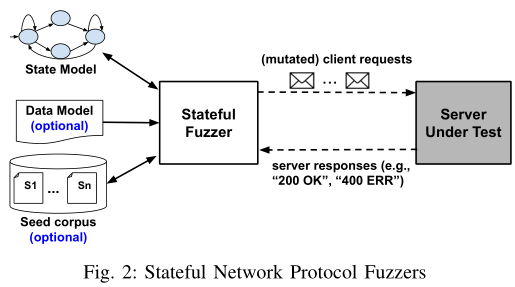
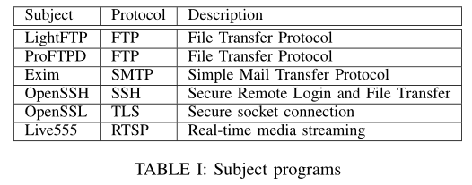
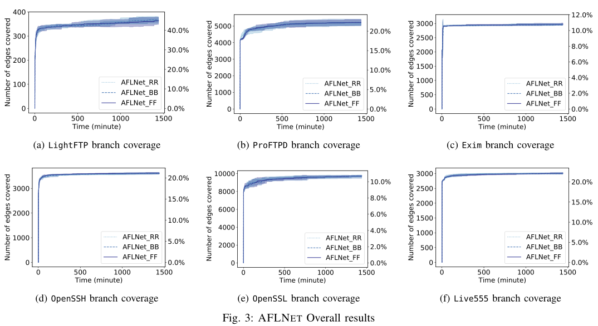
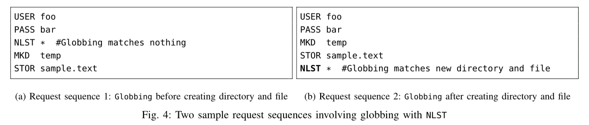
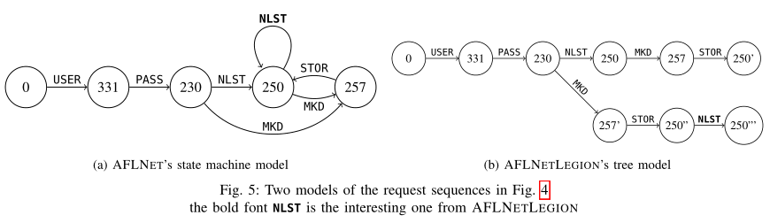
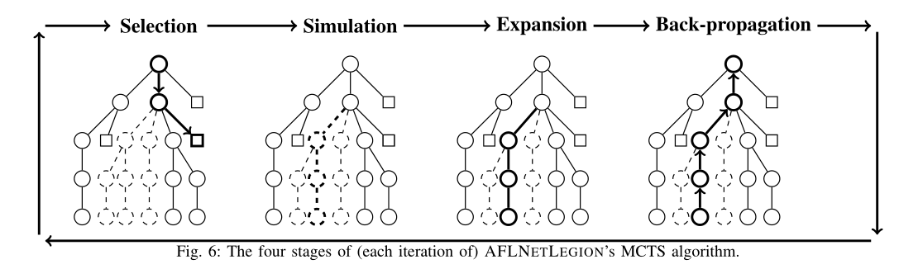
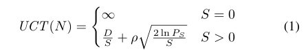
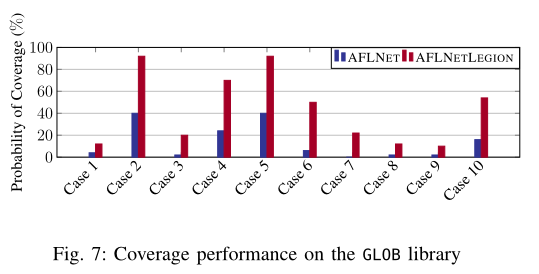
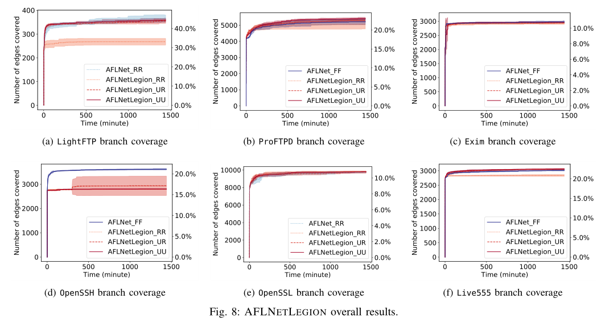

# State Selection Algorithms and Their Impact on The Performance of Stateful Network Protocol Fuzzing

## 摘要

* 在同一个模糊测试平台上（AFLNet）评估了一组广泛的状态选择算法
* 算法集包括AFLNet支持的现有算法和我们新的、原则性的算法AFLNetLegion
* 在ProFuzzBench基准上测试，实验结果表明
  * AFLNet现有的状态选择算法实现了非常相似的代码覆盖率
  * AFLNetLegion明显优于这些算法
  * 总体改进似乎微不足道

## 贡献

* 据我们所知，我们进行了第一项研究，以评估用于有状态网络协议模糊测试的一组广泛的状态选择算法。通过分析结果，我们发现了一些问题，并分享了一些见解，这些见解可能为这一主题的未来研究提供灵感。
* 我们将LEGION算法扩展到协议状态选择，并将其用于支持未来的研究。 

## 背景和相关工作

### A. 有状态的网络协议模糊测试

### B.状态建模算法

* 现有技术倾向于使用状态机对状态空间进行建模
* 状态机由有限数量的状态和状态之间的转移而组成的图
* 许多有状态模糊测试技术依赖于手动编写模型，这需要网络协议规范相关知识

---

* 状态模型可以通过在线或离线自动构建
  * 离线学习根据一组足够的网络轨迹推断出一个状态模型，准确性很大程度上依赖于该集合（PRISMA/PULSAR）
  * 在线学习在运行时学习和完善服务器状态模型

### C.状态选择算法

* Peach、BooFuzz和Snooze将状态选择算法留给开发者去实现
* PRISMA将每个状态对应于一个模板，并根据马尔科夫模型的转移概率随机选择一个模板
* PULSAT在一种状态下有多个模板，并且倾向于具有更多可模糊测试字段的模板
* MACE使用一个优先级队列，以偏向于过去访问过大量未开发的基本块的执行所遍历的状态。

### D.AFLNet：有状态的灰盒模糊测试

### E. 蒙特卡洛树搜索和Legion

* Monte Carlo tree search (MCTS)算法已经证明了其在探索大型搜索空间方面的效率
* 四个步骤迭代细化搜索空间的树模型：
  * 选择
  * 扩展
  * 模拟
  * 反向传播

---

* LEGION提出了一种基于蒙特卡洛树搜索的算法，用于覆盖率引导的软件测试
* LEGION将程序的符号树视为搜索空间，通过四个步骤对其进行探索：
  * 选择步骤沿树向下，直到选择一个模拟子节点。将模拟子节点添加到原始MCTS搜索树的每个节点，以允许从父节点的程序状态进行模拟，即使它们是中间节点。
  * 模拟是LEGION的第二步。它生成输入，通过求解模拟子节点的父节点的路径约束来保留选定的路径。为了降低约束求解计算量，设计了从中间节点进行模拟的方法。然后，LEGION将使用生成的输入执行被测程序。与原始的MCTS不同，LEGION记录整个执行路径，以确定下一步当前选择的结果（奖励）。
  * 第三步是扩展，检查当前树中是否存在新的执行路径，并将整个路径添加到树中。如果路径是新的，则会记录对当前选择的奖励。每次迭代都以传播结束。它将选择路径中所有节点的选择计数增加1，并将奖励添加到执行路径中所有节点的发现计数中。

* LEGION的设计也有利于轻量级有状态协议模糊测试技术，如AFLNet。

## 初步研究

评估AFLNet中现有的三种状态选择算法：RANDOM、ROUND-ROBIN和FAVOR

### A. 实验设置

* 基准程序：来自ProFuzzBench的六个程序

  

* 种子，超时和重复

  * ProFuzzBench提供的种子
  * 进行了24小时的实验
  * 重复了5次实验，以减轻随机性的影响

* 表现计算

  * 代码覆盖率
  * 使用ProFuzzBench的脚本来完全自动化Docker容器中的目标服务器的执行，并生成代码覆盖率报告

* 实验平台

### B. 初步结果和分析 

* 不同的状态选择算法对覆盖性能的影响较小

  

* 一般来说，所有算法在每个基准上都表现出相似的覆盖性能（由重叠曲线表示）和稳定性（由其置信区间的相似宽度表示）

* 所有算法在每一个目标程序上采用非常相似的覆盖轨迹：一开始，所有算法都可以快速稳定的覆盖相似数量的分支和线条，置信区间非常紧；然后，不同算法之间和同一算法的试验之间的性能开始出现差异；

* 曲线之间的差异几乎总是在置信区间内，这表明算法之间的差异与同一算法的试验之间的差异相比是微不足道的

FAVOUR和其他两个不同的替代方案之间的覆盖性能难以区分，这引起了以下问题提：

*这种意外的结果是由于FAVOUR某些缺点造成的吗？*

## 基于MCTS的状态选择算法

本节提出了一种名为AFLNetLegion的状态选择算法，以解决AFLNET中可能限制其性能的两个主要弱点。

AFLNet状态选择算法存在以下两个主要缺陷：

* 它的粗粒度状态机模型仅通过单个响应码识别每个状态，而不区分它们的前缀，从而导致不可靠的状态评估和选择
* 其直观的状态评估公式缺乏平衡探索-利用折中的方法，这可能导致对服务器状态产生不准确的估计

### A. Motivating Example

举一个例子：

上图4使用Name List FTP命令去阐述在有状态协议模糊测试中选择一个有趣状态的重要性。该命令将指示服务器列出与其参数匹配的文件名，这里使用*作为参数来测试GLOB库。该库负责用通配符或其他模式匹配文件和目录。

上图左序列1带有NLST请求，但不存在任何文件或目录；右序列2在发送相同的NLST命令之前创建一个目录和一个文件，因此对于fuzz来说，序列2中的NLST命令比序列1更有趣，因为当服务器尝试匹配参数时，它的变体更有可能覆盖GLOB库的更多代码。**服务器的严格模型应该区分这两个序列，以便选择算法以后可以了解到序列2的状态在模糊测试中比序列1更有效。**

上图5（a）展示了服务器在接收到图4中两个请求序列并返回响应码，由AFLNet生成的状态机。由图可以看出AFLNet状态机无法区分这两个不同的序列，并认为这两个请求序列产生相同的状态（250），但只有序列2发送的NLST才是感兴趣的。相似的，随着后来越来越多请求的生成，它可能进一步误导选择算法并考虑更多噪声请求序列作为感兴趣NLST的前缀，如`USER-->PASS-->NLST `。因此，噪声请求序列1将会降低状态250的估计值，从而降低了从序列2中选择感兴趣状态的可能性。

### B. Algorithm

* AFLNetLegion建议使用图5（b）所示的更细粒度的树模型来辅助状态选择
* 每个节点都用一个从根到自身的唯一响应代码序列来标识
* 每一个节点还存储了与AFLNet相同的统计信息和请求序列
* 具体方法是将AFLNet模型中的状态展开为树状分支，例如，感兴趣的NLST是从"节点250"发送的，它与响应代码相同但前缀不同（例如250/250‘/250’‘）的其他节点明显不同 ，因此将对它们进行独立评估和选择
* 无噪声请求序列将破坏每个节点的实际统计信息，或使其状态选择复杂化

### C. Tree Nodes

* 树节点被设计允许AFLnetLegion根据基于MCTS算法首选的过去的服务器状态开始进行模糊测试

* 树根节点表示服务器的初始状态（“0”）

* 每个子节点对应于在其父节点之后接受的响应码

* 每个树节点存储有趣的请求序列，这些序列可以重现相应的服务器状态

* 如果一个请求发现了该节点的一个子节点，则该请求被认为是有趣的（在MCTS范式下，考虑从同一服务器状态产生相同响应码的所有请求，作为一个相同的动作，并且只保存其中的一个（第一个）以避免重复）

* 每个节点还存储其选择计数和发现计数，这两个计数分别记录其被选择的次数和找到的新子节点的数量（便于状态选择）

* 每个请求序列的两个相同统计信息也会被保存

* AFLNetLegion节点继承自Legion，有三种类型用于不同需求：

  * 空心节点来表示可以启动模糊测试的服务器状态

  * 一个模拟节点连接每个空心节点，表示随后启动模糊测试的选项

    图6将空心节点和模拟节点分别绘制为圆形和方形

    > 在某些情况下，一个请求可以触发一行中的多个响应码，在这种情况下，我们只能从其中最后一个代码表示的服务器状态这里启动模糊测试，最后一个代码由一个空心节点表示，而其他代码由冗余节点表示

  * Legion中的实体节点（solid node）不适用于AFLNetLegion，因为符号执行在本文的范围内不可用。因此，**无法知道是否找到了一个节点的所有子节点，需要一个有原则性选择算法，限制由于未选择最佳服务器状态而导致的预期覆盖率损失。**

### D. Tree Construction

* 图6演示了AFLNetLegion探如何在其MCTS变异中探索树状结构的搜索空间：
  * 搜索算法的每一次迭代都按照与Legion相同的四个步骤进行，并根据有状态协议模糊测试定制细微的差异
  * 图6中，粗体线条突出了每个阶段的操作。实线和节点表示响应序列和服务器状态，它们已被覆盖并集成到树中。虚线和节点绘制未发现的响应序列和服务器状态

* 搜索步骤按照以下顺序执行：
  * **选择：**由两个子步骤组成：树节点选择和种子请求序列选择。通过递归应用选择策略，树节点选择从根节点向下，直到到达模拟节点。然后对存储在树节点中的所有请求序列应用选择策略，以找到用于模糊测试的种子（见E）。
  * **模拟：**它重放并恢复与父空心节点对应的服务器状态（如图5b的节点2500’‘），然后对接下来的请求进行模糊测试（如NLST *）
  * **扩展：**它将所有新发现的响应序列及其请求序列记录到树中，AFLNetLegion继承自LEGION，它将每个观察到的响应代码序列映射到树节点的路径。当找到新的响应代码子序列时，它会将每个新的响应码作为新的子节点添加到前一个节点上，并将相应的请求序列保存到第一个新的节点和每个新子节点的父节点。如上所述，当一个请求触发一行中的多个响应代码时，只有该子序列的最后一个响应码将会被创建为空心节点，而同一子序列的所有祖先将被添加为冗余节点。同样的，模拟节点将连接到每个空心节点上。
  * **反向传播：**它会更新树中记录的统计数据，以帮助未来的决策。对于在模拟阶段执行的每个变异操作，AFLNetLegion会选择路径中每个节点的过去选择计数+1，以阻止过于频繁地选择相同的节点。对于观察到的每个新响应码序列，它会增加第一个新节点和所有后续新节点的父节点的过去发现计数，以激励将来选择它们。

### E. Selection Policy

* 解决AFLNet的第二个缺点，AFLNetLegion的选择策略负责根据MCTS选择阶段的统计信息选择树节点和种子请求序列
* 依赖于两个统计数据
  * 过去发现计数（past discovery count）
    * 表示在目标程序状态下发现的响应码序列的数量，发现越多表示产率越高
  * 过去选择计数（past selection count）
    * 表示选择目标状态进行模糊测试的次数，选择越少，表示状态的不确定性越高

* 两个统计数据共同作用，试图在利用基于过去经验的最大产率、协议中不太为人所知的（响应码序列发现）产率不太明确的部分之间找到状态探索的平衡点

* 与AFLNet不同，AFLNetLegion继承UCT函数来评估树节点和请求序列：

  

  对于节点评估，D，S和P_S分别代表节点的过去发现计数、节点的过去选择计数和父节点的过去选择计数；

  对于种子评估，D，S和P_S分别代表种子的过去发现计数、种子的过去选择计数和种子所属模拟节点的过去选择计数

  * 发现计数记录：选择该状态/种子找到新的响应序列的数目
  * 选择计数记录：选择该状态/种子进行模糊测试的次数

## 评估

讨论两个问题：

* 是否有统计数据支持"AFLNetLegion的状态选择算法可能比AFLNet更好"这一观点？
* 不同的建模和选择算法如何影响总体覆盖性能？

---

### A. 案例研究

* 通过分析GLOB库的覆盖范围，可以间接的知晓AFLNetLegion的状态选择算法能否提高覆盖性能

* 虽然库代码很容易能覆盖到，但有许多特殊情况很难完全覆盖。前者确保大多数算法可以生成一些覆盖统计数据进行比较和分析，而后者的覆盖性能则表明算法的效率。

  * 图4a中的前三行是在不测试库中许多行的情形下达到该模型的最小测试用例
  * 图4b能够通过预创建一些文件来测试GLOB扩展通配符功能

  类似的，许多其他代码块也对应于特定的情形：

| Case | Description                    |
| ---- | ------------------------------ |
| 1    | 无法分配更多内存               |
| 2    | 全局搜索一个没有路径前缀的文件 |
| 3    | 全局搜索一个包含路径前缀文件   |
| 4    | 目录名中包含有通配符           |
| 5    | 使用*和？元字符进行全局搜索    |
| 6    | 使用[]元字符进行全局搜索       |
| 7    | 转义通配符元字符               |
| 8    | 成功使用元字符来扩展一个目录   |
| 9    | 全局搜索一个包含\\\\的目录     |
| 10   | 成功找到至少一个匹配项         |

* 比较上述十个案例，对AFLNet和AFLNetLegion选择算法进行12个小时的性能比较

### B. 总的评估

虽然案例研究强调了特定有趣代码块的性能，但总体评估缩小到了全局。它研究了状态选择算法对不同协议实现的总体影响。 

### C. 实验设置

#### 特定案例研究设置

#### 算法和模型

添加了三个基于AFLNetLegion的新算法：

* AFLNetLegion_UU：选择UCT分数最高的状态和种子
* AFLNetLegion_UR：使用UCT进行状态选择，并随机选择种子
* AFLNetLegion_RR：随机选择状态和种子

代码开源：https://github.com/Alan32Liu/AFLNet_Legion/tree/SANER2022

### D. 实验结果

1）案例研究：

>AFLNetLegion减少了状态选择中的噪音（即共享相同响应代码但不满足先决条件的状态），允许更准确地测量每个状态的过去奖励，并对每个服务器状态的潜力进行可靠估计。
>
>覆盖罕见案例需要平衡选择状态和请求顺序的能力。这些状态和顺序似乎是最有回报的，而回报不太确定。这种能力允许有意地从一开始似乎没有生产力的状态中产生足够多的变异体。在不了解这一特定语法的情况下，AFLNetLegion能够在一次普通试验中不止一次地涵盖这一行。

2）总的比较：

>尽管案例研究的结果很好，但AFLNetLegion未能证明其整体性能比其衍生产品或AFLNET中性能最好的算法要好得多。
>
>AFLNetLegion在OpenSSH中表现差的原因是OpenSSH的大多数唯一响应序列都使通过不保留前缀找到的。
>
>AFLNetLegion未能像Legion一样表现出良好性能的另外一个原因是：无法使用符号执行。符号执行在优化Legion表现在修剪只有一个子节点和不希望找到更多执行路径的节点方面起到至关重要的作用。

## 讨论

1. 确定了AFLNet的两个局限性；
2. 模糊测试低吞吐量：导致AFLNetLegion在给定预算时间内不能产生足够的测试用例来探索状态空间
3. 状态感知和结构感知变异：被测服务器通常需要结构良好的输入，这意味着目前由AFLNet支持的随机变异操作生成的消息大概率会被服务器拒绝（404），因此可能不会深入探索更多的代码路径。引入**结构感知**方法可能会有所帮助，但有状态服务器会要求每个状态有多个输入模型/语法，在每个状态下，预期的输入格式可能不同。此外，消息之间可能存在依赖关系，这使得有状态服务器的输入生成更具挑战。

## 总结

在本文中，我们讨论了有状态网络协议模糊测试面临的挑战，以及状态选择算法对探索状态空间的重要性。我们还分享了我们对六种不同状态选择算法的有效性和效率的研究。在分析实验结果和模糊测试artefacts后，我们发现了潜在的问题，例如模糊测试吞吐量低和生成的输入质量低，阻止了状态选择算法充分发挥其潜力。我们未来的计划是为那些阻碍问题找到解决方案，并将我们的研究扩展到更多的算法。 

## 我的看法

亮点：

* 明确了AFLNet在状态选择方面存在的两个局限性：粗粒度状态机模型、状态评估公式

* 通过对6种不同状态选择算法有效性和效率的研究，明确状态选择算法对探索状态空间的重要性

* 讨论了AFLNet系列工具存在的问题

  * 低模糊测试吞吐量（低吞吐量）
  * 缺少状态感知和结构感知的变异（低效）

  **导致AFLNetLegion的优势不能完全体现**

* 将MCTS引入到状态选择算法中，能有效探索状态空间，但在某些案例下，其性能不如AFLNet原始的状态选择算法。

不足：

* AFLNetLegion在OpenSSH中未体现出优势，论文中认为与OpenSSH大多数唯一响应序列不保留前缀即可找到有关。
* AFLNetLegion和AFLNet在状态选择方面的差异性不大，论文将原因归结于网络协议Fuzz自身的存在局限性，有些牵强。