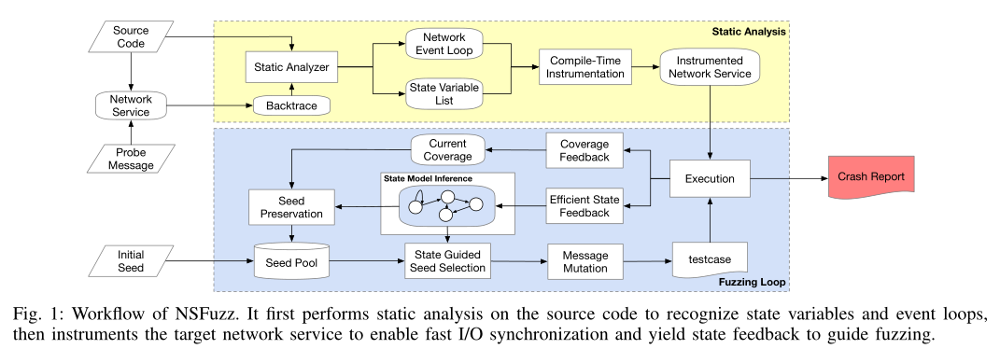

# Registered Report: NSFuzz: Towards Efficient and State-Aware Network Service Fuzzing

## 贡献

* 提出了一种**基于变量的状态表示模式**来识别网络服务状态，并推断他们的状态模型来指导模糊测试过程
* 提出了一种基于SUT的网络事件循环的高效同步机制，为网络服务fuzzer提供了更高的吞吐量
* 实现了NSFuzz原型并在几个实际网络服务商进行了简要评估。初步结果表明，NSFuzz比最先进的网络fuzzer更准确地进行状态模型推理，并获得更好的模糊测试效果。 

## 相关工作

### A. 黑盒网络协议模糊测试

### B. 灰盒网络协议模糊测试

### C. 程序状态模型推断

* AutoFuzz和PULSAR：基于流量分析进行自动状态模型推断
* Prospex：使用动态污点分析推断协议状态模型和消息格式
* PRETT：使用二进制令牌并结合网络跟踪来构建最小化状态模型
* IJON和FazzFactory：允许用户通过提供的API对测试程序中的特定变量进行注释，使用特定的反馈来指导fuzzer执行特定于域的模糊测试
* AFLNET和StateAFL在模糊测试过程中建立状态模型，并执行状态指导以改善模糊测试效果
* 使用模糊测试对TLS/DTLS协议状态模型进行推断，并手工验证其安全性，以检查服务实现中的状态模型是否存在逻辑缺陷

## 网络应用程序的研究

### A. 网络应用程序的实现

* 网络应用程序通常包含三个典型阶段：

  **1）服务初始化阶段**

  * 执行初始操作，如根据启动参数读取配置和初始化相关数据结构
  * 使用网络编程接口，进行套接字创建、网络端口绑定和套接字侦听，直到远程客户端请求套接字连接

  **2）服务处理阶段**

  * 网络服务在事件循环中工作：处理请求，在循环中给出响应
  * 只有当客户端主动退出或出现异常时，网络服务才会退出此阶段

  **3）服务清理阶段**

  * 当网络服务将**主动终止**时，此阶段负责程序清理，如资源释放，然后退出以停止提供服务

>* 由于网络服务需要为任意远程客户端提供长期服务，它们通常在后台持续运行或作为守护进程运行。因此，网络服务程序大部分时间在第二阶段运行，在网络事件循环中连续处理远程客户端发送的请求消息。
>* 开发人员在实现运行有状态协议的网络服务时，总是使用一些变量来表示服务器状态（stateAFL）。

* 清单1展示了Bftpd中的服务处理阶段代码片段，第3-6行包含一个网络事件循环，其中第3行接受请求消息，并在第5行对其进行解析。Bftpd FTP协议服务将重复这些操作，直到远程客户端用户**主动关闭**网络套接字或服务因**任何异常**而结束。同时，在Bftpd中，开发人员使用`commands`结构体来存储每种请求的类型名、处理程序的函数指针和状态需求。在`parsecmd()`函数中，Bftpd首先尝试匹配传入请求消息的类型（第13行），并执行状态检查（第16行），然后仅在通过状态检查后调用相应的处理程序（第18行），否则将根据当前服务状态向客户机响应失败消息。 

  

### B. 见解

* **同步点**：事件循环的入口
  * 以Bftpd中的代码片段为例，在Bftpd的消息处理阶段，网络事件循环（第3行）的条目可以表示Bftpd服务器已经处理了之前的FTP请求消息，并准备接收下面的FTP请求消息。因此第3行可以作为事件循环的入口
  * 同步时主动通知fuzzer即时发送请求消息，避免无用的等待时间
  * 同步还可以告诉fuzzer执行状态收集，以避免状态转移的执行后分析

* **网络服务总是使用变量来表示运行时服务状态，而响应码不能用于区分网络服务的实际状态**
  * 以Bftpd中的代码片段为例，当Bftpd收到PASS请求时，它将调用command_pass函数，将请求的密码字段作为函数参数，并根据当前服务状态执行不同的代码分支。当登录成功后，Bftp将全局`state`变量设置为`STATE_CONNECTED`。
  * 由上例子所示，全局枚举变量`state`用于表示网络服务的状态，在网络事件循环中被读取（Line 21）或更新（Line 42）
  * 与响应代码相比，使用程序变量来表示服务状态也更加准确和合理

* 建议使用网络服务中的**特定变量**来准确表示服务状态，并使用**网络事件循环作为指标来实现高效的I/O同步**。

## 方法论

### A. 总体设计

* NSFuzz主要流程如图1所示，其中有两个主要组件：
  * 静态分析
  * 模糊测试循环

### B. 静态分析

* 寻找两类信息：
  * 网络事件循环
  * 关键状态变量（用来精确表示网络应用程序的状态）

* NSFuzz通过**执行前离线静态分析**来提取状态变量，同时在编译期间将状态变量值映射到共享内存中

---

**细节**：

* :one:网络事件循环识别：
  * 主要挑战在于要将网络事件循环与程序中的其他循环区分，同时事件循环本身可能包含嵌套循环
  * 解决方法：在服务处理阶段跟踪网络I/O操作，并通过回溯区分外部循环
    * 在于输入相关的系统调用（如read、recv、recvmsg等）上设置断点
    * 接着，fuzzer建立到SUT的套接字连接，并发送探测消息
    * 当遇到断点时，SUT保存函数调用堆栈的回溯，将回溯作为静态分析器的辅助输入，以识别网络事件循环
    * 静态分析器首先将服务中心包含I/O操作的所有循环记录为候选循环，并从底部扫描回溯调用堆栈，以匹配包含I/O循环的第一个函数（外部函数），然后将其视为网络事件循环

* 状态变量提取：

  * 主要挑战：静态分析状态变量提取存在大量的误报
  * 解决方法：使用启发式规则来减少提取状态变量时的误报
    * 网络服务中与状态变量相关的操作始终在网络事件循环中执行。因此，静态分析器仅在网络事件循环中执行分析，以缩小分析范围
    * 网络服务中的状态变量总是在网络事件循环或消息处理程序中读取（用于状态检查）或写入（用于状态更新）。因此，静态分析器只提取加载和存储的变量
    * 网络服务的状态变量通常是数据结构中的全局枚举变量或整数成员变量，它们只能被分配常量来表示特定的状态。因此，静态分析器在其存储操作中只保留全局整型变量或用户定义的结构成员分配的常量值

  * 以一个相对较低的误报率从服务应用程序中提取所有状态变量，并为每个变量分配唯一的字符串ID

* 编译时插桩：

  * 前述静态分析已经获得了网络事件循环和状态变量列表

  * **同步**：NSFuzz在网络事件循环的入口插入了一个raise(`SIGSTOP`) [停止程序] 语句，由此fuzzer能够收到信号反馈，表明它准备好接受接下来的请求消息

  * **传值**：NSFuzz为每一个状态变量插入`STORE`操作符：使用正在写入的值作为键来更新SUT和fuzzer之间的状态相关的共享内存。为了区分记录代码覆盖率的共享内存，我们将记录状态信息的共享内存表示为共享状态，映射规则如下：

    

    首先，NSFuzz对每个状态变量的唯一字符串ID进行散列，并将散列值与要写入的新状态值进行异或，然后使用异或结果作为索引来更新共享状态

    此外，NSFuzz还使用相同的方法更新旧状态值对应的索引，以恢复共享状态

    :thinking:有无可能存在碰撞的概率:question: 可否添加一个简单的冲突避免策略:question: 

    * 添加额外的冲突避免策略无疑会加重插桩的开销 ---> 程序运行的开销
    * 碰撞概率较低，理论上可忽略不计..

### C. 模糊测试循环

* 引入`signal raising`反馈，用于同步插桩信号反馈以实现高I/O同步
* 状态变量`STORE`操作的插桩使NSFuzz在适当的时间检查`shared_state`，收集状态转移序列以帮助推断状态模型

---

细节：

1. 快速I/O同步：

   * AFLNET和stateAFL的FORKSERVER机制
   * NSFuzz实现了NET_FORKSERVER机制，配合SUT的信号反馈，以实现快速I/O同步。
     * NSFuzz每次发送请求时，都会通过管道等待NET_FORKSERVER的反馈
     * NET_FORKSERVER等待SUT发起的信号来确定是否已经完成一轮I/O交互或者是引起崩溃【正常情况应是`SIGSTOP`信号，否则应为crash】，然后将信息传递给fuzzer

   * 下图展示了NSFuzz框架中fuzzer、NET_FORKSERVER和SUT之间的I/O同步

     

2. 状态感知模糊测试：

   * 当fuzzer通过通信管道从NET_FORKSERVER接受消息处理结果时，它会计算`shared_state`缓冲区的哈希值，该哈希值可以表示SUT的当前状态：
     * 如果消息导致状态转换，某些状态变量的值必定会发生改变，然后更新`shared_state`缓冲区
     * 处理该消息之后，fuzzer将会获得`shared_state`缓冲区的哈希值，此值与该消息发送之前的哈希值不同（即SUT状态改变时，缓冲区的哈希值就会改变）
     * fuzzer可以使用缓冲区的哈希值来表示程序状态，收集状态转移序列

   * 与stateAFL相比，NSFuzz使用共享状态哈希更充分地表示状态
   * NSFuzz还将保留触发新服务状态或状态转移的测试用例，作为后续模糊测试的一个有趣种子，然后NSFuzz将执行类似于AFLNET的状态引导种子选择和消息变异。

## 评估

* NSFuzz的实现包含约4.5k行C/C++代码和大约100行Python脚本
* 基于LLVM框架实现了静态分析器和编译时插桩，基于AFLNET实现了模糊测试引擎。

### 两个问题

| ID   | Question                       |
| ---- | ------------------------------ |
| RQ1  | NSFuzz推断状态模的准确性       |
| RQ2  | NSFuzz状态感知模糊测试的有效性 |

### A. 实验设置

* 在网络协议模糊基准ProFuzzBench中选择了一些模糊目标来评估NSFuzz

  

* 与`AFLNET`和`stateAFL`进行了比较，同时也与`AFLNWE`进行比较

### B. 状态模块推断评估（RQ1）

1. 静态分析：

   * NSFuzz首先执行静态分析，以识别网络事件循环，并使用该循环作为起点来提取状态变量

   * 下表显示了NSFuzz对7种目标服务的静态分析结果

     

   * 上述结果表明：
     * NSFuzz可以成功从不同的目标服务中定位网络事件循环
     * NSFuzz可以成功通过静态分析提取状态变量
     * 提取状态变量的数量和分析时间通常与目标服务的规模（LoC）呈正相关

2. 推断状态模块：

   * NSFuzz也会在模糊测试过程中为SUT建立一个状态模型

   * 下表展示建立的状态模型顶点和边的平均个数（与AFLNET和stateAFL比较）

     

   * 以LightFTP为例：

     * NSFuzz推断出一个包含5个顶点和12条边的状态模型，如下图所示。

       

     * 静态分析提取了一个名为Access的状态变量，用于表示客户端会话的访问权限

     * 手动分析源代码后，我们发现Access有4个常量值来表示客户端用户的不同权限（`NOT LOGGED IN`, `READONL Y` , `CREA TENEW`, `FULL`），LightFTP将根据用户权限执行不同的消息处理过程

     * NSFuzz推断出的状态模型包含所有这4个状态以及一个额外的初始哑状态，这表明NSFuzz可以在LightFTP的模糊过程中准确地推断出所有状态，从而在状态变量和模型之间建立直接映射

     * AFLNET和stateAFL创建的模型无法区分客户端用户的不同权限，这可能会导致不完整的状态指导

   * :star: 静态分析器不仅会提取用于表示服务内部状态的变量，还会将程序中的一些变量（如标志或模式）标识为输出，这是对服务实现状态的细化 ---> **表明NSFuzz能够识别网络服务中的细粒度状态**

### C. 模糊测试效率评估（RQ2）

#### 模糊测试吞吐量

* 模糊测试吞吐量展示了每秒执行的测试用例数

  

* 实验结果解读：
  * stateAFL由于引入了额外的开销导致其模糊测试吞吐量较低
  * AFLNWE是一个支持I/O的AFL版本，**无状态感知**，NSFuzz吞吐量仍高于AFLNWE，表明这种同步机制显著提高了整体模糊测试效率

#### 代码覆盖率

* 结果如[表5](#table5)所示，结果解读：
  * NSFuzz可以在几乎所有目标服务上实现更高的代码分支覆盖率
  * AFLNWE缺乏状态感知，因此无法实现很好的代码覆盖
  * stateAFL覆盖的平均代码分支数与AFLNET没有显著差异（低吞吐量导致）

* 几个fuzzers随着模糊测试时间推移，探索的代码分支数变化曲线如下图所示：

  

  * 解读：NSFuzz不仅可以覆盖大多数目标服务上更多的代码分支，而且可以比任何其他Fuzzer更快地探索这些分支
  * :thinking: 原因？
    * :star: 高吞吐量 --> 更多的测试 --> 更多覆盖范围（[图4](#coverage_img)仅测试了10个小时，由于AFLNET和stateAFL低吞吐量，很可能很多测试用例都不能及时测试）
    * 更精确的状态信息 --> 更细粒度的感兴趣种子 --> 探索更深层次的代码

#### Crash的触发

* 实验结果：

  

* 结果解读：
  * 与其他Fuzzer相比，NSFuzz可以在相同的目标上触发碰撞，并且触发第一次碰撞的平均时间明显低于其他竞争对手
  * 这在一定程度上表明，NSFuzz在模糊化网络服务时能更快地触发目标程序中的潜在漏洞

## 未来工作

* 静态分析的局限性：
  * **仅支持C语言的目标程序**，不支持C++目标。因为C++中虚函数生成的间接调用，使得很难构建准确的调用图，从而影响静态分析的结果
  * **一些网络应用程序使用事件驱动库（例libevent）来构建其服务程序**，由此其网络事件循环是在库中实现的，而不是在服务代码中实现，静态分析器寻找实现同步进行raise函数插桩的点就很困难

* 计划在NSFuzz引入注释机制，对静态分析器进行补充。将设计几个API来帮助用户在SUT中手动注释状态变量和同步点（**需要有专家背景知识的人工参与**），这有望提高NSFuzz的适用性和可伸缩性
* 缺少ablation study，即没有评估状态变量对整体模糊测试效率的具体影响

## 我的看法

亮点：

1. 基于stateAFL的思想，注意到网络应用程序的本质使用一个**网络事件循环**来监听收到的消息，然后再对消息进行处理。找到网络事件循环的入口点，然后再入口点处告知fuzzer应用程序已经结束对上一条消息的处理，由此减少fuzzer发送下一条消息前的等待时间，从而提高模糊测试吞吐量
2. 基于状态变量的细粒度状态表示。在stateAFL中，dump长周期的数据，但这会引入额外的插桩开销和计算开销，NSFuzz使用**轻量级的状态变量**来表示更细粒度的状态，通过值的改变来建立索引，其插桩开销小和计算开销小，但这依赖于静态分析状态变量的精确识别。

不足[参考[未来工作](#future_work)]：

1. [静态分析的局限性](#weakness1)
2. 静态分析依赖于源代码开源
3. 缺少ablation study

