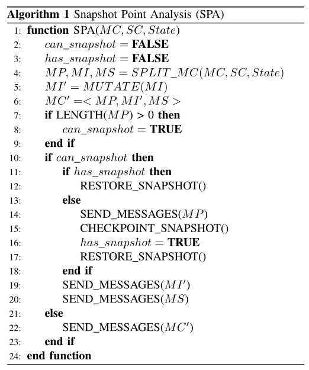

# SNPSFuzzer: A Fast Greybox Fuzzer for Stateful Network Protocols using Snapshots

## 挑战

SCGF面临两个挑战：

* 低速

  * 与传统命令行输入和库API程序不同，网络协议程序使用套接字通信来完成消息交互，套接字的通信速度比程序慢很多

  * 现有的SCGF fuzzer首先发送一系列消息前缀，然后发送变异消息来对网络协议程序的目标状态进行探索

  * 具体来说：

    

    如上图所示，如果图1所示的状态S3需要通过SCGF fuzzer进行模糊测试，那么它先会发送前缀消息M1和M2，然后在到达状态S3后发送变异消息

  * 有时，为了达到某些深层协议状态，必须发送大量前缀消息；更重要的是，为了对某一状态进行模糊测试，需要发送若干前缀消息以到达该状态

  * 发送前缀消息的过程将导致很高的时间消耗，并最终导致网络协议模糊测试速度变低

* 很难覆盖深层次状态

  * SCGF fuzzers首先选择目标状态作为模糊测试对象，然后选择能够到达该目标状态的消息序列
  * 不同的消息序列可以以不同的方式到达相同的状态，以图1为例，有很多路径能够到达状态S3，例如 [S0->S1->S3]，[S0->S2->S3]，[S0->S1->S3->S0->S2->S3]
  * 每一个额外消息将增加时间开销（消息的发送和接受）
  * 大多数SCGF fuzzers更喜欢能够更快到达目标状态的消息序列（即前缀消息更短），以减少消息发送和接受的时间。**然而，这种选择使得很难覆盖深层状态，最终无法找到深层路径和bug**。

## 贡献

1. 我们总结了现有SCGF fuzzers的关键思想和过程，并研究了现有SCGF fuzzers模糊速度慢的原因。在此基础上，我们提出了使用快照技术来加速网络协议模糊测试。
2. 我们提出了快照点分析（SPA）算法来帮助SCGF fuzzers判断何时拍摄和恢复快照，并提出了消息链分析（MCA）算法来覆盖更多更深层次的协议状态。
3. 我们实现了一个SNPSFuzzer原型，并在两个广泛使用的开源网络协议程序上对其进行了评估。结果表明，与目前最先进的灰盒网络协议fuzzer AFLNET相比，SNPSFuzzer可以将网络协议的模糊测试速度提高112.0%-168.9%，路径覆盖率提高21.4%-27.5%。它还发现了一个真实网络程序中的未知漏洞。 

## 背景

### A. 基于覆盖的灰盒模糊测试

### B. 有状态基于覆盖的灰盒模糊测试

* 总体思想：首先依次发送前缀消息以达到特定状态，然后在此状态下发送变异消息。在此过程中，会出现消息链和状态链：

  * **消息链**指在一次模糊测试过程中连续发送的消息组成的链，每次迭代都会生成一个新的消息链

  * **状态链**指由网络协议程序生成的消息中的状态依次组成的链，在每次迭代的开始，网络协议程序处于初始状态，因而状态链的第一个状态时初始状态S0

    图2展示了消息链和状态链：

    

* 网络协议状态转换过程可用协议状态机（PSM）模型表示，如图2（a）所示。当网络协议程序开始时，它处于初始状态S0。如果收到消息M1，则程序处于状态S1；如果收到消息M4，则程序处于状态S2；否则，它仍然处于S0。如图2（b）所示，假设在模糊测试迭代过程中，SCGF依次发送消息M1、M2、...、M6，即消息链**MC=[M1，M2，M3，M4，M5，M6]**。在迭代开始时，网络协议程序处于初始状态S0。在状态S0时，接收到消息M1，并根据协议状态机，程序将处于状态S1。我们可以用同样的方式推断剩下的部分。最后，网络协议程序的状态链（对应于MC）**SC=[S0，S1，S3，S0，S2，S3，S3]**

* 总的来说，SCGF的工作流可以抽象为两个阶段：初始阶段 和 模糊测试循环阶段
  

  * **初始阶段（:x:）**

    用户为网络协议程序提供的一个或多个初始种子将被添加到消息链队列中。与传统CGF的种子队列类似，消息链队列维护有趣的消息链信息。如果一个新的消息链可以找到新的代码覆盖范围或新的状态，SCGF将其视为有趣的消息链。初始阶段只执行一次，然后进入模糊测试循环阶段。

  * **模糊测试循环阶段**

    1. 维护一个状态链队列，该队列可以在模糊测试循环更新
    2. **状态选择器**：从状态链队列中选择最感兴趣的网络协议程序状态作为目标状态以进行模糊测试
    3. **消息链选择器**：从消息链队列中选择能够到达该目标状态的消息链
    4. **消息链变异器**：对消息链中特定的消息进行变异以生成新的变异消息
    5. **网络消息处理器**：该部件通过socker套接字通信，将变异的消息发送给网络协议程序并接受相应的消息，实现网络协议程序的状态转移
    6. 根据返回的状态、代码覆盖率等信息，维护感兴趣的消息链和状态链
    7. 回到第[2](#step2)步

* SCGF使用相应的数据结构保存消息链和状态链信息以对网络协议程序进行模糊测试。为了达到网络协议程序的目标状态，SCGF根据数据结构依次发送相应的消息。以图4为例，假设状态S2是状态选择器选择的目标状态，为了从初始状态S0开始到达S2，SCGF根据MC和SC发送前缀消息M1,...,M4，接着在状态S2的基础上，发送变异消息。无论何时选择模糊测试目标S2，都需要发送前缀消息。

  

## 动机

### A. SCGF的速度

* CGF使用轻量级的插桩来获得代码覆盖率，无需对程序进行分析
* CGF虽然种子质量没有符号执行好，但速度快

---

* 为了揭示SCGF的速度，在AFLNET上进行一个实验：

  * 使用**afl-clang-fast**插桩模式

  * 根据下式计算执行速度：
    $$
    S=N/T
    $$
    其中，N表示测试用例的执行总数，T表示fuzzer的运行时间，S表示执行速度；

  * 为了更好展示结果，使用每个测试用例的执行时间度量来表示SCGF的速度，根据下式计算执行时间度量E：
    $$
    E=1/S
    $$
    其中，E与S成反比。S越大，E越小。E表示每个测试用例的执行时间。

* 实验结果

  

  * 每个测试用例执行时间都在毫秒级别，从几十毫秒到几百毫秒不等
  * AFLNET平均速度比CGF fuzzer要慢两个数量级
  * 发送消息所花费的时间过多

### B. 速度慢和动机描述的进一步分析

* 消息发送时间实际上指的是消息链中发送每条消息所花费的总时间，包括发送消息和接受响应消息的时间。
* **1.每个模糊测试迭代的消息发送时间理论上与发送的消息数成正相关**，发送的消息越多，执行套接字通信就越多。因此，发送过多的消息会导致网络协议模糊测试速度严重下降。
* **2.网络协议程序时有状态的**，为了对目标状态进行模糊测试，必须提前发送前缀消息。我们可以将每次迭代发送的消息分为两部分：前缀消息和非前缀消息，如图6所示。

​		假设在模糊测试迭代期间，SCGF fuzzer发送n条消息，前i（i<n）条消息为前缀消息，非前缀消息数为n-i。因此，前缀消息发送的越多，非前缀消息就发送的越少。

### 两个动机

* **动机1**

  SCGF首先发送相应的前缀消息以到达目标状态，然后在此状态下发送变异消息以对模糊测试协议程序的目标状态进行模糊测试。**:star: 如果目标状态下的网络协议程序可以保存**，则在模糊测试目标状态的过程中不需要发送前缀消息。这样，可以节省发送前缀消息的时间开销；此外，如果前缀消息的长度较长，我们可以节省更多的消息发送时间开销。

  * 进一步分析AFLNET对不同网络协议程序进行模糊测试时的*前缀消息平均数的累积分布函数（CDF）*，结果如下图所示：

    

  * 不同网络协议程序的前缀消息平均数是不同的

* **动机2**

  不同数量的前缀消息会影响网络协议模糊测试的效率：

  **:star: 不同数量的前缀消息表示到达目标状态的不同状态深度**

  例如，如[图1](#pic1)所示，有多种方法能够达到S3，如[S0->S1->s3], [S0->S2->S3], [S0->S1->S3->S0->S2->S3]，每增加一条消息，都会增加消息发送和接受的时间。

  大多是SCGF fuzzer更喜欢能够更快到达目标状态的消息链（即前缀消息更短的MC），以减少消息发送和接受的时间。然而，这种选择使得很难覆盖深层状态，最终无法找到深层路径和bug。

  在快照技术的基础上，增加前缀消息的数量不会增加消息发送和接收的时间开销。因此，我们设计了一种算法来增加前缀消息的数量，以探索更多更深的状态。 

## SNPSFuzzer概述

### A. 框架

* SNPSFuzzer的基本工作流程和主要组件如下图所示。基本工作流程分为两个阶段：初始阶段和模糊测试循环阶段。 

  

* SNPSFuzzer初始阶段与传统SCGF一样，不再此处赘述

* SNPSFuzzer模糊测试循环阶段：

  1. 维护一个状态链队列，该队列可以在模糊循环期间更新；

  2. 状态选择器从状态链队列中选择要模糊测试的最有趣的网络协议程序状态作为目标状态；

  3. 消息链选择器从消息链队列中选择能够达到目标状态的消息链；

  4. **消息链分析**分析消息链选择器选择的消息链，确定：

     1）是否拍摄和恢复PUT快照；

     2）消息链中最有趣的部分。

     对于前者，

     * 如果PUT需要拍摄快照，消息链分析器将会传递快照指导信息给**snapshotor**，使用**基于快照的进程实例生成器**为进程实例设置*检查点*；

     * 如果PUT已经有快照，消息链分析器调用snapshotor去恢复快照。

     对于后者，

     * 消息链分析器将变异指导信息传递给消息链变异器，以对消息链中最感兴趣的部分进行变异操作。

  5. 消息链变异器对消息链中的特定消息进行变异，以生成新的变异消息；

  6. 网络消息处理器将变异后的消息发送给由**基于快照进程实例生成器**生成的PUT，并通过套接字通信接受相应的回复消息，从而实现PUT的状态转换。

     基于快照进程实例生成器有**两种生成模式**：

     * 传统Fork-Server模式
     * 基于快照进程实例生成模式

     当对PUTs进行模糊测试时，不需要快照时，传统的FS模式将被用来生成进程实例，否则，启用基于快照进程的实例生成模式。

  7. 根据反馈信息维护有趣的消息链和状态链；

  8. 回到步骤2； 

>在现有的SCGF fuzzer的基础上，我们主要在fuzzing循环阶段对其进行了修改，并添加了三个主要组件：
>
>* 基于快照进程实例生成器
>* snapshoter
>* 消息链分析器

### B. 基于快照进程实例生成器

:speech_balloon: **讨论**

* 虚拟机快照技术可以保存虚拟机在特定时间的状态和数据信息

  * *技术粒度大*，获取和恢复的信息太大且冗余
  * 虚拟机快照技术的速度较慢

  :x: 不适用于快速模糊测试场景

* 保存程序的一些关键信息，例如程序内存的值
  * 需要很好了解程序内部实现细节，以保存最关键的程序信息，并在特定时间覆盖原始值
  * 不同网络程序的实现细节和内部状态往往不同，很难判断不同程序应该保存哪些关键信息
  * 如果程序的关键信息被设计为不可保存，就无法恢复正确的程序上下文，甚至直接导致程序崩溃

* :smile: 考虑具有**适当粒度**的快照技术，需要：
  * （快速性）快速完成快照的获取和恢复，加快网络协议模糊测试速度
  * （通用性）准确有效应用到各个网络程序中

---

:question: **该选取何种粒度的快照技术**

* 无论PUT如何被模糊测试，程序始终以**进程**的形式存在
* 进程级快照的速度是合理的，比网络发送数据包过程要快

---

下图显示了基于快照进程实例生成器的工作流程：

整个工作流中有三个进程实例：

* fuzzer进程
* Fork-Server进程
* 程序实例进程

其中，Fork-Server进程由fuzzer的 *fork()* 和 *execv()* 而生成，他们之间通过命令管道和状态管道进行通信。

为了生成进程实例，fuzzer进程首先判断网络协议模糊测试的迭代是否满足两个条件：

1）是否使用快照

2）是否有快照

如果两个条件都满足，snapshotor使用 *restore* 函数来获取之前快照的进程实例。否则，通过管道通知Fork-Server进程生成一个新的进程实例，并返回相应的进程pid。

### C. Snapshotor

* Snapshotor专用于获取和恢复程序**进程**的快照
* 为了更好实现PUT的快照，snapshotor必须支持PUT进程上下文信息的完整保护和恢复；PUT上下文信息具有三种特征：
  1. PUT运行环境的特征
  2. PUT本身的特点
  3. fuzzers工具带来的PUT的新特性

#### PUT运行环境的特性

* 大多数开源Put和Fuzzer都在Linux操作系统中运行
* 我们希望尽可能对PUT的新版本进行模糊测试，需要在更新的Linux内核版本中运行它们

#### PUT本身的特性

* PUT有两个特点：
  * PUT使用**网络编程**，需要socket接口；
  * PUT通常是**多进程或多线程程序**。每当收到合法客户端请求时，PUT就会启动一个新进程或线程来处理该请求，并实现同时处理多个请求目标。

#### Fuzzers工具带来的PUT新特性

* 灰盒fuzzer通过插桩获取代码覆盖率信息，并使用该信息确定是否生成了感兴趣的种子
* 在该工作流中，fuzzer进程需要与程序实例进程交互，以实现代码覆盖信息的共享。IPC（进程间通信）是满足上述要求的主要方法，IPC中有很多方法，比如消息队列、管道、共享内存，最先进灰盒fuzzer之一的AFL使用共享内存共享代码覆盖信息

---

* 期望Snapshotor能够支持PUT的上述三个功能

* 调研了现有的进程快照：

  

  发现`CRIU`符合PUT的所有特性，因此选择`CRIU`作为snapshotor

---

:star2: Snapshotor CRIU实现两个功能： *检查点*  和  *恢复*，具体流程如下：

* **检查点**：拍摄进程快照，包括三个步骤：

  1）冻结进程和其子进程以避免快照拍摄过程中进程执行导致的错误；

  2）将进程的完整状态信息保存到image文件中；

  3）终止程序实例进程

* **恢复**：恢复进程快照，包括五个步骤：

  1）读取image文件，获得快照信息；

  2）对进程和其子进程克隆；

  3）恢复进程的基本资源；

  4）跳转到进程拍摄快照时的状态；

  5）继续剩余的进程任务。

### D. 消息链分析器

#### 基本想法

* 快照获取和恢复的位置选择将影响网络协议模糊测试的效率
* 现有的基于状态覆盖的灰盒模糊测试算法SCGF将网络协议程序的状态信息添加到CGF中，并具有网络协议程序的状态感知。但该过程需要发送前缀消息以到达目标状态，因此效率低
* 使用快照技术在某个时间保存网络协议程序进程的状态（即程序进程上下文信息），并在以后需要模糊测试该状态时恢复状态快照

#### 细节

* 提出了快照点分析（SPA）算法来判断何时拍摄和恢复快照（本质上其实是一个**快照调度算法**），如下所示：

  

* :star: 是否拍摄快照与消息链中前缀消息的长度有关！！

  * 如果目标状态为初始状态S0，则前缀消息长度为0，无需拍摄快照；

  * 整个SPA算法分为三个步骤：

    1）SPA算法有三个输入参数：消息链`MC`、状态链`SC`和目标状态

    这三个参数有函数`SPLIT_MC`调用，并将`MC`分为三个部分：`MP`，`MI`和`MS`，其中`MP`代表到达目标状态时的前缀消息；`MI`表示当PUT处于目标状态时的中缀消息；`MS`表示链中剩下的后缀消息，这样做有两个目的，如下所示：

    * 传统CGF fuzzer没有意识到网络程序的状态并且无法识别何种消息更有效，因此它平等的对待消息链中的所有消息，并改变整个消息链中的所有消息。
    
      :star: 具体来说，消息链`MC`由`n`个消息组成，`MC`=[M1,..., Mn]。假设Mi是最感兴趣的消息，CGF不会关注Mi，而重复对不感兴趣的消息Mi之前的M1到Mi-1的消息进行变异。通过划分MC，我们能够有效的对感兴趣的消息进行变异以提高网络协议模糊测试的有效性。（Line 5-6）
    
    * 这样可以更有效的确定何时拍摄快照。
    
      如前所述，目标状态是当前模糊测试迭代中最有趣的状态。发送前缀消息后，网络程序将处于目标状态。探索它更有可能发现更多的代码覆盖率和漏洞。因此，我们**根据前缀消息的长度来判断是否可以拍摄快照**，以快速对最感兴趣的状态进行模糊测试。 
    
    **消息链分析算法：划分消息链**，算法如下图所示。
    
    
    
    图11展示了两种情况：
    
    
    
    * (a) 展示了第一种情况。假设目标状态S2在SC中仅出现一次，那么[M1,M2,M3,M4]将作为前缀消息，M5将作为中缀消息，而[M6,M3]将作为后缀消息。
    * (b) 展示了第二种情况，更为复杂。假设目标状态S3在SC中出现了三次，现有的SCGF将会选择第一次出现的S3作为目标点，这样可以更快的到达目标状态且要发送前缀消息最短，**但这样一来很难覆盖深层状态，导致深层路径和bug不易被发现**。
    
    快照技术的引入不会增加消息发送和接受的时间开销，在进行模糊测试时，直接恢复快照以到达某个状态。
    
    因此，我们选择SC中最后一个**连续的目标状态S3最为目标点**：
    
    * 快照技术避免了长前缀消息造成的时间开销
    * 能够探索PUT更多更深层次的状态。
    
    ---
    
    2）算法SPA维护两个重要的布尔变量：`can_Snapshot`和`has_Snapshot`，前者表示在PUT的特定状态下是否可以拍摄快照，后者表示在该状态下是否有相应的快照。 
    
    * 初始化阶段将这两个变量设置为False（Line 2-3）
    * 在使用`SPLIT_MC`函数后，可以得到前缀消息`MP`，根据前缀消息`MP`是否存在（即`MP`链的长度＞0）来判断是否需要拍摄快照；如果无法拍摄快照，则直接发送消息链`MC'`（当`MP`长度为0时，即代表目标状态为初始状态，无需发送前缀消息即可到达该状态）
    * 拍摄快照后，无需在下一次模糊测试中对相同的状态拍摄快照，仅需恢复快照即可。
    
    ---
    
    3）在确定目标状态是否可以拍摄快照后，接下来需要进一步判断该状态下是否有快照。
    
    * 如果快照存在，则直接调用函数`RESTORE_SNAPSHOT`来恢复快照（Line 11-12）。
    * 否则，它首先调用`SEND_MESSAGES`函数来发送前缀消息`MP`并接受响应消息，以使PUT达到目标状态；然后，调用函数`CHECKPOINT_SNAPSHOT`函数拍摄PUT的快照并设置布尔变量`has_snapshot`为True；最后，恢复PUT快照（Line 13-17）
    
    * 依次发送变异消息`MI'`（Line 19）和后缀消息`MS`（Line 20），以便在恢复快照后完成对目标状态的模糊测试。

## 评估

### 实现

* 在AFLNET的基础上实现了SNPSFuzzer
* 使用快照器CRIU
* 使用C语言实现基于快照实例生成器和消息链分析器

### 实验设置

* 实验对象：DTLS[Tinydtls]和SIP[Kamailio]

  

* 与AFLNET和AFLNWE进行比较

### 研究问题

| ID   | Question                                                     |
| ---- | ------------------------------------------------------------ |
| RQ1  | 与最先进的基于状态覆盖的灰盒fuzzer AFLNET相比，执行速度的结果如何？ |
| RQ2  | 与AFLNET发送的消息总数相比，SNPSFuzzer可以保存多少消息？     |
| RQ3  | 与之前的网络协议灰盒fuzzer相比，SNPSFuzzer在进行网络协议模糊测试时的代码覆盖率结果如何？ |
| RQ4  | 网络协议模糊测试中漏洞发现的结果与之前的网络协议灰盒fuzzer相比如何？ |

### A. 速度评估（RQ1）

* 不使用消息链分析MCA算法的模式称为SNPSFuzzer-tmp模式

* 速度结果见表3：

  其中RT和RS分别代表SNPSFuzzer-tmp和SNPSFuzzer与AFLNET相比的速度提升。 

* 实验结果表明两点：
  * 快照机制的有效性
  * MCA算法带来的速度上的提升（MCA选择更长前缀消息，这样同一MC中剩下的消息则更少，因此能够减少发送和接受这些消息的时间）

### B. 消息保存开销评估（RQ2）

* 统计：
  * AFLNET在同一24小时内发送的消息总数 
  * SNPSFuzzer和SNPSFuzzer-tmp保存的消息数

* 实验结果：

* 实验结果解读：
  * SNPSFuzzer和SNPSFuzzer-tmp都可以节省发送的消息数量，SNPSFuzzer可以节省更多的消息
  * 结果差异性的原因：
    * SNPSFuzzer和SNPSFuzzer-tmp的执行速度比AFLNET快。因此，SNPSFuzzer和SNPSFuzzer-tmp同时运行更多的测试用例；与Tintdtls程序相比，它们在Kamailio程序中保存了更多的消息。
    * SNPSFuzzer使用MCA算法对选择状态进行优先级排序。它需要保存更长的消息前缀的快照。因此，SNPSFuzzer比SNPSFuzzer-tmp要保存更多的消息。 

### C. 代码覆盖率评估（RQ3）

* 实验结果：

* 实验结果解读：
  * 快照机制能够提高路径覆盖率（相同时间内能够发送更多的消息，即速度提升带来的优势）
  * MCA算法有助于覆盖更深层次的网络协议模糊路径

### D. 漏洞挖掘能力评估（RQ4）

* 实验结果：

* 实验结果解读：
  * SNPSFuzzer能够发现更多的unique crash
  * MCA算法可以探索更深层次的协议状态（常由于消息解析和异常状态转换导致）

* 使用Address Sanitizer重新编译程序重新评估，得到unique vulnerabilities，结果如下所示：

  

  * SNPSFuzzer在发现的唯一漏洞总数上优于AFLNWE和AFLNET。

## 我的看法

亮点：

* 分析网络协议模糊测试吞吐量低的原因，并使用快照技术解决
* 提出消息链分析（MCA）算法，以覆盖更深层次的代码/发现更深层次的漏洞
* 快照机制+MCA效果比单一效果更佳

不足：

* 实验部分仅对DTLS和SIP两个协议的具体实现进行比较，实验对象不够充分
* 未开源（作者说等论文发布后会开源~[GitHub - SNPSFuzzer/SNPSFuzzer](https://github.com/SNPSFuzzer/SNPSFuzzer)）

